---
# Front matter
lang: ru-RU
title: "Презентация по лабораторной работе"
author: "Elizaveta Savchenko"
institute: \inst{1}RUDN University, Moscow, Russian Federation
	
date: 19.05.2021

## Formatting
toc: false
slide_level: 2
theme: metropolis
header-includes: 
 - \metroset{progressbar=frametitle,sectionpage=progressbar,numbering=fraction}
 - '\makeatletter'
 - '\beamer@ignorenonframefalse'
 - '\makeatother'
aspectratio: 43
section-titles: true
---


# Цель работы

Познакомиться с операционной системой Linux. Получить практические навыки работы с редактором Emacs.

# Задание

1.Ознакомиться с теоретическим материалом.
2.Ознакомиться с редактором emacs.
3.Выполнить упражнения.
4.Ответить на контрольные вопросы.

# Выполнение лабораторной работы


1. Открыла emacs.

 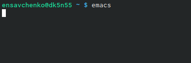{ #fig:001 width=70% }

## Слайд 1

2. Создала файл lab07.sh с помощью комбинации Ctrl-x Ctrl-f (C-x C-f).

 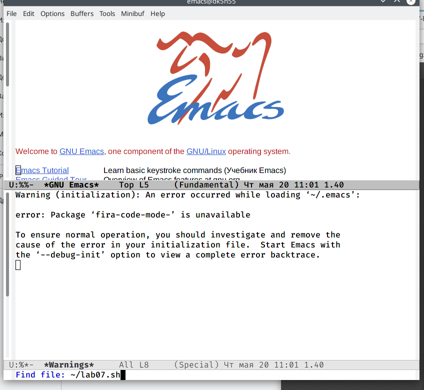{ #fig:001 width=70% }

## Слайд 2

3. Наберала текст:
```bash
#!/bin/bash
HELL=Hello
function hello
{
LOCAL HELLO=World 
echo $HELLO
}
echo $HELLO
hello
```

 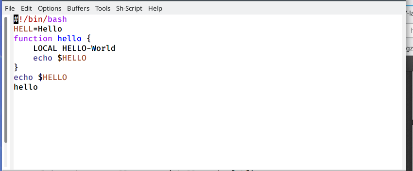{ #fig:001 width=70% }

## Слайд 4
4. Сохранила файл с помощью комбинации Ctrl-x Ctrl-s (C-x C-s).

 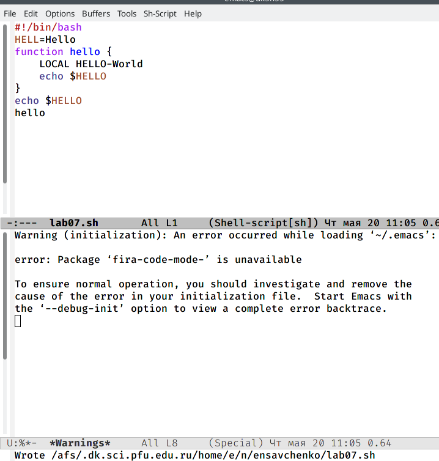{ #fig:001 width=70% }


## Слайд 5
5. Проделала с текстом стандартные процедуры редактирования, каждое действие должно осуществляться комбинацией клавиш.
 5.1. Вырезать одной командой целую строку (С-k).

 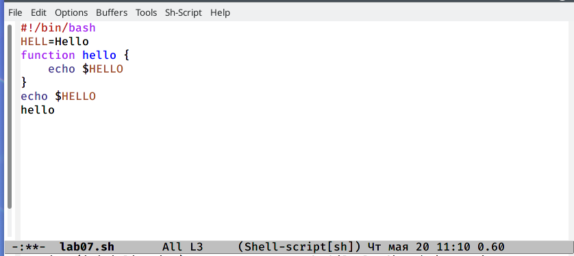{ #fig:001 width=70% }

## Слайд 6
 5.2. Вставила эту строку в конец файла (C-y).

 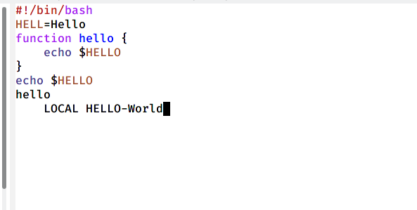{ #fig:001 width=70% }

## Слайд 7
 5.3. Выделила область текста (C-space).

 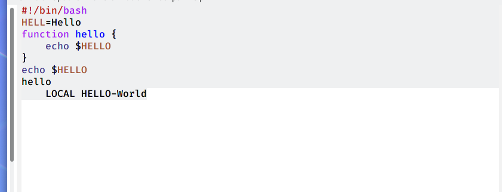{ #fig:001 width=70% }

## Слайд 8
 5.4. Скопировала область в буфер обмена (M-w).
 5.5. Вставила область в конец файла.

  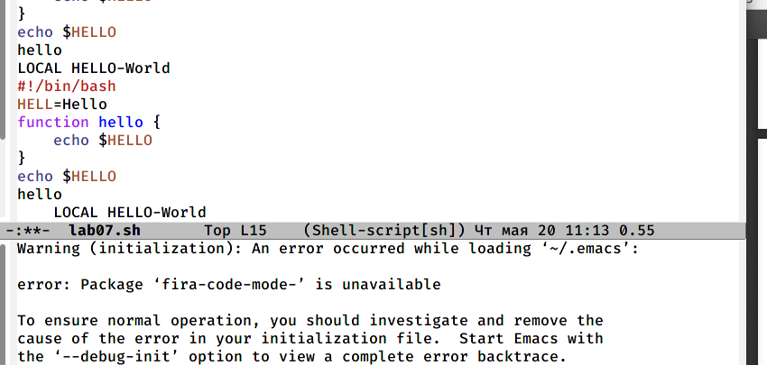{ #fig:001 width=70% }

## Слайд 9
 5.6. Вновь выделила эту область и на этот раз вырезала её (C-w).
 5.7. Отменила последнее действие (C-/).

 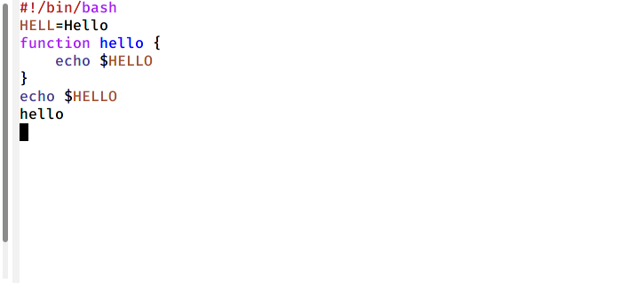{ #fig:001 width=70% }

## Слайд 10
6. Научилась использовать команды по перемещению курсора.
 6.1. Переместила курсор в начало строки (C-a).

 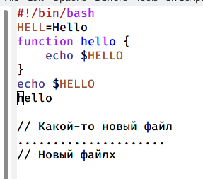{ #fig:001 width=70% }

## Слайд 11
 6.2. Переместила курсор в конец строки (C-e).

 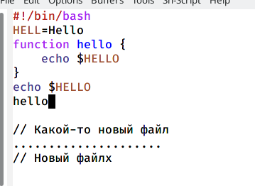{ #fig:001 width=70% }

## Слайд 12
 6.3. Переместила курсор в начало буфера (M-<).

 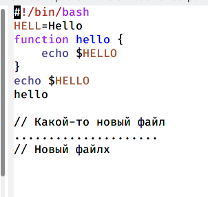{ #fig:001 width=70% }

## Слайд 13
 6.4. Переместила курсор в конец буфера (M->).

 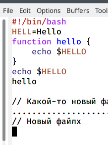{ #fig:001 width=70% }

## Слайд 14
7. Управление буферами.
 7.1. Вывела список активных буферов на экран (C-x C-b).


 { #fig:001 width=70% }

## Слайд 15
 7.2. Переместилась во вновь открытое окно (C-x) o со списком открытых буферов и переключилась на другой буфер.


 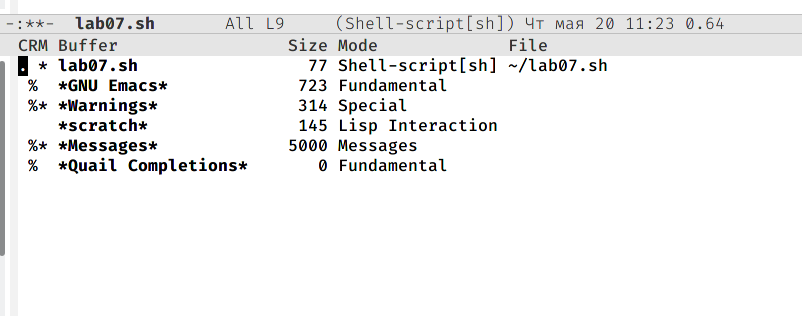{ #fig:001 width=70% }

## Слайд 16
 7.3. Закрыла это окно (C-x 0).


 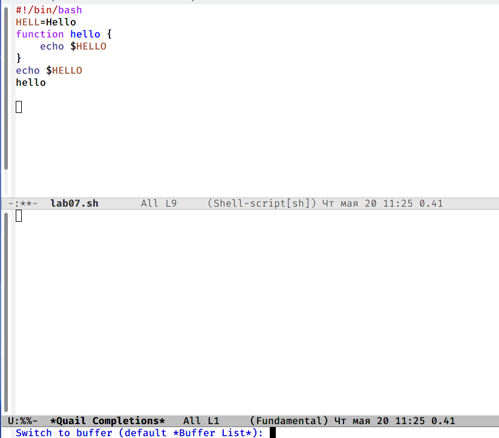{ #fig:001 width=70% }

## Сдайд 17
 7.4. Теперь вновь переключилась между буферами, но уже без вывода их спискана экран (C-x b)


8. Управление окнами.
 8.1. Поделила фрейм на 4 части: разделила фрейм на два окна по вертикали(C-x 3), а затем каждое из этих окон на две части по горизонтали (C-x 2)

## Слайд 18
 8.2. В каждом из четырёх созданных окон открыла новый буфер (файл) и ввела несколько строк текста.

 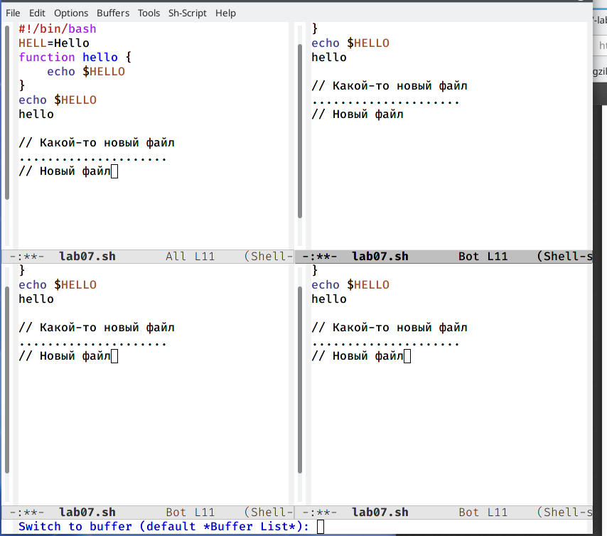{ #fig:001 width=70% }

## Слайд 19
9. Режим поиска
 9.1. Переключилась в режим поиска(C-s) и нашла несколько слов, присутствующих в тексте.


 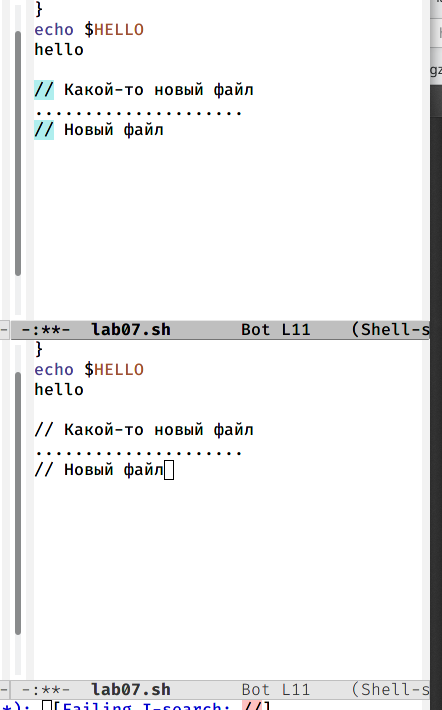{ #fig:001 width=70% }

## Слайд 20
 9.2. Переключилась между результатами поиска, нажимая C-s.

 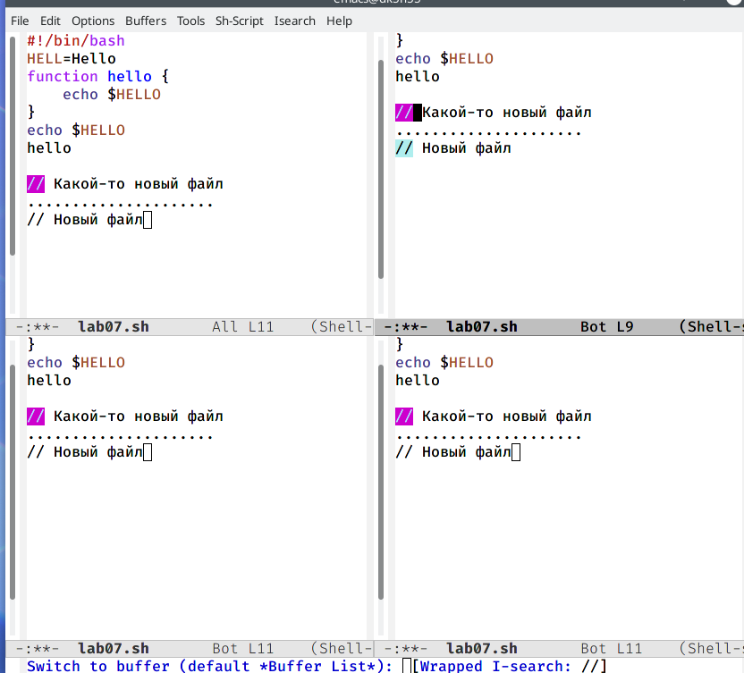{ #fig:001 width=70% }

## Слайд 21
 9.3. Вышла из режима поиска, нажав C-g.

 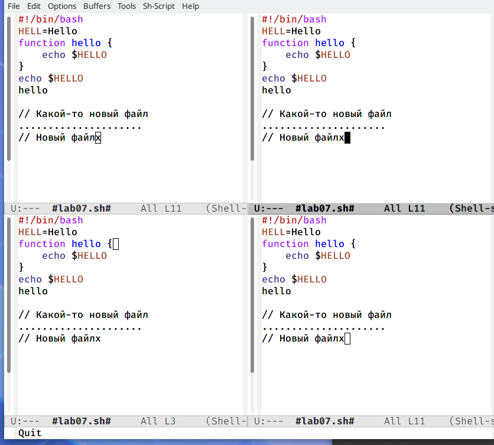{ #fig:001 width=70% }

## Слайд 22
 9.4. Перешла в режим поиска и замены (M-%), ввела текст, который следовало найти и заменить, нажмите Enter, затем ввела текст для замены. После того как были подсвечены результаты поиска, нажала ! для подтверждения замены.

 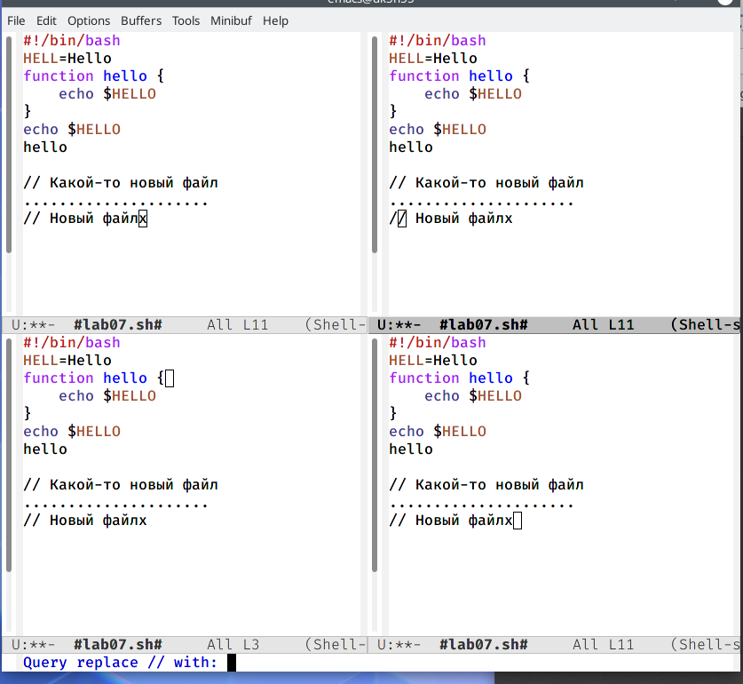{ #fig:001 width=70% }

## Слайд 23
 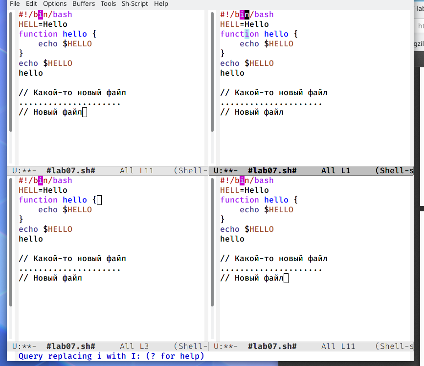{ #fig:001 width=70% }

 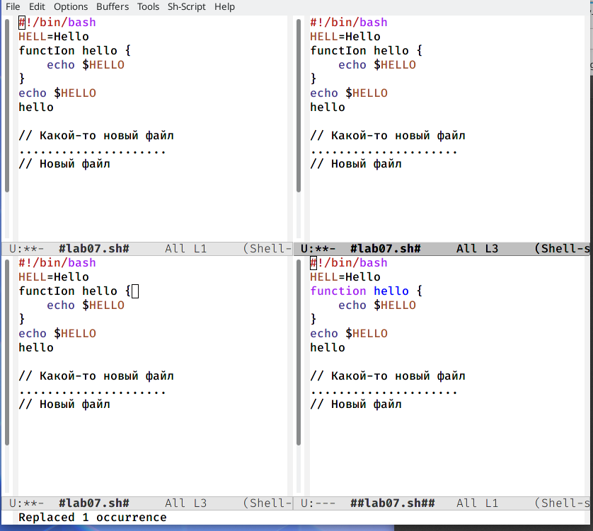{ #fig:001 width=70% }
 
 
## Слайд 24
 9.5. Испробовала другой режим поиска, нажав M-s o. Объясните, чем он отлича-ется от обычного режима?
 Лично у меня это функция не сработала.


 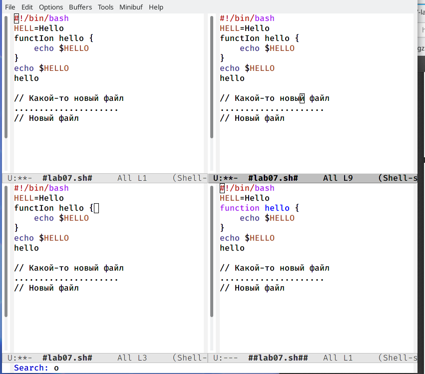{ #fig:001 width=70% }


# Выводы

Я познакомилась с операционной системой Linux и получила практические навыки работы с редактором emacs, установленным по умолчанию практически во всех дистрибутивах.