---
# Front matter
lang: ru-RU
title: "Отчёт по лабораторной работе"
subtitle: "Лабораторная работа No 7. Текстовой редактор emacs"
author: "Savchenko Elizaveta"

# Formatting
toc-title: "Содержание"
toc: true # Table of contents
toc_depth: 2
lof: true # List of figures
lot: true # List of tables
fontsize: 12pt
linestretch: 1.5
papersize: a4paper
documentclass: scrreprt
polyglossia-lang: russian
polyglossia-otherlangs: english
mainfont: PT Serif
romanfont: PT Serif
sansfont: PT Sans
monofont: PT Mono
mainfontoptions: Ligatures=TeX
romanfontoptions: Ligatures=TeX
sansfontoptions: Ligatures=TeX,Scale=MatchLowercase
monofontoptions: Scale=MatchLowercase
indent: true
pdf-engine: lualatex
header-includes:
  - \linepenalty=10 # the penalty added to the badness of each line within a paragraph (no associated penalty node) Increasing the value makes tex try to have fewer lines in the paragraph.
  - \interlinepenalty=0 # value of the penalty (node) added after each line of a paragraph.
  - \hyphenpenalty=50 # the penalty for line breaking at an automatically inserted hyphen
  - \exhyphenpenalty=50 # the penalty for line breaking at an explicit hyphen
  - \binoppenalty=700 # the penalty for breaking a line at a binary operator
  - \relpenalty=500 # the penalty for breaking a line at a relation
  - \clubpenalty=150 # extra penalty for breaking after first line of a paragraph
  - \widowpenalty=150 # extra penalty for breaking before last line of a paragraph
  - \displaywidowpenalty=50 # extra penalty for breaking before last line before a display math
  - \brokenpenalty=100 # extra penalty for page breaking after a hyphenated line
  - \predisplaypenalty=10000 # penalty for breaking before a display
  - \postdisplaypenalty=0 # penalty for breaking after a display
  - \floatingpenalty = 20000 # penalty for splitting an insertion (can only be split footnote in standard LaTeX)
  - \raggedbottom # or \flushbottom
  - \usepackage{float} # keep figures where there are in the text
  - \floatplacement{figure}{H} # keep figures where there are in the text
---

# Цель работы

Познакомиться с операционной системой Linux. Получить практические навыки работы с редактором Emacs.

# Задание

1.Ознакомиться с теоретическим материалом.
2.Ознакомиться с редактором emacs.
3.Выполнить упражнения.
4.Ответить на контрольные вопросы.

# Выполнение лабораторной работы


1. Открыла emacs.

 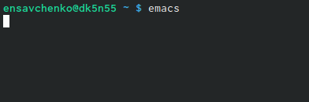{ #fig:001 width=70% }

2. Создала файл lab07.sh с помощью комбинации Ctrl-x Ctrl-f (C-x C-f).

 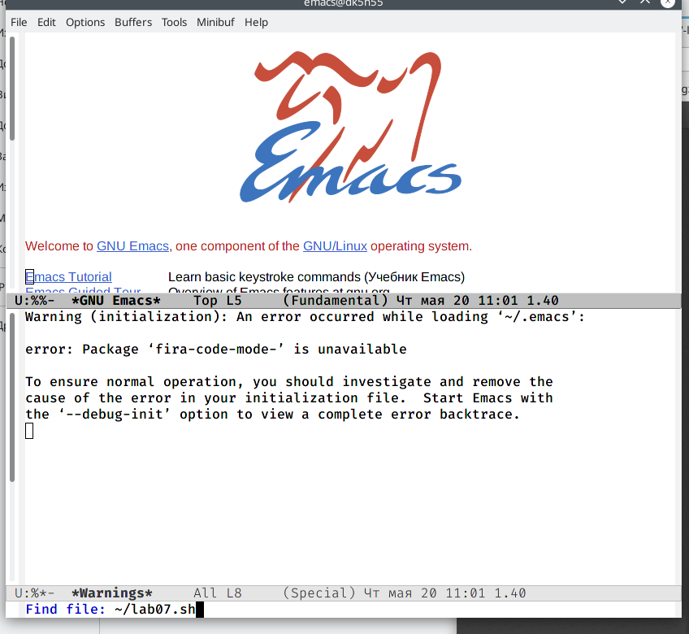{ #fig:001 width=70% }

3. Наберите текст:
```bash
#!/bin/bash
HELL=Hello
function hello
{
LOCAL HELLO=World 
echo $HELLO
}
echo $HELLO
hello
```

 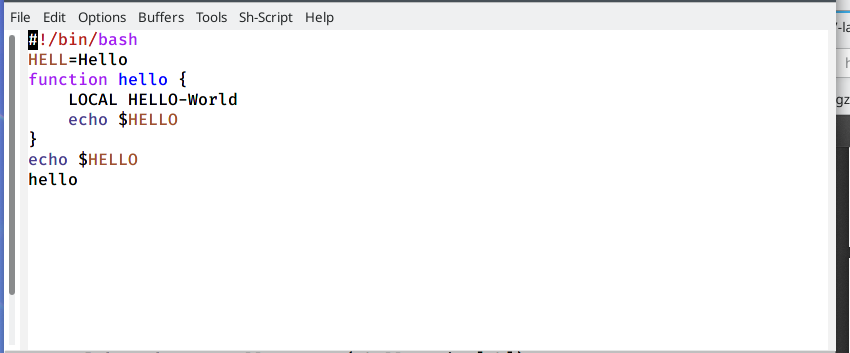{ #fig:001 width=70% }

4. Сохранила файл с помощью комбинации Ctrl-x Ctrl-s (C-x C-s).

 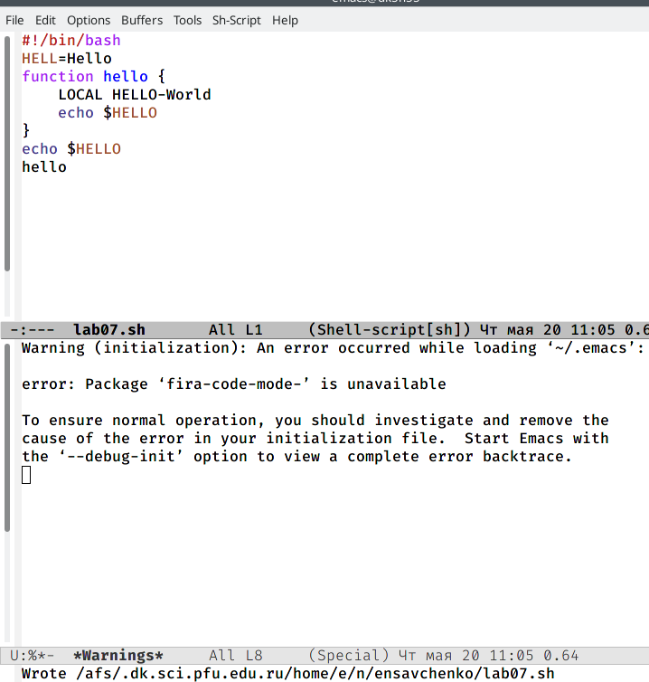{ #fig:001 width=70% }

5. Проделала с текстом стандартные процедуры редактирования, каждое действие должно осуществляться комбинацией клавиш.
 5.1. Вырезать одной командой целую строку (С-k).

 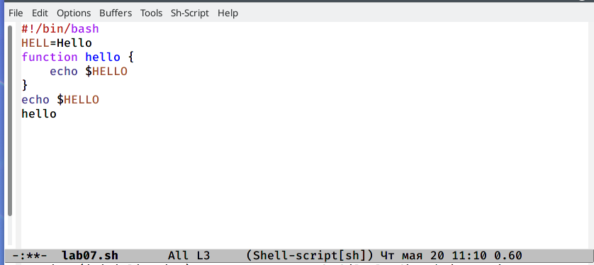{ #fig:001 width=70% }

 5.2. Вставила эту строку в конец файла (C-y).

 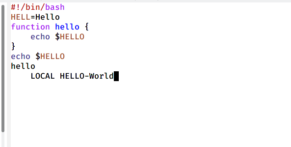{ #fig:001 width=70% }

 5.3. Выделила область текста (C-space).

 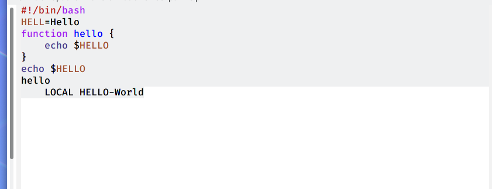{ #fig:001 width=70% }

 5.4. Скопировала область в буфер обмена (M-w).
 5.5. Вставила область в конец файла.

  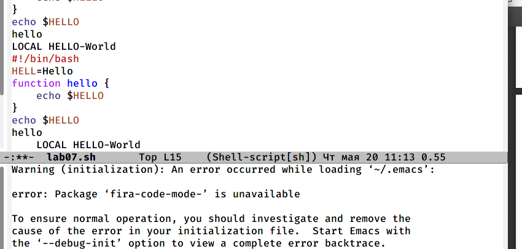{ #fig:001 width=70% }

 5.6. Вновь выделила эту область и на этот раз вырезала её (C-w).
 5.7. Отменила последнее действие (C-/).

 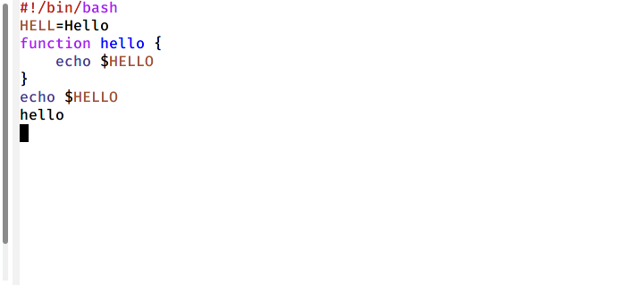{ #fig:001 width=70% }

6. Научилась использовать команды по перемещению курсора.
 6.1. Переместила курсор в начало строки (C-a).

 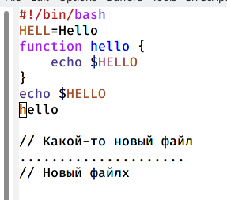{ #fig:001 width=70% }

 6.2. Переместила курсор в конец строки (C-e).

 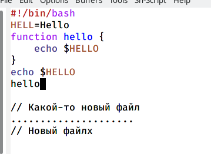{ #fig:001 width=70% }

 6.3. Переместила курсор в начало буфера (M-<).

 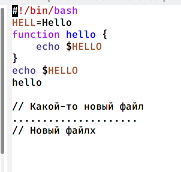{ #fig:001 width=70% }

 6.4. Переместила курсор в конец буфера (M->).

 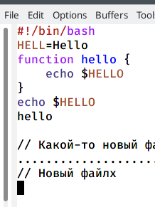{ #fig:001 width=70% }

7. Управление буферами.
 7.1. Вывела список активных буферов на экран (C-x C-b).


 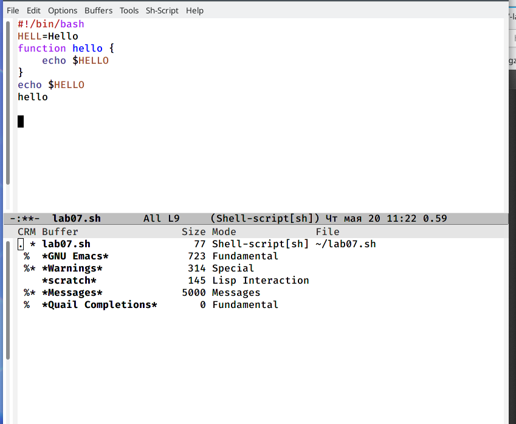{ #fig:001 width=70% }

 7.2. Переместилась во вновь открытое окно (C-x) o со списком открытых буферов и переключилась на другой буфер.


 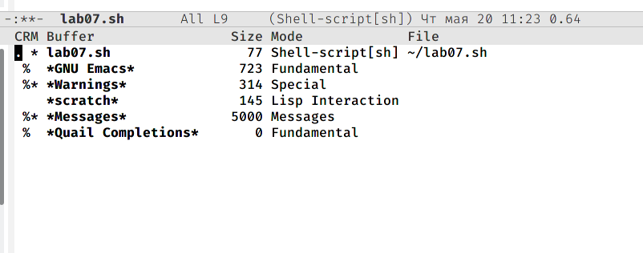{ #fig:001 width=70% }

 7.3. Закрыла это окно (C-x 0).


 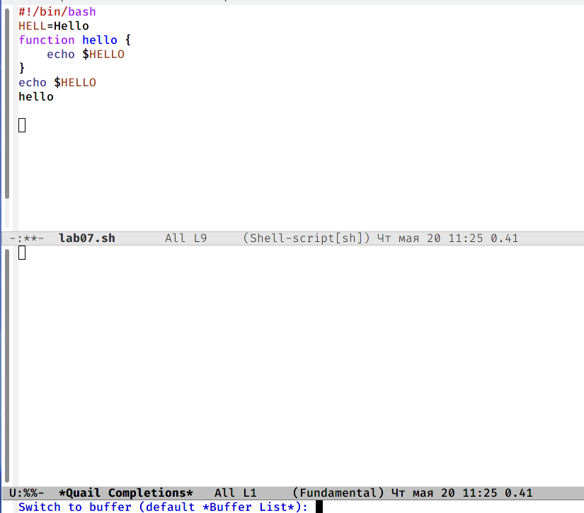{ #fig:001 width=70% }

 7.4. Теперь вновь переключилась между буферами, но уже без вывода их спискана экран (C-x b)


8. Управление окнами.
 8.1. Поделила фрейм на 4 части: разделила фрейм на два окна по вертикали(C-x 3), а затем каждое из этих окон на две части по горизонтали (C-x 2)


 8.2. В каждом из четырёх созданных окон открыла новый буфер (файл) и ввела несколько строк текста.

 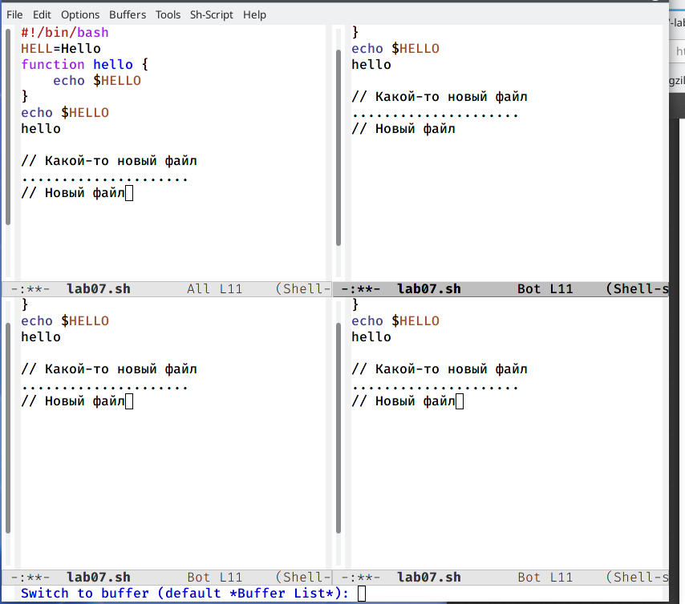{ #fig:001 width=70% }

9. Режим поиска
 9.1. Переключилась в режим поиска(C-s) и нашла несколько слов, присутствующих в тексте.


 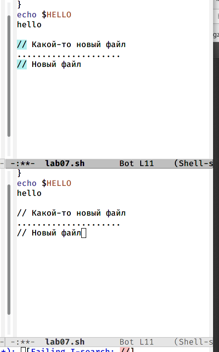{ #fig:001 width=70% }

 9.2. Переключайлась между результатами поиска, нажимая C-s.

 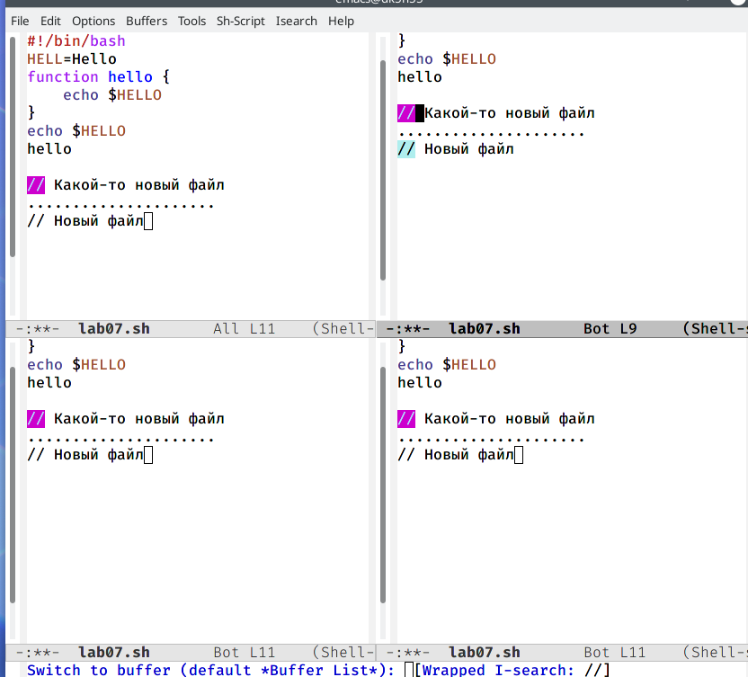{ #fig:001 width=70% }

 9.3. Вышла из режима поиска, нажав C-g.

 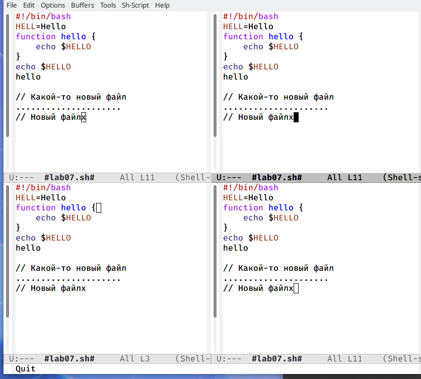{ #fig:001 width=70% }

 9.4. Перешла в режим поиска и замены (M-%), ввела текст, который следовало найти и заменить, нажала Enter, затем ввела текст для замены. После того как будут подсвечены результаты поиска, нажала ! для подтверждения замены.

 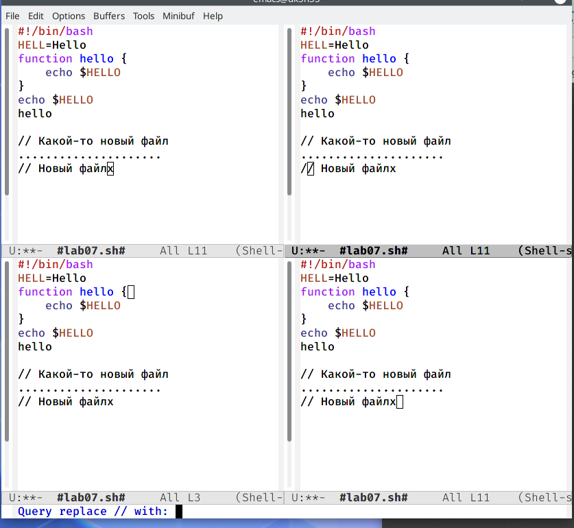{ #fig:001 width=70% }

 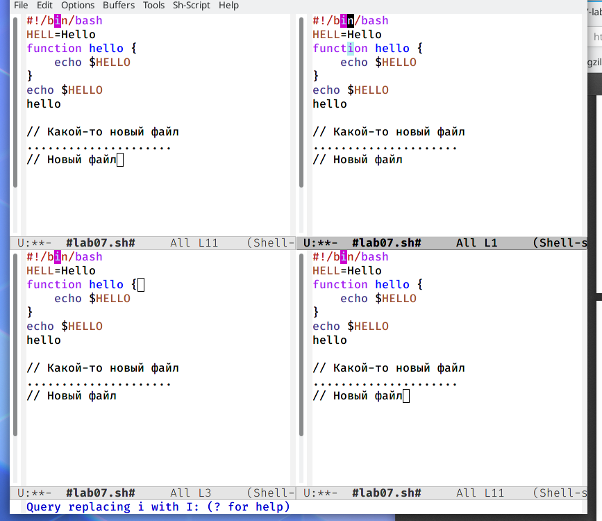{ #fig:001 width=70% }

 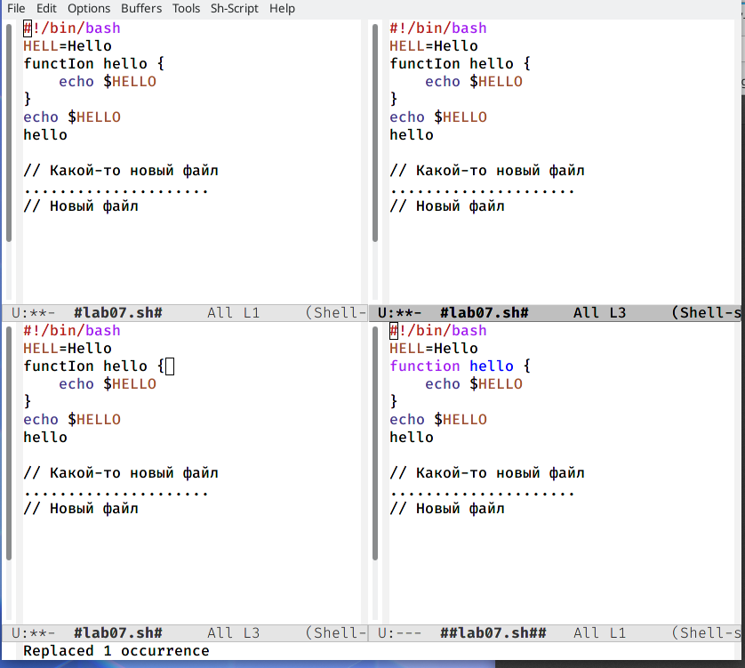{ #fig:001 width=70% }
 

 9.5. Испробовала другой режим поиска, нажав M-s o. Объясните, чем он отличается от обычного режима?
 Лично у меня данная функция не сработала

 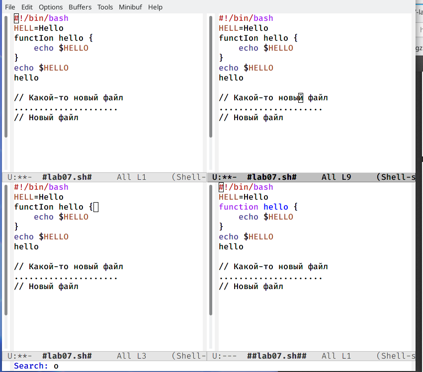{ #fig:001 width=70% }


# Выводы

Я познакомилась с операционной системой Linux и получила практические навыки работы с редактором emacs, установленным по умолчанию практически во всех дистрибутивах.