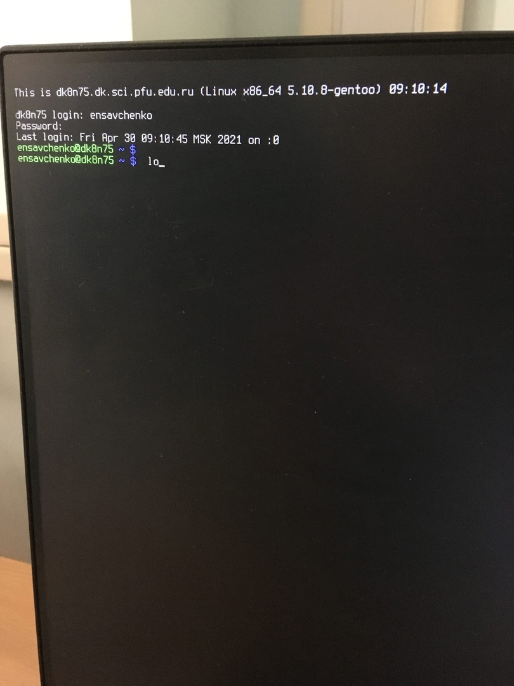
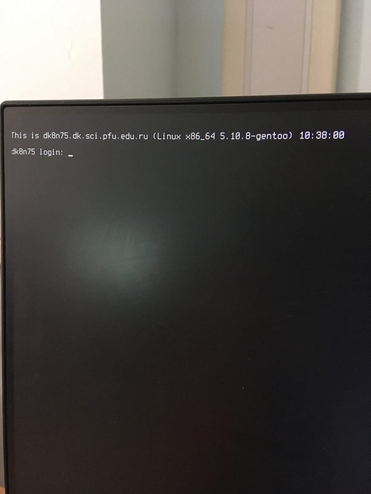
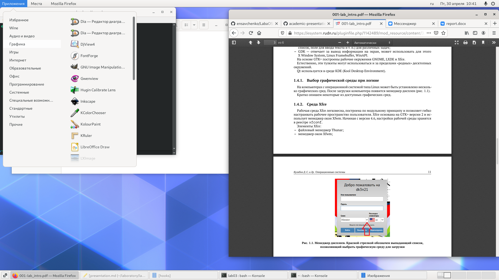
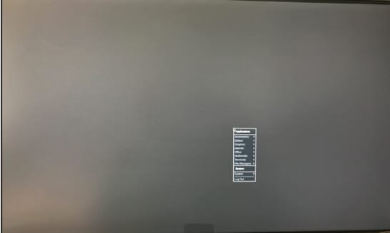
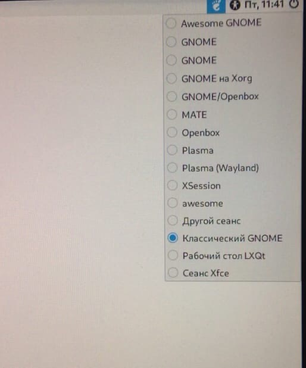
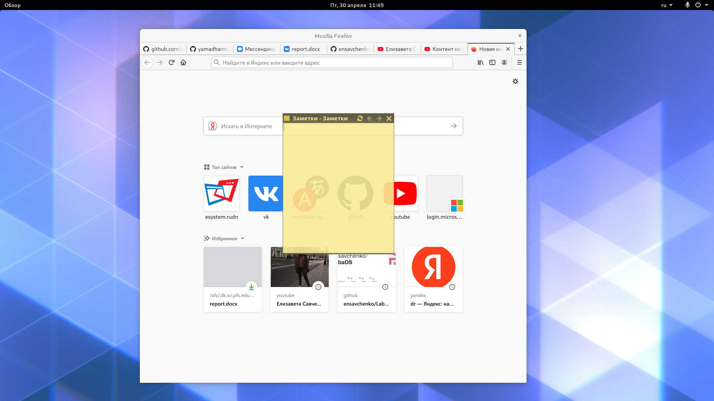
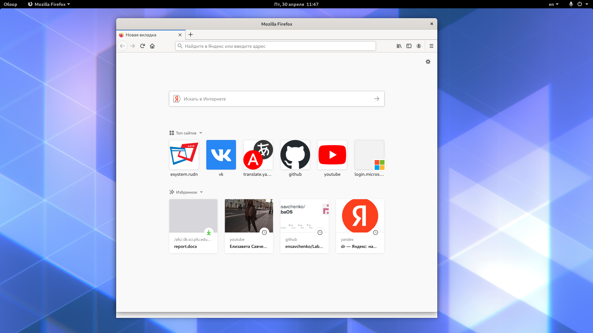
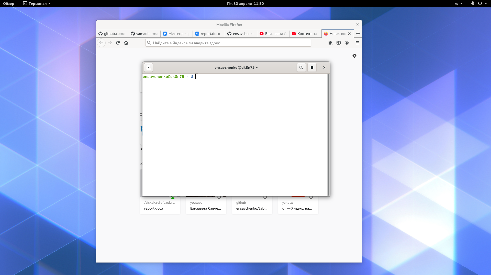

---
# Front matter
lang: ru-RU
title: "отчёт по лабораторной работе 4"
subtitle: "Простейший вариант"
author: "Savchenko Elizaveta"

# Formatting
toc-title: "Содержание"
toc: true # Table of contents
toc_depth: 2
lof: true # List of figures
lot: true # List of tables
fontsize: 12pt
linestretch: 1.5
papersize: a4paper
documentclass: scrreprt
polyglossia-lang: russian
polyglossia-otherlangs: english
mainfont: PT Serif
romanfont: PT Serif
sansfont: PT Sans
monofont: PT Monohttps://github.com/yamadharma/academic-laboratory-report-template.git
pdf-engine: lualatex
header-includes:
  - \linepenalty=10 # the penalty added to the badness of each line within a paragraph (no associated penalty node) Increasing the value makes tex try to have fewer lines in the paragraph.
  - \interlinepenalty=0 # value of the penalty (node) added after each line of a paragraph.
  - \hyphenpenalty=50 # the penalty for line breaking at an automatically inserted hyphen
  - \exhyphenpenalty=50 # the penalty for line breaking at an explicit hyphen
  - \binoppenalty=700 # the penalty for breaking a line at a binary operator
  - \relpenalty=500 # the penalty for breaking a line at a relation
  - \clubpenalty=150 # extra penalty for breaking after first line of a paragraph
  - \widowpenalty=150 # extra penalty for breaking before last line of a paragraph
  - \displaywidowpenalty=50 # extra penalty for breaking before last line before a display math
  - \brokenpenalty=100 # extra penalty for page breaking after a hyphenated line
  - \predisplaypenalty=10000 # penalty for breaking before a display
  - \postdisplaypenalty=0 # penalty for breaking after a display
  - \floatingpenalty = 20000 # penalty for splitting an insertion (can only be split footnote in standard LaTeX)
  - \raggedbottom # or \flushbottom
  - \usepackage{float} # keep figures where there are in the text
  - \floatplacement{figure}{H} # keep figures where there are in the text
---

# Цель работы

Познакомиться с операционной системой Linux,получить практические навыки рабо-ты с консолью и некоторыми графическими менеджерами рабочих столов операционной системы.

# Задание

1. Ознакомиться стеоретическим материалом.
2. Загрузить компьютер.
3. Перейти на текстовую консоль. Сколько текстовых консолей доступно на вашем компьютере?
4. Перемещаться междутекстовыми консолями. Какие комбинации клавиш необходимопри этом нажимать? 
5. Зарегистрироваться в текстовой консоли операционной системы.Какой логин вы при этом использовали? Какие символы отображаются при вводе пароля?
6. Завершить консольный сеанс. Какую команду или комбинацию клавиш необходимо для этого использовать?
7. Переключиться на графический интерфейс. Какую комбинацию клавиш для этого необходимо нажать?
8. Ознакомиться с менеджером рабочих столов. Как называется менеджер, запускаемый по умолчанию? 
9. Поочерёдно зарегистрироваться в разных графических менеджерах рабочих столов(GNOME,KDE,XFCE) и оконных менеджерах (Openbox).Продемонстрировать разницу между ними, сделав снимки экрана (скриншоты). Какие графические менеджерыустановлены на вашем компьютере?
10. Изучить список установленных программ. Обратить внимание на предпочтитель-ные программы для разных применений.Запустите поочерёдно браузер,текстовойредактор,текстовой процессор,эмулятор консоли.Укажите названия программ.

# Выполнение лабораторной работы
1. Ознакомилась с теоретическим материалом
2. Загрузила компьютер 
3. Перешла на текстовую консоль. Сколько текстовых консолей доступно на вашем компьютере?
ответ: 6 текстовых консолей доступно на компьютере
4. Перемещалась между текстовыми консолями, при этом использовала комбинацию ctrl+alt+f(n), где в диапозоне от 1 до 6 (6 текстовых консошлей)
{ #fig:001 width=70% }

5. Зарегистрировалась в текстовой консоли операционной системы. Я использовала логин: ensavchenko
При вводе контроля не отображаются символы для сохранения конфиденциальности
{ #fig:001 width=70% }

6. Завершила консольный сеанс. использовав ctrl+D

{ #fig:001 width=70% }
7. Ознакомиться с менеджером рабочих столов.Как называется менеджер,запускаемый по умолчанию? -GNOME

Ниже показываю различия в графических мнеджерах; в списке программ визуальные различия (в XFCE) и в нижней вкладке правой (в KDE)
{ #fig:001 width=70% }

{ #fig:001 width=70% }

{ #fig:001 width=70% }

8. Поочерёдно зарегистрироваться в разных графических менеджерах рабочих столов(GNOME,KDE,XFCE) и оконных менеджерах (Openbox).Продемонстрировать разницумежду ними, сделав снимки экрана (скриншоты).

{ #fig:001 width=70% }

9. Изучить список установленных программ. Обратить внимание на предпочтительные программы для разных применений.
{ #fig:001 width=70% }
Mozilla Firefox
{ #fig:001 width=70% }

Geany
{ #fig:001 width=70% }

Libreoffice Writer
{ #fig:001 width=70% }
# Выводы
Познакомилась с операционной системой Linux,получила практические навыки работы с консолью и некоторыми графическими менеджерами рабочих столов операционной системы
Здесь кратко описываются итоги проделанной работы.
