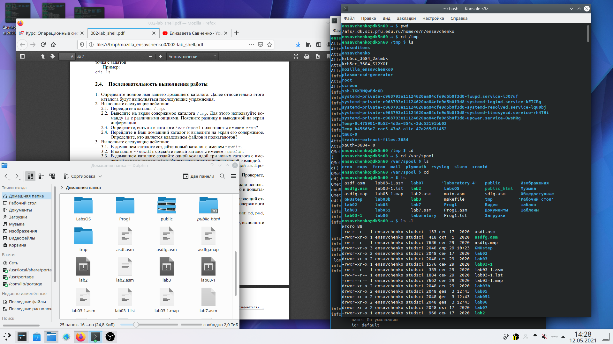
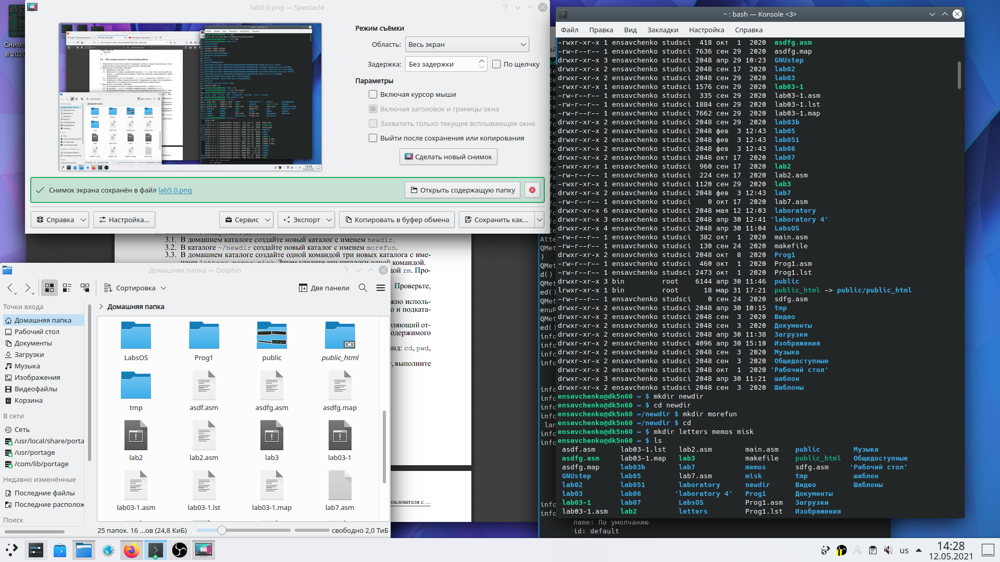
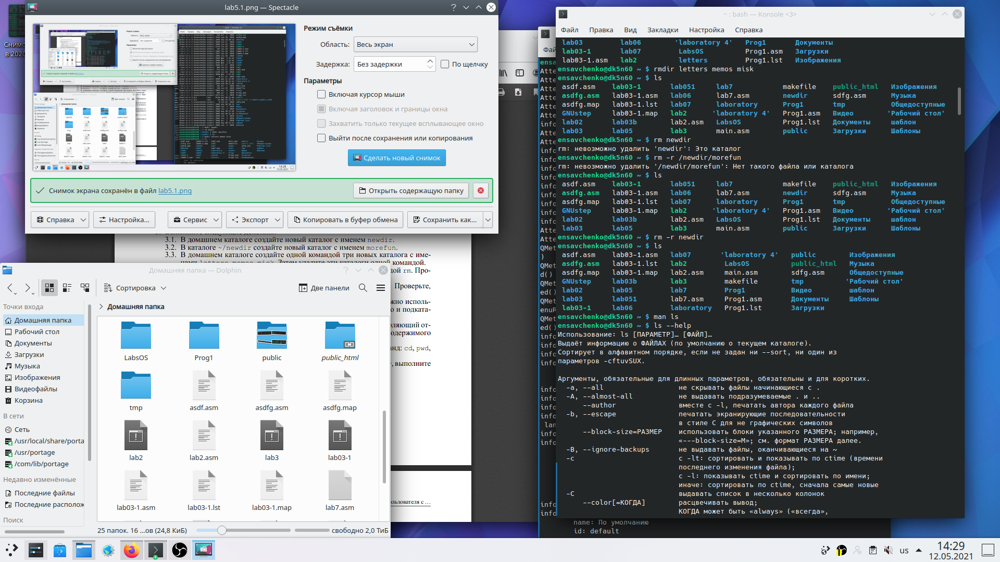
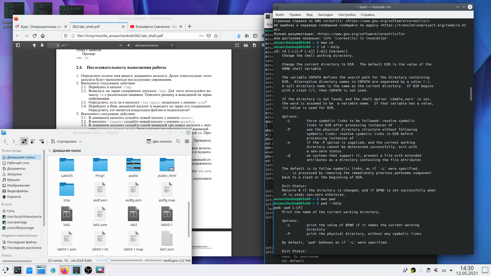
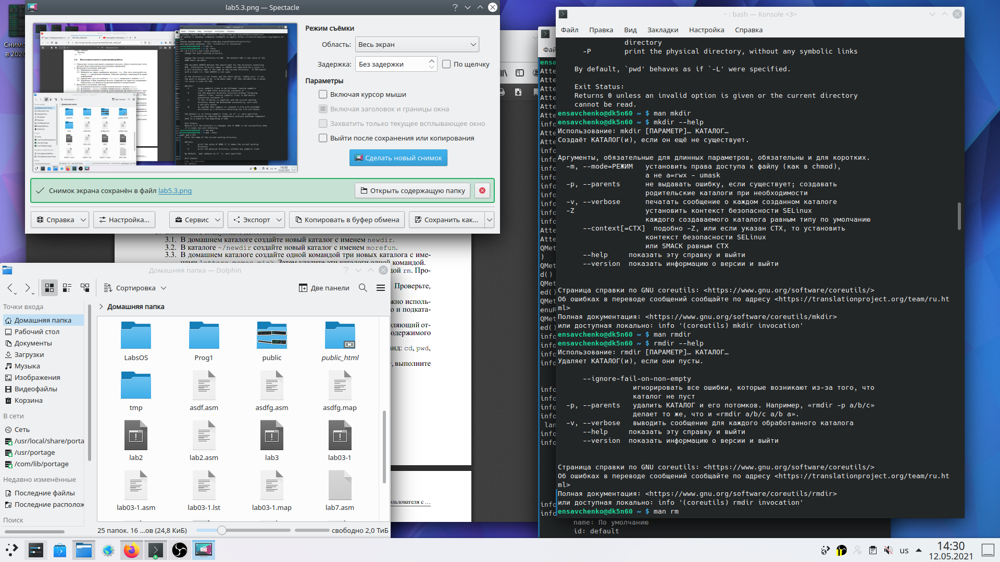
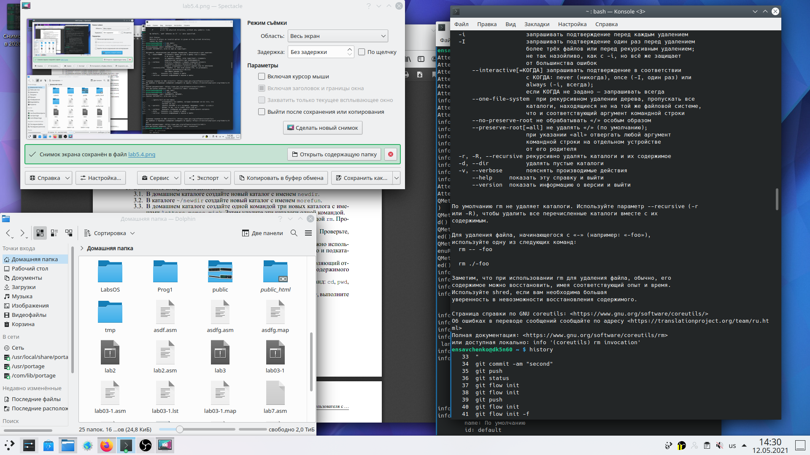
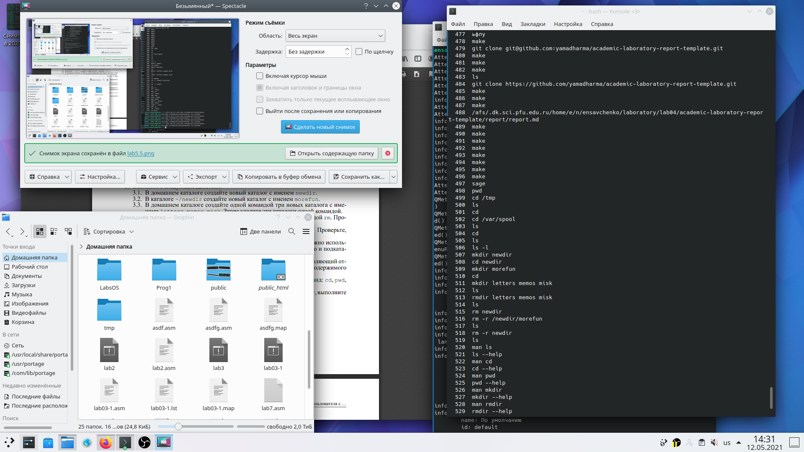
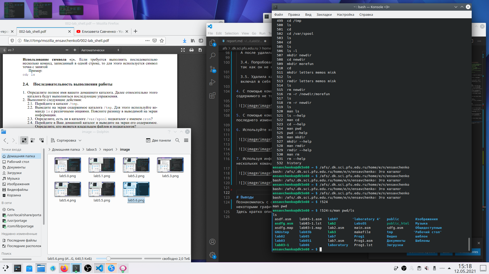

---
## Front matter
lang: ru-RU
title: Лабораторная работа No 2. Основы интерфейса взаимодействия пользователя с системой Unix на уровне командной строки.
author: "Elizaveta Savchenko"
institute: |
	\inst{1}RUDN University, Moscow, Russian Federation

date: 12.05.2021

## Formatting
toc: false
slide_level: 2
theme: metropolis
header-includes: 
 - \metroset{progressbar=frametitle,sectionpage=progressbar,numbering=fraction}
 - '\makeatletter'
 - '\beamer@ignorenonframefalse'
 - '\makeatother'
aspectratio: 43
section-titles: true
---

# Цель работы

Приобретение практических навыков взаимодействия пользователя с системой посредством командной строки.

# Задание

## Слайд 3

1. Определите полное имя вашего домашнего каталога. Далее относительно этого каталога будут выполняться последующие упражнения.

2. Выполните следующие действия:
 2.1. Перейдите в каталог /tmp.
 2.2. Выведите на экран содержимое каталога/tmp. Для этого используйте команду ls с различными опциями. 
 2.3. Определила, есть ли в каталоге /var/spool подкаталог с именем cron?
 2.4. Перешла в свой домашний каталог и вывела на экран его содержимое. Определила, кто является владельцем файлов и подкаталогов?

## Слайд 4

3. Заполнила следующие действия:
  3.1. В домашнем каталоге создала новый каталог с именем newdir.
  3.2. В каталоге~/newdir создала новый каталог с именем morefun. 
  3.3. В домашнем каталоге создала одной командой три новых каталога с име-нами letters, memos, misk. Затем удалила эти каталоги одной командой.
  3.4.Попробуйте удалить ранее созданный каталог~/newdir командой rm. Проверьте, был ли каталог удалён.
  3.5.Удалила каталог~/newdir/morefun из домашнего каталога. Проверила, был ли каталог удалён.

## Слайд 5

4. С помощью командыmanопределите, какую опцию командыlsнужно исполь-зовать для просмотра содержимое не только указанного каталога, но и подката-логов, входящих в него.

5. С помощью командыmanопределите набор опций командыls, позволяющий от-сортировать по времени последнего изменения выводимый список содержимогокаталога с развёрнутым описанием файлов.

## Слайд 6

6. Используйте командуmanдля просмотра описания следующих команд:cd,pwd,mkdir,rmdir,rm. Поясните основные опции этих команд.

7. Используя информацию, полученную при помощи командыhistory, выполнитемодификацию и исполнение нескольких команд из буфера команд.

# Выполнение лабораторной работы

## Слайд 7

1. Я определила полное имя своего домашнего каталога. И относительно данного каталога я выполняла все последующие упражнения.

## Слайд 8

2. Выполнила такие действия:
  2.1. Перешла в каталог /tmp.
  2.2. Вывела на экран содержимое каталога /tmp, используя команду ls.
  2.3. Определила, есть ли в каталоге /var/spool подкаталог с именем cron.
       Да, такой подкатолог с именем cron существует.
  2.4. Затем перешла в свой домашний каталог и вывела на экран его содержимое. После определила, кто является владельцем файлов и подкаталогов.

 { #fig:001 width=70% }

## Слайд 9

3. Выполнила такие действия, как:
  3.1. В домашнем каталоге создала новый католог с именем newdir.
  3.2. В этом каталоге я создала новый каталог с именем morefun.

  3.3. В домашнем каталоге создала одной командой три новых каталога с именем letters, memos, misk. 
  
   { #fig:001 width=70% }
  
  А после удалила эти каталоги одной командой.

## Слайд 10

  3.4. Попробовала удалить ранее созданны домашнего каталога (вернее удалила каталог newdir, который включал в себя кталог morefun) через команду rm -r newdir.

## Слайд 11

4. С помощью команды man определила, какую опцию команды ls нужно использовать для просмотра содержимого не только указанного каталога, но и подкаталогов, входящих в него.

 { #fig:001 width=70% }

## Слайд 12

5. С помощью команды man определила набор опций команды ls, позволяющий отсортировать по времени последнего изменения выводимый список содержимого каталога с развёрнутым описанием файлов.

## Слайд 13

6. Используйте командуmanдля просмотра описания следующих команд: cd, pwd, mkdir, rmdir, rm. 

 { #fig:001 width=70% }

## Слайд 14
 { #fig:001 width=70% }

## Слайд 15

7. Используя информацию, полученную при помощи команды history, выполнила модификацию и исполнение нескольких команд из буфера команд.

 { #fig:001 width=70% }

## Слайд 16 

 { #fig:001 width=70% }

## Слайд 17 
 { #fig:001 width=70% }

# Выводы
Во время выполнения работы я приобрела практические навыки взаимодействия пользователя с системой посредством командной строки.
