---
## Front matter
lang: ru-RU
title: "Лабораторная работа No 3. Анализ файловой системы Linux.Команды для работы с файлами и каталогами"
author: "Elizaveta Savchenko"
institute: |
	\inst{1}RUDN University, Moscow, Russian Federation
	
date: 13.05.2021

## Formatting
toc: false
slide_level: 2
theme: metropolis
header-includes: 
 - \metroset{progressbar=frametitle,sectionpage=progressbar,numbering=fraction}
 - '\makeatletter'
 - '\beamer@ignorenonframefalse'
 - '\makeatother'
aspectratio: 43
section-titles: true
---

# Цель работы

  Ознакомиться с файловой системой Linux, её структурой, именами и содержанием каталогов. Приобретение практических навыков по применению команд для работы с файлами и каталогами, по управлению процессами (и работами), по проверке использования диска и обслуживанию файловой системы.

# Задание

## Слайд 1
1. Выполните все примеры, приведённые в первой части описания лабораторной работы.

## Слайд 2
2. Выполните следующие действия, зафиксировав в отчёте по лабораторной работе используемые при этом команды и результаты их выполнения: 
 2.1. Скопируйте файл/usr/include/sys/io.h в домашний каталог и назовитеего equipment. Если файла io.h нет, то используйте любой другой файл вкаталоге /usr/include/sys/ вместо него.
 2.2. В домашнем каталоге создайте директорию ~/ski.plases. 
 2.3. Переместите файлequipment в каталог ~/ski.plases. 
 2.4. Переименуйтефайл~/ski.plases/equipmentв~/ski.plases/equiplist.

## Слайд 3
 2.5. Создайте в домашнем каталоге файлabc1и скопируйте его в каталог~/ski.plases, назовите егоequiplist2.2.6.Создайте каталог с именемequipmentв каталоге~/ski.plases.
 2.7. Переместите файлы~/ski.plases/equiplistиequiplist2в каталог~/ski.plases/equipment.
 2.8. Создайте и переместите каталог~/newdirв каталог~/ski.plasesи назо-вите егоplans.

## Слайд 4
3. Определите опции командыchmod, необходимые для того, чтобы присвоить пе-речисленным ниже файлам выделенные права доступа, считая, что в начале та-ких прав нет:
3.1.drwxr--r--   ...   australia
3.2.drwx--x--x   ...   play
3.3.-r-xr--r--  ...  my_os
3.4.-rw-rw-r--   ...   feathers
При необходимости создайте нужные файлы.

## Слайд 5
4. Проделайте приведённые ниже упражнения, записывая в отчёт по лабораторной работе используемые при этом команды:
 4.1. Просмотрите содержимое файла/etc/password. 
 4.2. Скопируйте файл~/feathersв файл~/file.old.
 4.3. Переместите файл~/file.oldв каталог~/play.
 4.4. Скопируйте каталог~/playв каталог~/fun.
 4.5. Переместите каталог~/fun в каталог~/play и назовите его games.
 4.6. Лишите владельца файла ~/feathers права на чтение.
 4.7. Что произойдёт, если вы попытаетесь просмотреть файл ~/feathers командой cat?

## Слайд 6
 4.8. Что произойдёт, если вы попытаетесь скопировать файл~/feathers?
 4.9. Дайте владельцу файла~/feathers право на чтение.
 4.10. Лишите владельца каталога~/play права на выполнение.
 4.11. Перейдите в каталог~/play. Что произошло?
 4.12. Дайте владельцу каталога~/playправо на выполнение.

## Слайд 7
5.Прочитайте man по командам mount,fsck,mkfs,kill и кратко их охарактеризуйте, приведя примеры.

# Выполнение лабораторной работы

## Слайд 8

1. Я выполнила все примеры, приведенный к первой части описания лабораторной работы. Продемонстрировала скриншотами.

 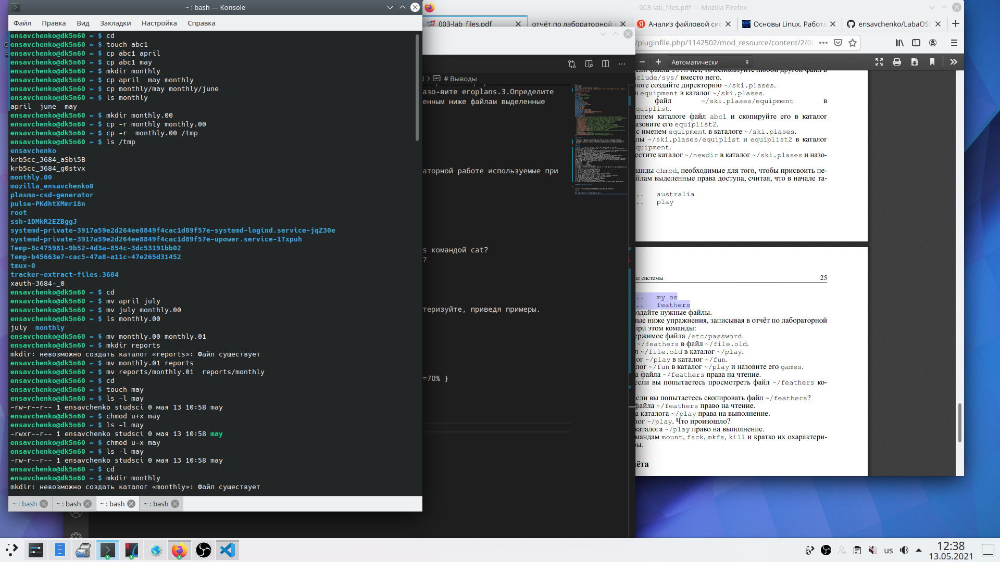{ #fig:001 width=70% }

## Слайд 9
 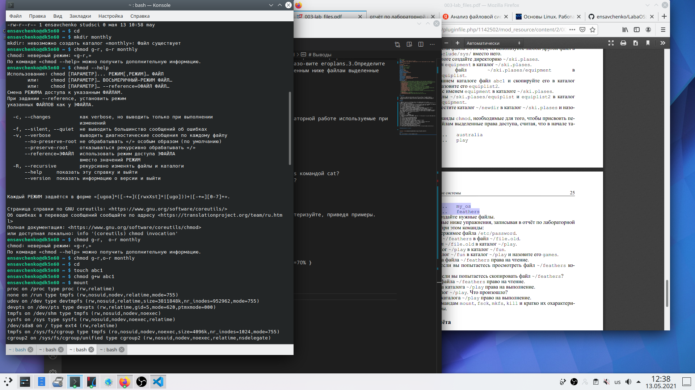{ #fig:001 width=70% }

## Слайд 10
 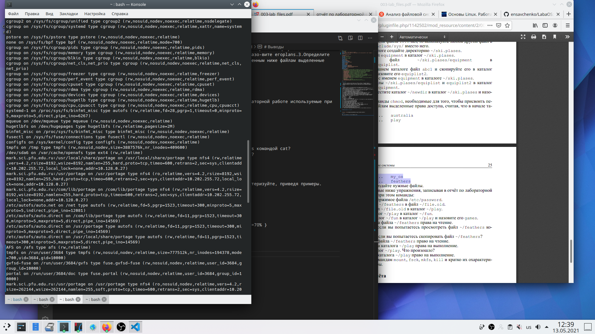{ #fig:001 width=70% }

## Слайд 11

2.  Выполните следующие действия, зафиксировав в отчёте по лабораторной работе используемые при этом команды и результаты их выполнения: 
2.1. Скопируйте файл/usr/include/sys/io.h в домашний каталог и назовитеего equipment. Если файла io.h нет, то используйте любой другой файл вкаталоге /usr/include/sys/ вместо него.
 
## Слайд 12
 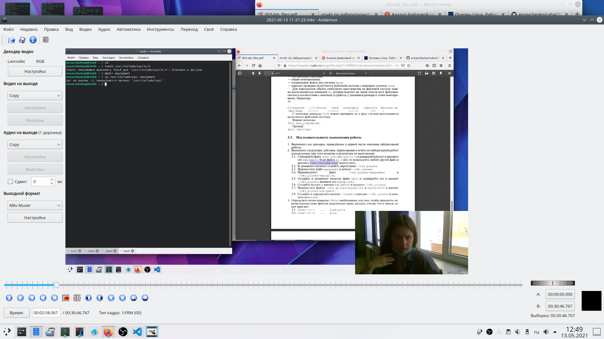{ #fig:001 width=70% }

## Слайд 13
2.2. В домашнем каталоге создайте директорию ~/ski.plases. 
2.3. Переместите файлequipment в каталог ~/ski.plases. 
2.4. Переименуйтефайл~/ski.plases/equipment в~/ski.plases/equiplist.

## Слайд 14
 
 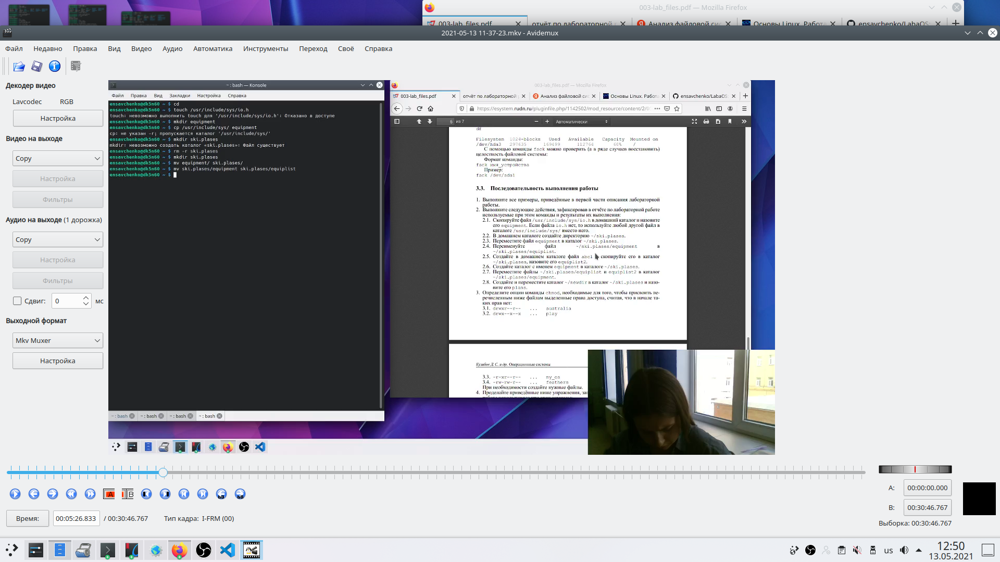{ #fig:001 width=70% }

## Слайд 15

2.5. Создайте в домашнем каталоге файлabc1и скопируйте его в каталог~/ski.plases, назовите егоequiplist2.

 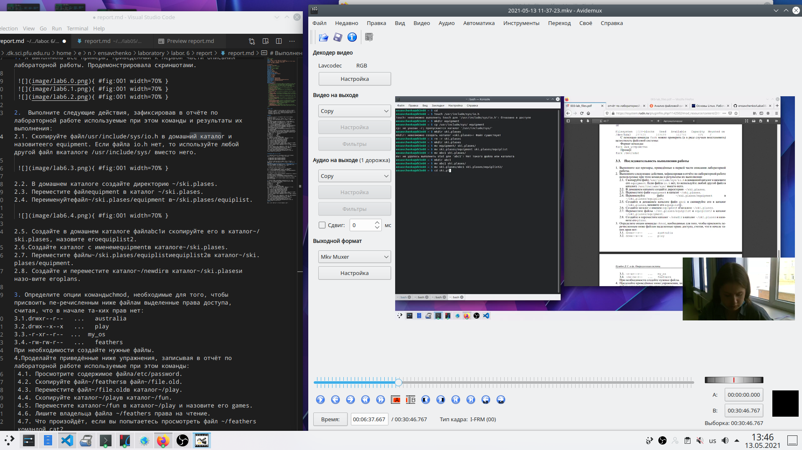{ #fig:001 width=70% }

## Слайд 16
2.6.Создайте каталог с именемequipmentв каталоге~/ski.plases.
2.7. Переместите файлы~/ski.plases/equiplistиequiplist2в каталог~/ski.plases/equipment.
2.8. Создайте и переместите каталог ~/newdirв каталог~/ski.plases и назовите его plans.

## Слайд 17
 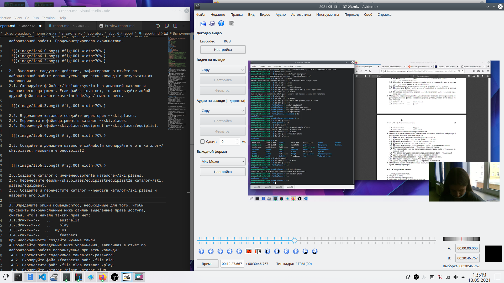{ #fig:001 width=70% }

## Слайд 18

3. Определите опции командыchmod, необходимые для того, чтобы присвоить пе-речисленным ниже файлам выделенные права доступа, считая, что в начале та-ких прав нет:
3.1.drwxr--r--   ...   australia

## Слайд 19
 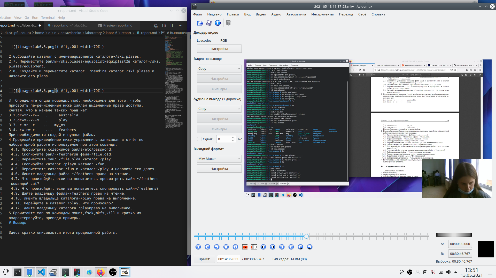{ #fig:001 width=70% }

## Слайд 20
 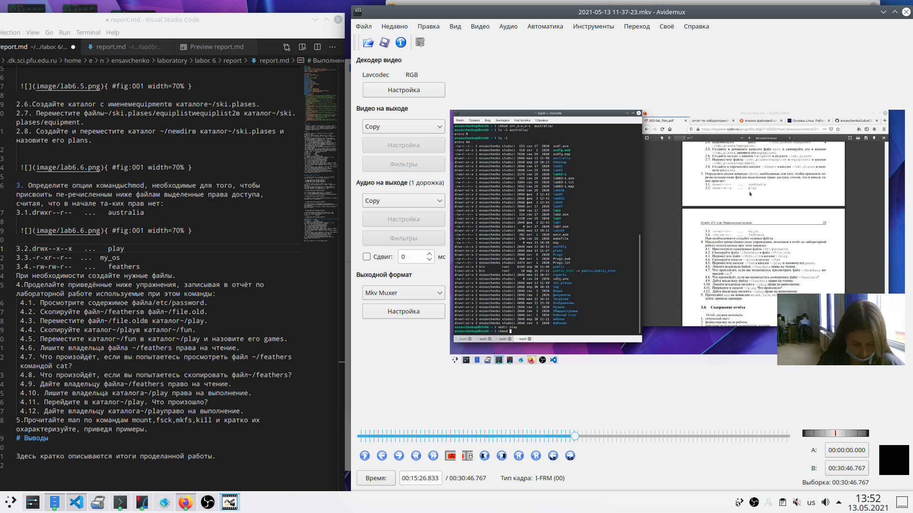{ #fig:001 width=70% }

## Слайд 21
3.2.drwx--x--x   ...   play
3.3.-r-xr--r--  ...  my_os

## Слайд 22
 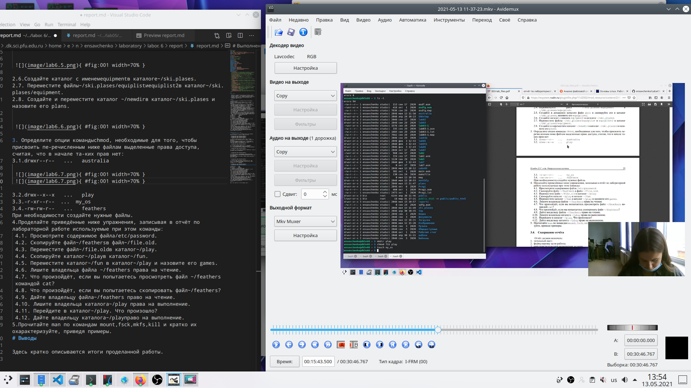{ #fig:001 width=70% }

## Слайд 23
 { #fig:001 width=70% }

## Слайд 24
3.4.-rw-rw-r--   ...   feathers

## Слайд 25
 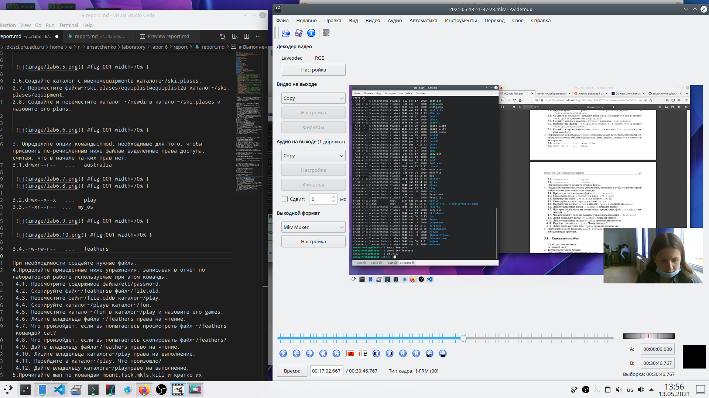{ #fig:001 width=70% }

При необходимости создайте нужные файлы.

## Слайд 26
4. Проделайте приведённые ниже упражнения, записывая в отчёт по лабораторной работе используемые при этом команды:
 4.1. Просмотрите содержимое файла/etc/password. 

## Слайд 27
 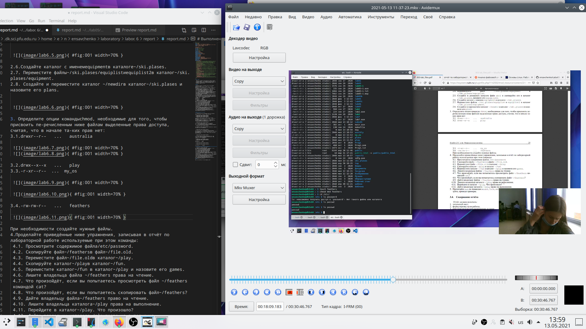{ #fig:001 width=70% }

## Слайд 28
 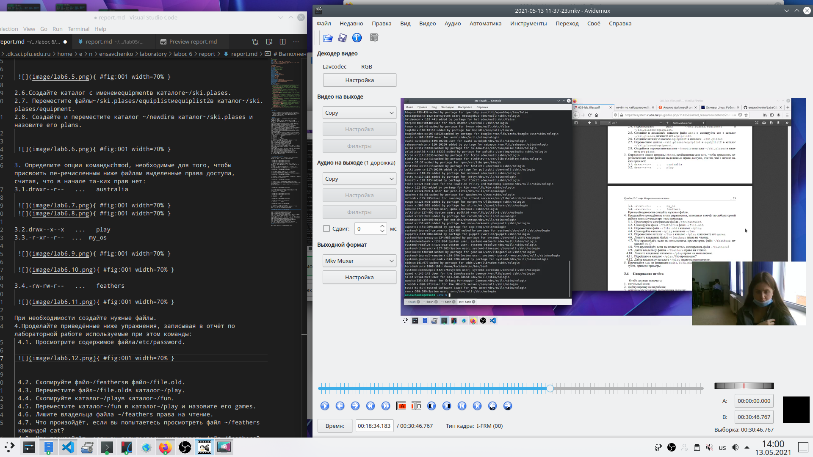{ #fig:001 width=70% }

## Слайд 29
 4.2. Скопируйте файл~/feathersв файл~/file.old.
 4.3. Переместите файл~/file.oldв каталог~/play.
 4.4. Скопируйте каталог~/playв каталог~/fun.
 4.5. Переместите каталог~/fun в каталог~/play и назовите его games.
 4.6. Лишите владельца файла ~/feathers права на чтение.
 4.7. Что произойдёт, если вы попытаетесь просмотреть файл ~/feathers командой cat?

## Слайд 30
 4.8. Что произойдёт, если вы попытаетесь скопировать файл~/feathers?
 4.9. Дайте владельцу файла~/feathers право на чтение.
 4.10. Лишите владельца каталога~/play права на выполнение.
 4.11. Перейдите в каталог~/play. Что произошло?
 4.12. Дайте владельцу каталога~/playправо на выполнение.

## Слайд 31
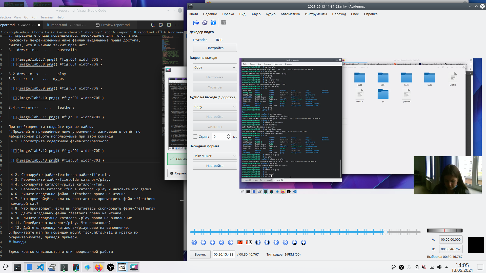{ #fig:001 width=70% }

## Слайд 32
5. Прочитайте man по командам mount,fsck,mkfs,kill и кратко их охарактеризуйте, приведя примеры.

## Слайд 33
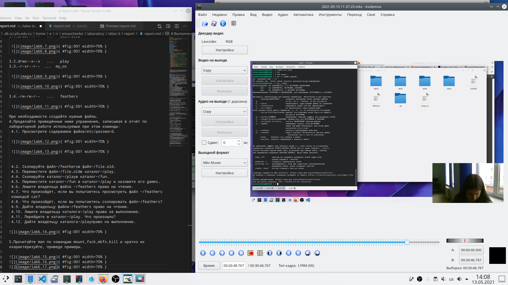{ #fig:001 width=70% }

## Слайд 34
{ #fig:001 width=70% }

## Слайд 35
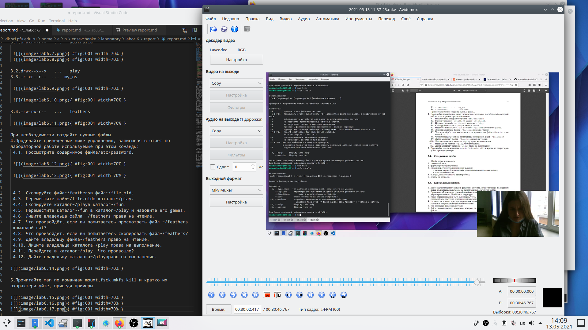{ #fig:001 width=70% }

# Выводы

Итак, подведя итоги, хотела бы сказать, что сегодня мне удалось ознакомиться с файловой системой Linux, ее структурой, именами и содержаием каталогов. Также я приобрела практические навыки по применению команд для работы с файлами и каталогами, по управлению процессами.
