---
# Front matter
lang: ru-RU
title: "Шаблон отчёта по лабораторной работе"
subtitle: "Лабораторная работа No 3. Анализ файловой системы Linux.Команды для работы с файлами и каталогами"
author: "Savchenko Elizaveta"

# Formatting
toc-title: "Содержание"
toc: true # Table of contents
toc_depth: 2
lof: true # List of figures
lot: true # List of tables
fontsize: 12pt
linestretch: 1.5
papersize: a4paper
documentclass: scrreprt
polyglossia-lang: russian
polyglossia-otherlangs: english
mainfont: PT Serif
romanfont: PT Serif
sansfont: PT Sans
monofont: PT Mono
mainfontoptions: Ligatures=TeX
romanfontoptions: Ligatures=TeX
sansfontoptions: Ligatures=TeX,Scale=MatchLowercase
monofontoptions: Scale=MatchLowercase
indent: true
pdf-engine: lualatex
header-includes:
  - \linepenalty=10 # the penalty added to the badness of each line within a paragraph (no associated penalty node) Increasing the value makes tex try to have fewer lines in the paragraph.
  - \interlinepenalty=0 # value of the penalty (node) added after each line of a paragraph.
  - \hyphenpenalty=50 # the penalty for line breaking at an automatically inserted hyphen
  - \exhyphenpenalty=50 # the penalty for line breaking at an explicit hyphen
  - \binoppenalty=700 # the penalty for breaking a line at a binary operator
  - \relpenalty=500 # the penalty for breaking a line at a relation
  - \clubpenalty=150 # extra penalty for breaking after first line of a paragraph
  - \widowpenalty=150 # extra penalty for breaking before last line of a paragraph
  - \displaywidowpenalty=50 # extra penalty for breaking before last line before a display math
  - \brokenpenalty=100 # extra penalty for page breaking after a hyphenated line
  - \predisplaypenalty=10000 # penalty for breaking before a display
  - \postdisplaypenalty=0 # penalty for breaking after a display
  - \floatingpenalty = 20000 # penalty for splitting an insertion (can only be split footnote in standard LaTeX)
  - \raggedbottom # or \flushbottom
  - \usepackage{float} # keep figures where there are in the text
  - \floatplacement{figure}{H} # keep figures where there are in the text
---

# Цель работы

  Ознакомиться с файловой системой Linux, её структурой, именами и содержанием каталогов. Приобретение практических навыков по применению команд для работы с файлами и каталогами, по управлению процессами (и работами), по проверке использования диска и обслуживанию файловой системы.

# Задание

1. Выполните все примеры, приведённые в первой части описания лабораторной работы.
2. Выполните следующие действия, зафиксировав в отчёте по лабораторной работе используемые при этом команды и результаты их выполнения: 
 2.1. Скопируйте файл/usr/include/sys/io.h в домашний каталог и назовитеего equipment. Если файла io.h нет, то используйте любой другой файл вкаталоге /usr/include/sys/ вместо него.
 2.2. В домашнем каталоге создайте директорию ~/ski.plases. 
 2.3. Переместите файлequipment в каталог ~/ski.plases. 
 2.4. Переименуйтефайл~/ski.plases/equipmentв~/ski.plases/equiplist.
 2.5. Создайте в домашнем каталоге файлabc1и скопируйте его в каталог~/ski.plases, назовите егоequiplist2.2.6.Создайте каталог с именемequipmentв каталоге~/ski.plases.
 2.7. Переместите файлы~/ski.plases/equiplistиequiplist2в каталог~/ski.plases/equipment.
 2.8. Создайте и переместите каталог~/newdirв каталог~/ski.plasesи назо-вите егоplans.3.Определите опции командыchmod, необходимые для того, чтобы присвоить пе-речисленным ниже файлам выделенные права доступа, считая, что в начале та-ких прав нет:
3.1.drwxr--r--   ...   australia
3.2.drwx--x--x   ...   play
3.3.-r-xr--r--  ...  my_os
3.4.-rw-rw-r--   ...   feathers
При необходимости создайте нужные файлы.
4.Проделайте приведённые ниже упражнения, записывая в отчёт по лабораторной работе используемые при этом команды:
 4.1. Просмотрите содержимое файла/etc/password. 
 4.2. Скопируйте файл~/feathersв файл~/file.old.
 4.3. Переместите файл~/file.oldв каталог~/play.
 4.4. Скопируйте каталог~/playв каталог~/fun.
 4.5. Переместите каталог~/fun в каталог~/play и назовите его games.
 4.6. Лишите владельца файла ~/feathers права на чтение.
 4.7. Что произойдёт, если вы попытаетесь просмотреть файл ~/feathers командой cat?
 4.8. Что произойдёт, если вы попытаетесь скопировать файл~/feathers?
 4.9. Дайте владельцу файла~/feathers право на чтение.
 4.10. Лишите владельца каталога~/play права на выполнение.
 4.11. Перейдите в каталог~/play. Что произошло?
 4.12. Дайте владельцу каталога~/playправо на выполнение.
5.Прочитайте man по командам mount,fsck,mkfs,kill и кратко их охарактеризуйте, приведя примеры.

# Выполнение лабораторной работы

1. Я выполнила все примеры, приведенный к первой части описания лабораторной работы. Продемонстрировала скриншотами.

 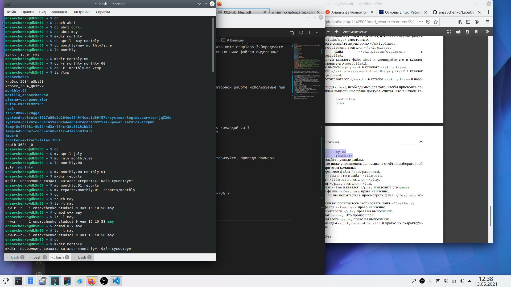{ #fig:001 width=70% }
 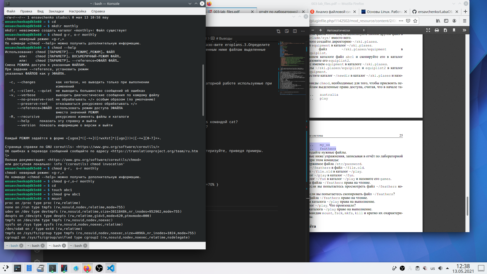{ #fig:001 width=70% }
 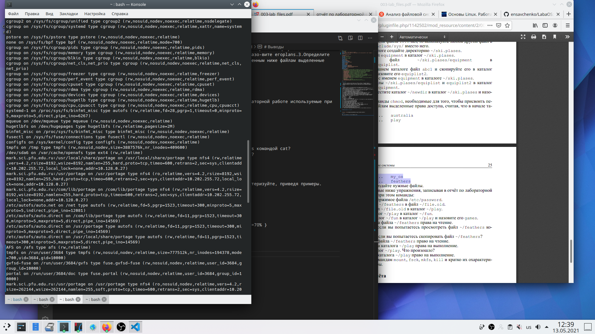{ #fig:001 width=70% }

2.  Выполните следующие действия, зафиксировав в отчёте по лабораторной работе используемые при этом команды и результаты их выполнения: 
2.1. Скопируйте файл/usr/include/sys/io.h в домашний каталог и назовитеего equipment. Если файла io.h нет, то используйте любой другой файл вкаталоге /usr/include/sys/ вместо него.
 
 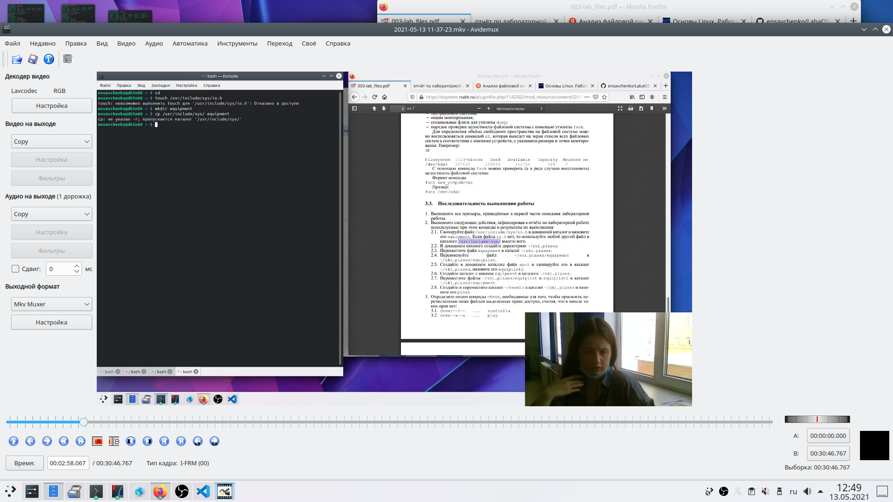{ #fig:001 width=70% }

2.2. В домашнем каталоге создайте директорию ~/ski.plases. 
2.3. Переместите файлequipment в каталог ~/ski.plases. 
2.4. Переименуйтефайл~/ski.plases/equipment в~/ski.plases/equiplist.
 
 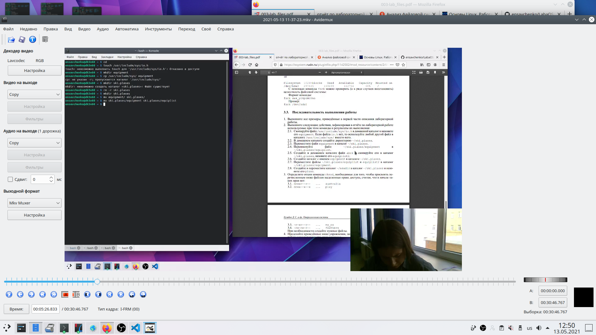{ #fig:001 width=70% }

2.5. Создайте в домашнем каталоге файлabc1и скопируйте его в каталог~/ski.plases, назовите егоequiplist2.

 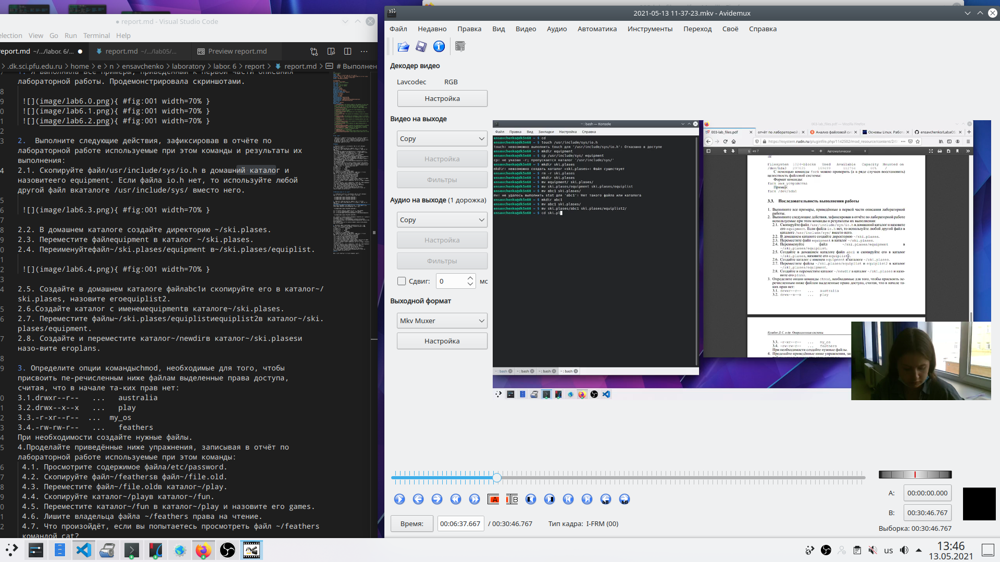{ #fig:001 width=70% }

2.6.Создайте каталог с именемequipmentв каталоге~/ski.plases.
2.7. Переместите файлы~/ski.plases/equiplistиequiplist2в каталог~/ski.plases/equipment.
2.8. Создайте и переместите каталог ~/newdirв каталог~/ski.plases и назовите его plans.

 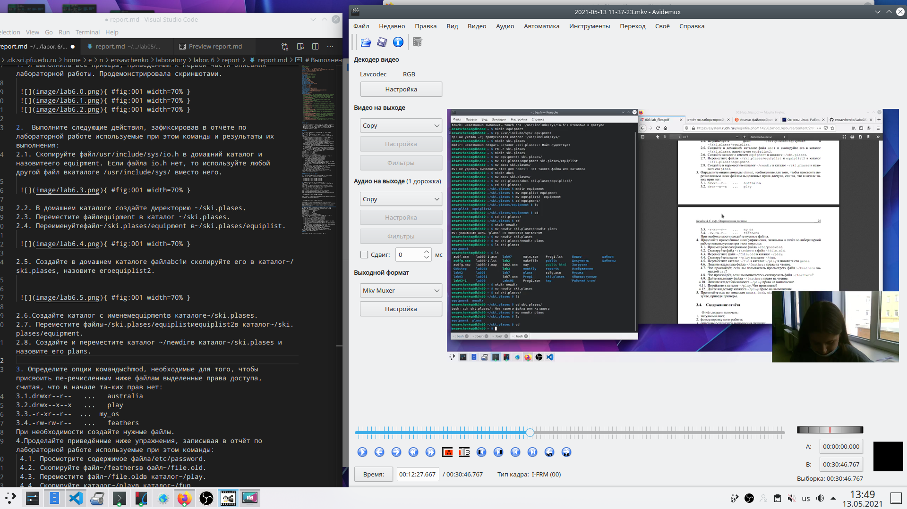{ #fig:001 width=70% }

3. Определите опции командыchmod, необходимые для того, чтобы присвоить пе-речисленным ниже файлам выделенные права доступа, считая, что в начале та-ких прав нет:
3.1.drwxr--r--   ...   australia

 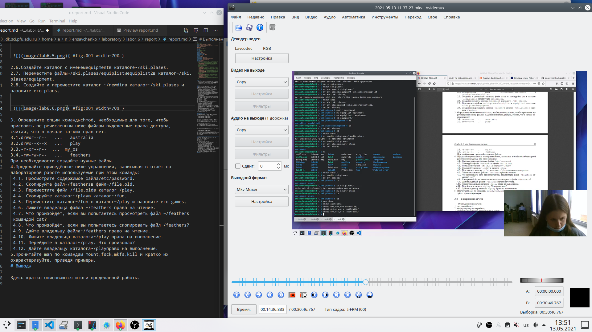{ #fig:001 width=70% }
 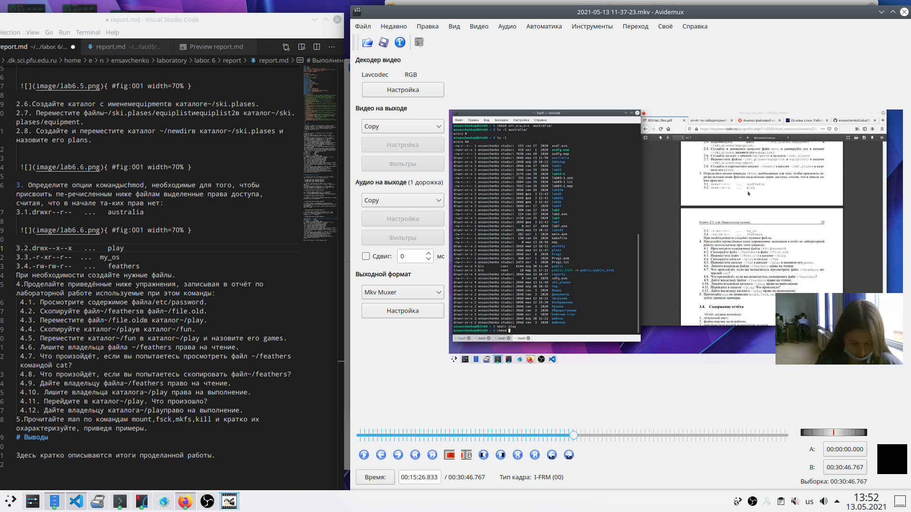{ #fig:001 width=70% }

3.2.drwx--x--x   ...   play
3.3.-r-xr--r--  ...  my_os

 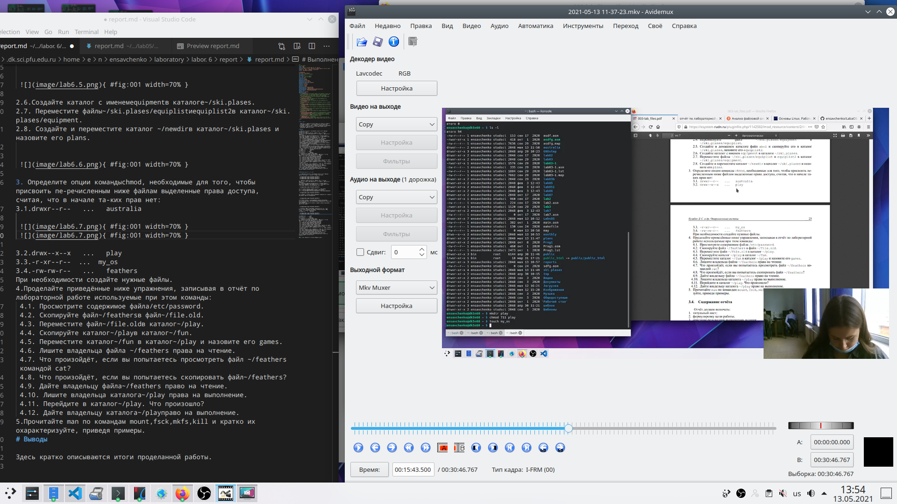{ #fig:001 width=70% }

 { #fig:001 width=70% }

3.4.-rw-rw-r--   ...   feathers

 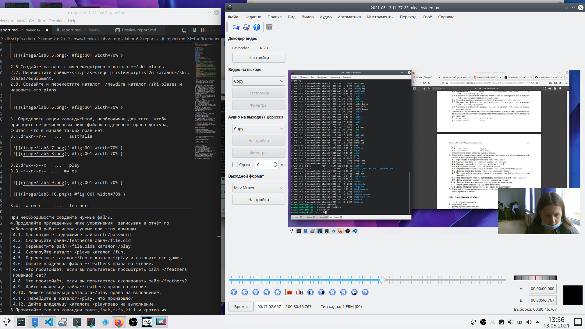{ #fig:001 width=70% }

При необходимости создайте нужные файлы.
4. Проделайте приведённые ниже упражнения, записывая в отчёт по лабораторной работе используемые при этом команды:
 4.1. Просмотрите содержимое файла/etc/password. 

 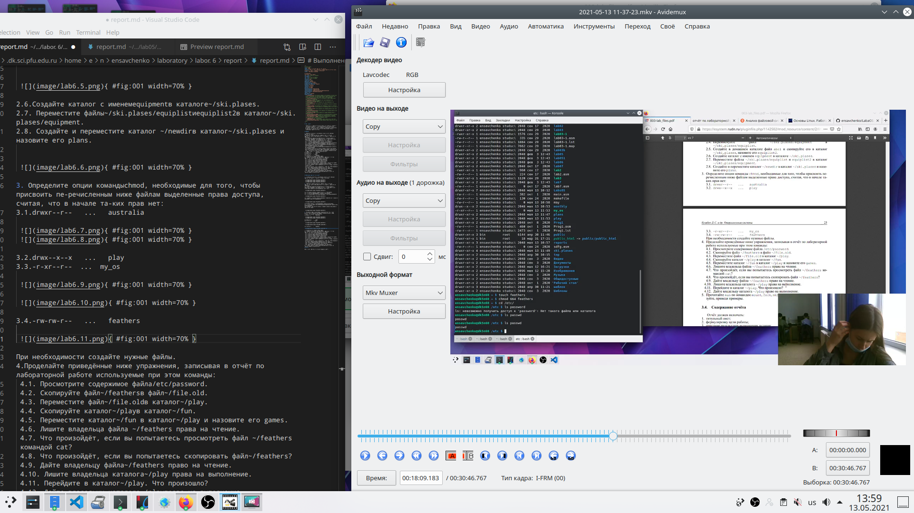{ #fig:001 width=70% }

 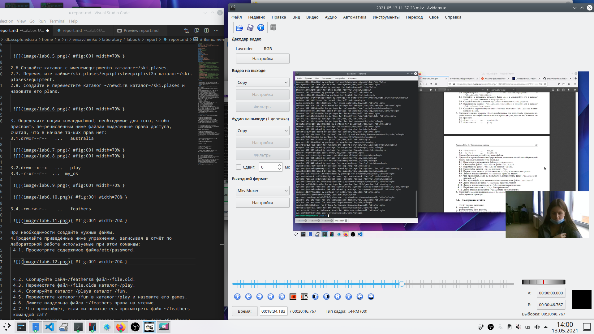{ #fig:001 width=70% }

 4.2. Скопируйте файл~/feathersв файл~/file.old.
 4.3. Переместите файл~/file.oldв каталог~/play.
 4.4. Скопируйте каталог~/playв каталог~/fun.
 4.5. Переместите каталог~/fun в каталог~/play и назовите его games.
 4.6. Лишите владельца файла ~/feathers права на чтение.
 4.7. Что произойдёт, если вы попытаетесь просмотреть файл ~/feathers командой cat?
 4.8. Что произойдёт, если вы попытаетесь скопировать файл~/feathers?
 4.9. Дайте владельцу файла~/feathers право на чтение.
 4.10. Лишите владельца каталога~/play права на выполнение.
 4.11. Перейдите в каталог~/play. Что произошло?
 4.12. Дайте владельцу каталога~/playправо на выполнение.

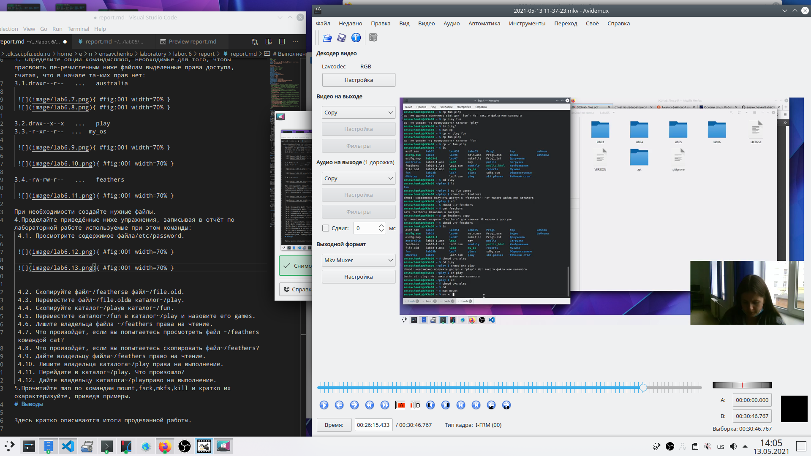{ #fig:001 width=70% }

5. Прочитайте man по командам mount,fsck,mkfs,kill и кратко их охарактеризуйте, приведя примеры.

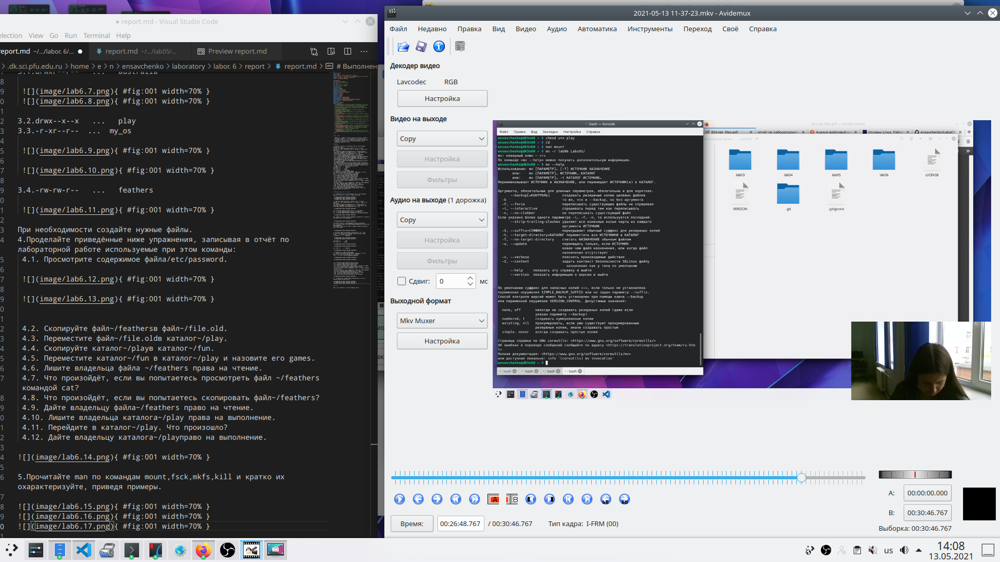{ #fig:001 width=70% }
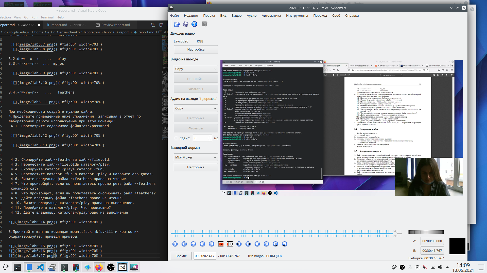{ #fig:001 width=70% }
{ #fig:001 width=70% }

# Выводы

Итак, подведя итоги, хотела бы сказать, что сегодня мне удалось ознакомиться с файловой системой Linux, ее структурой, именами и содержаием каталогов. Также я приобрела практические навыки по применению команд для работы с файлами и каталогами, по управлению процессами.
