---
## Front matter
lang: ru-RU
title: "Лабораторная работа No 3. Анализ файловой системы Linux.Команды для работы с файлами и каталогами"
author: "Elizaveta Savchenko"
institute: |
	\inst{1}RUDN University, Moscow, Russian Federation
	
date: 13.05.2021

## Formatting
toc: false
slide_level: 2
theme: metropolis
header-includes: 
 - \metroset{progressbar=frametitle,sectionpage=progressbar,numbering=fraction}
 - '\makeatletter'
 - '\beamer@ignorenonframefalse'
 - '\makeatother'
aspectratio: 43
section-titles: true
---

# Цель работы

Ознакомление с инструментами поиска файлов и фильтрации текстовых дан-ных. Приобретение практических навыков: по управлению процессами (и заданиями), по проверке использования диска и обслуживанию файловых систем.

# Задание

## Слайд 1

1. Осуществите вход в систему, используя соответствующее имя пользователя.
2. Запишите в файл file.txt названия файлов, содержащихся в каталоге /etc. Допишите в этот же файл названия файлов, содержащихся в вашем домашнемкаталоге.
3. Выведите имена всех файлов изfile.txt, имеющих расширение.conf, поглечего запишите их в новый текстовой файлconf.txt.
4. Определите, какие файлы в вашем домашнем каталоге имеют имена, начинав-шиеся с символаc? Предложите несколько вариантов, как это сделать.

## Слайд 2
5. Выведите на экран (по странично) имена файлов из каталога /etc, начинающи-еся с символаh. 
6. Запустите в фоновом режиме процесс, который будет записывать в файл~/logfileфайлы, имена которых начинаются сlog.
7. Удалите файл~/logfile.
8. Запустите из консолив фоновом режимередакторgedit.

## Слайд 3
9. Определите идентификатор процессаgedit, используя командуps, конвейер ифильтрgrep. Можно ли определить этот идентификатор более простым способом?
Описываются проведённые действия, в качестве иллюстрации даётся ссылка на иллюстрацию (рис. -@fig:001)d, выведите имена всех директорий,имеющихся в вашем домашнем каталоге.

# Выполнение лабораторной работы

1. Осуществите вход в систему, используя соответствующее имя пользователя.
2. Запишите в файл file.txt названия файлов, содержащихся в каталоге /etc. Допишите в этот же файл названия файлов, содержащихся в вашем домашнемкаталоге.

## Слайд 4
 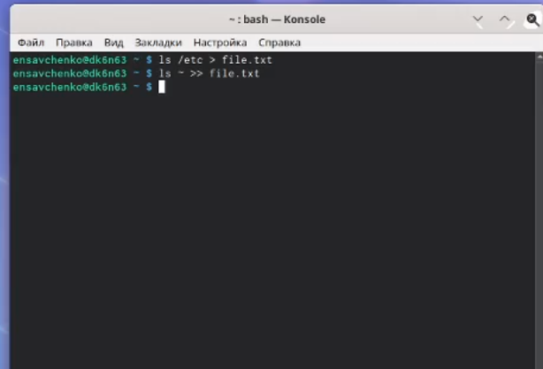{ #fig:001 width=70% }

## Слайд 5

3. Выведите имена всех файлов из file.txt, имеющих расширение.conf, поглечего запишите их в новый текстовой файлconf.txt.

## Слайд 6
 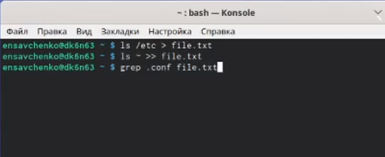{ #fig:001 width=70% }

## Слайд 7
 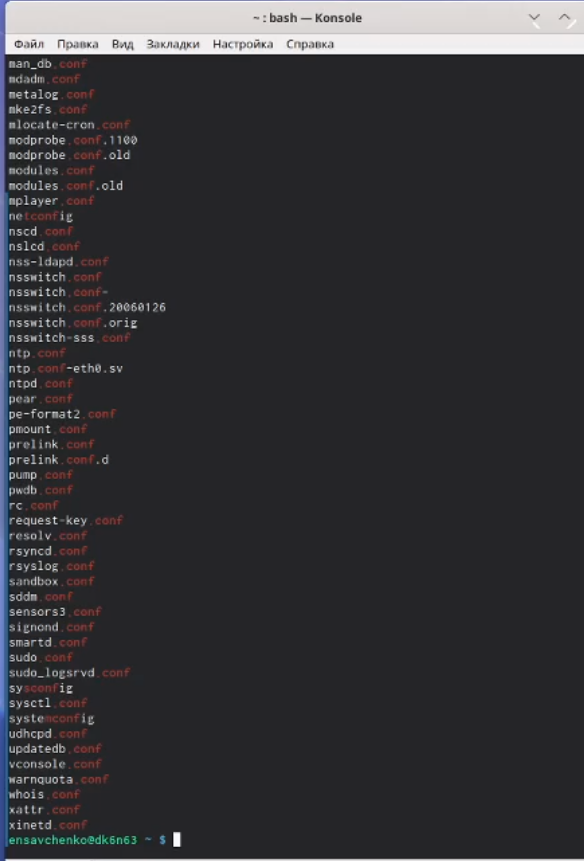{ #fig:001 width=70% }

## Слайд 8
{ #fig:001 width=70% }

## Слайд 9
4. Определите, какие файлы в вашем домашнем каталоге имеют имена, начинав-шиеся с символаc? Предложите несколько вариантов, как это сделать.

## Слайд 10
 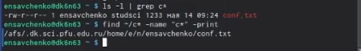{ #fig:001 width=70% }

## Слайд 11

5. Выведите на экран (по странично) имена файлов из каталога /etc, начинающи-еся с символаh. 

 
## Слайд 12
6. Запустите в фоновом режиме процесс, который будет записывать в файл~/logfileфайлы, имена которых начинаются сlog.

7. Удалите файл~/logfile.

## Слайд 13
 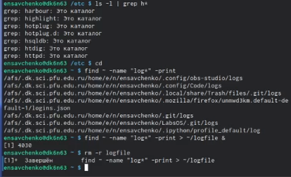{ #fig:001 width=70% }

## Слайд 14

8. Запустите из консолив фоновом режиме редактор gedit.

 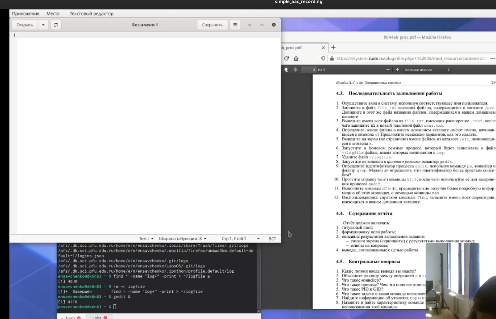{ #fig:001 width=70% }

## Слайд 15
9. Определите идентификатор процессаgedit, используя командуps, конвейер ифильтрgrep. Можно ли определить этот идентификатор более простым способом?

## Слайд 16
 { #fig:001 width=70% }

## Слайд 17

10. Прочтите справку (man) команды kill, после чего используйте её для завершения процессаgedit.

## Слайд 18
 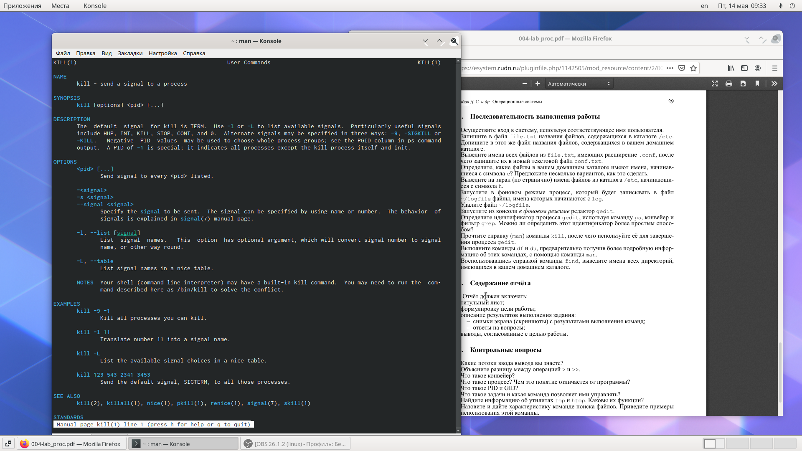{ #fig:001 width=70% }

## Слайд 19
 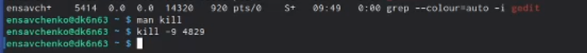{ #fig:001 width=70% }

11. Выполните команды df и du, предварительно получив более подробную инфор-мацию об этих командах, с помощью командыman.

## Слайд 20
 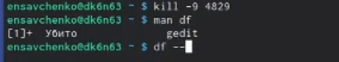{ #fig:001 width=70% }

## Слайд 21
 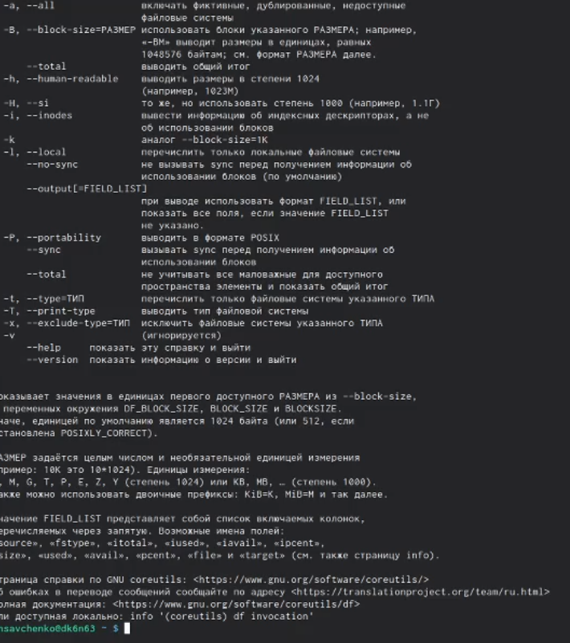{ #fig:001 width=70% }

## Слайд 22
 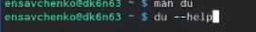{ #fig:001 width=70% }

## Слайд 23
 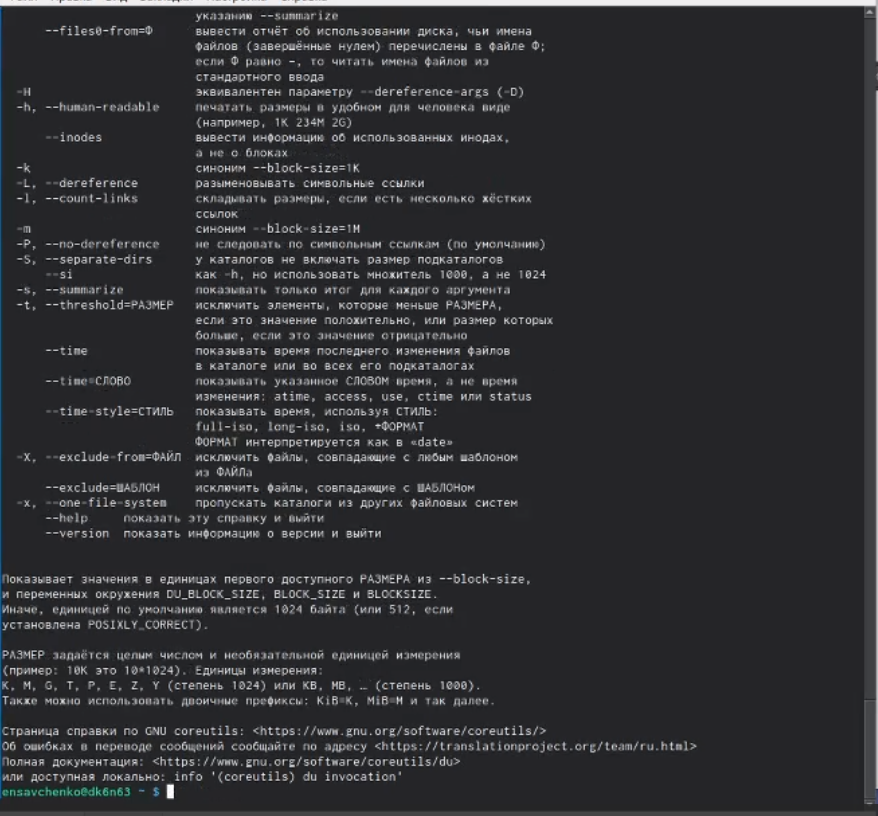{ #fig:001 width=70% }

## Слайд 24
 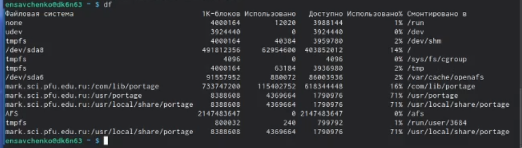{ #fig:001 width=70% }

## Слайд 25
 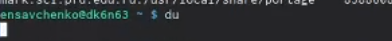{ #fig:001 width=70% }

## Слайд 26
12. Воспользовавшись справкой команды find, выведите имена всех директорий,имеющихся в вашем домашнем каталоге.

 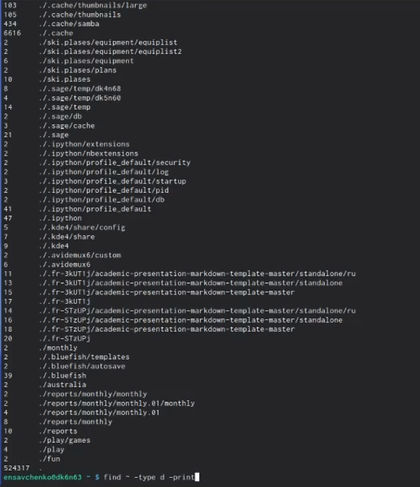{ #fig:001 width=70% }

## Слайд 27
 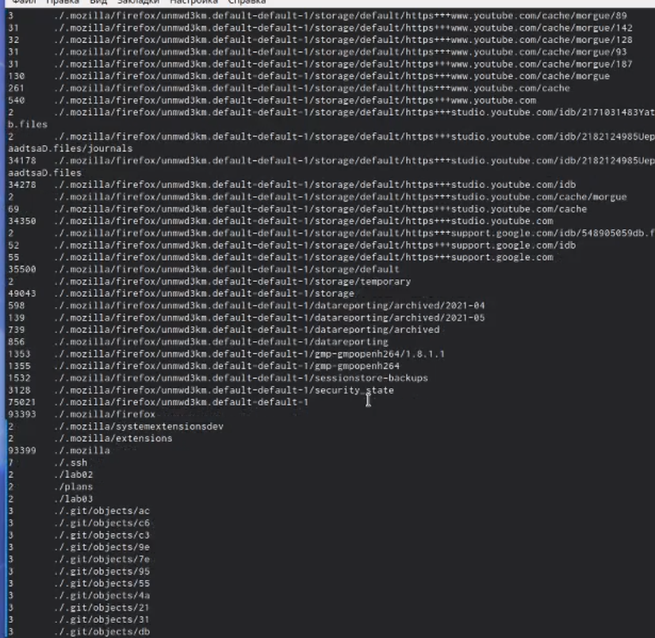{ #fig:001 width=70% }

# Выводы

Я ознакомилась с инструментами поиска файлов и фильтрации текстовых данных. Приобрела практические навыки: по управлению процессами (и заданиями), по проверке использования диска и обслуживанию файловых систем.