---
# Front matter
lang: ru-RU
title: Лабораторная работа No 4. Поиск файлов. Перенаправлениеввода-вывода. Просмотр запущенных процессов.
author: "Savchenko Elizaveta"

# Formatting
toc-title: "Содержание"
toc: true # Table of contents
toc_depth: 2
lof: true # List of figures
lot: true # List of tables
fontsize: 12pt
linestretch: 1.5
papersize: a4paper
documentclass: scrreprt
polyglossia-lang: russian
polyglossia-otherlangs: english
mainfont: PT Serif
romanfont: PT Serif
sansfont: PT Sans
monofont: PT Mono
mainfontoptions: Ligatures=TeX
romanfontoptions: Ligatures=TeX
sansfontoptions: Ligatures=TeX,Scale=MatchLowercase
monofontoptions: Scale=MatchLowercase
indent: true
pdf-engine: lualatex
header-includes:
  - \linepenalty=10 # the penalty added to the badness of each line within a paragraph (no associated penalty node) Increasing the value makes tex try to have fewer lines in the paragraph.
  - \interlinepenalty=0 # value of the penalty (node) added after each line of a paragraph.
  - \hyphenpenalty=50 # the penalty for line breaking at an automatically inserted hyphen
  - \exhyphenpenalty=50 # the penalty for line breaking at an explicit hyphen
  - \binoppenalty=700 # the penalty for breaking a line at a binary operator
  - \relpenalty=500 # the penalty for breaking a line at a relation
  - \clubpenalty=150 # extra penalty for breaking after first line of a paragraph
  - \widowpenalty=150 # extra penalty for breaking before last line of a paragraph
  - \displaywidowpenalty=50 # extra penalty for breaking before last line before a display math
  - \brokenpenalty=100 # extra penalty for page breaking after a hyphenated line
  - \predisplaypenalty=10000 # penalty for breaking before a display
  - \postdisplaypenalty=0 # penalty for breaking after a display
  - \floatingpenalty = 20000 # penalty for splitting an insertion (can only be split footnote in standard LaTeX)
  - \raggedbottom # or \flushbottom
  - \usepackage{float} # keep figures where there are in the text
  - \floatplacement{figure}{H} # keep figures where there are in the text
---

# Цель работы

Ознакомление с инструментами поиска файлов и фильтрации текстовых дан-ных. Приобретение практических навыков: по управлению процессами (и заданиями), по проверке использования диска и обслуживанию файловых систем.

# Задание

1. Осуществите вход в систему, используя соответствующее имя пользователя.
2. Запишите в файл file.txt названия файлов, содержащихся в каталоге /etc. Допишите в этот же файл названия файлов, содержащихся в вашем домашнемкаталоге.
3. Выведите имена всех файлов изfile.txt, имеющих расширение.conf, поглечего запишите их в новый текстовой файлconf.txt.
4. Определите, какие файлы в вашем домашнем каталоге имеют имена, начинав-шиеся с символаc? Предложите несколько вариантов, как это сделать.
5. Выведите на экран (по странично) имена файлов из каталога /etc, начинающи-еся с символаh. 
6. Запустите в фоновом режиме процесс, который будет записывать в файл~/logfileфайлы, имена которых начинаются сlog.
7. Удалите файл~/logfile.
8. Запустите из консолив фоновом режимередакторgedit.
9. Определите идентификатор процессаgedit, используя командуps, конвейер ифильтрgrep. Можно ли определить этот идентификатор более простым способом?
Описываются проведённые действия, в качестве иллюстрации даётся ссылка на иллюстрацию (рис. -@fig:001)d, выведите имена всех директорий,имеющихся в вашем домашнем каталоге.

# Выполнение лабораторной работы

1. Осуществите вход в систему, используя соответствующее имя пользователя.
2. Запишите в файл file.txt названия файлов, содержащихся в каталоге /etc. Допишите в этот же файл названия файлов, содержащихся в вашем домашнемкаталоге.

 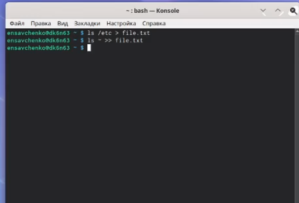{ #fig:001 width=70% }

3. Выведите имена всех файлов из file.txt, имеющих расширение.conf, поглечего запишите их в новый текстовой файлconf.txt.

 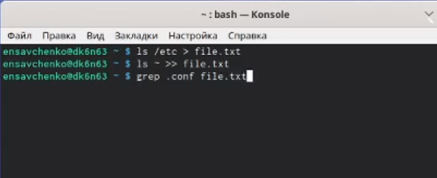{ #fig:001 width=70% }
 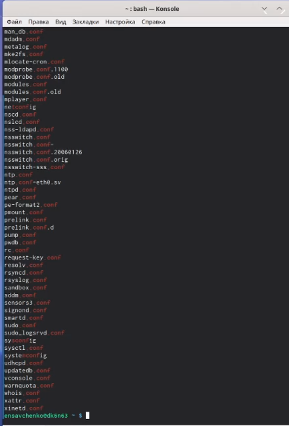{ #fig:001 width=70% }
{ #fig:001 width=70% }
4. Определите, какие файлы в вашем домашнем каталоге имеют имена, начинав-шиеся с символаc? Предложите несколько вариантов, как это сделать.

 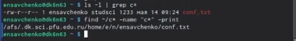{ #fig:001 width=70% }

5. Выведите на экран (по странично) имена файлов из каталога /etc, начинающи-еся с символаh. 

 

6. Запустите в фоновом режиме процесс, который будет записывать в файл~/logfileфайлы, имена которых начинаются сlog.

7. Удалите файл~/logfile.

 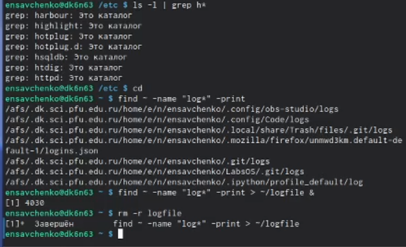{ #fig:001 width=70% }

8. Запустите из консолив фоновом режиме редактор gedit.

 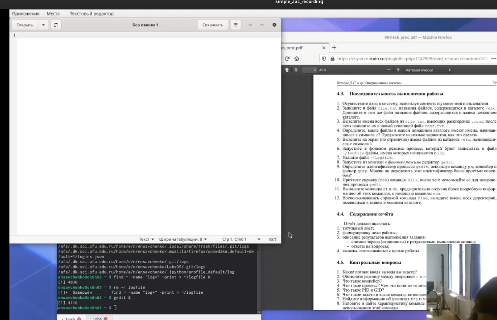{ #fig:001 width=70% }

9. Определите идентификатор процессаgedit, используя командуps, конвейер ифильтрgrep. Можно ли определить этот идентификатор более простым способом?

 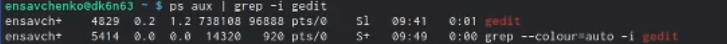{ #fig:001 width=70% }

10. Прочтите справку (man) команды kill, после чего используйте её для заверше-ния процессаgedit.

 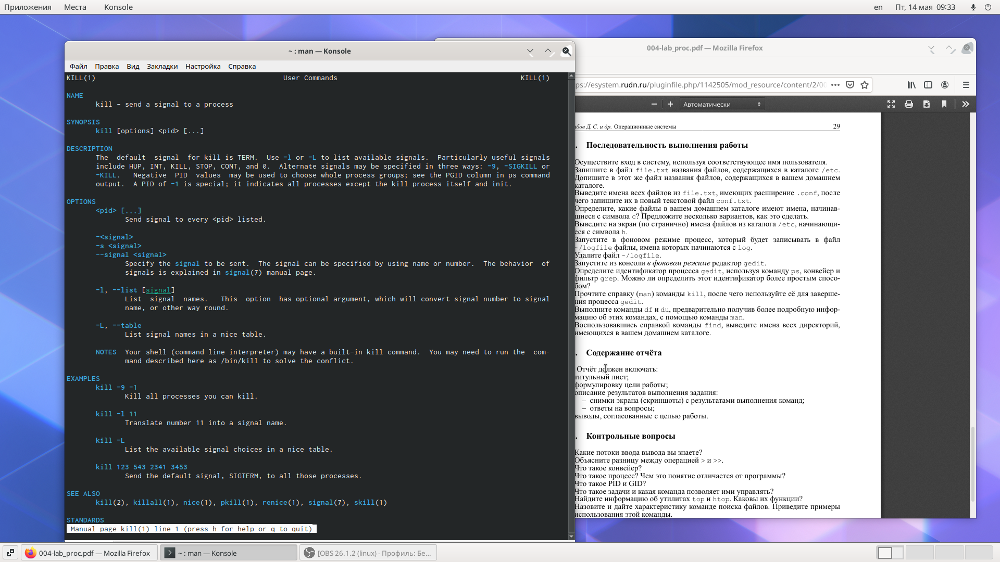{ #fig:001 width=70% }
 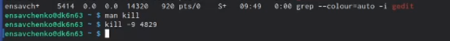{ #fig:001 width=70% }

11. Выполните команды df и du, предварительно получив более подробную инфор-мацию об этих командах, с помощью командыman.

 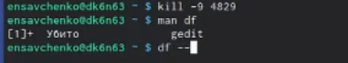{ #fig:001 width=70% }
 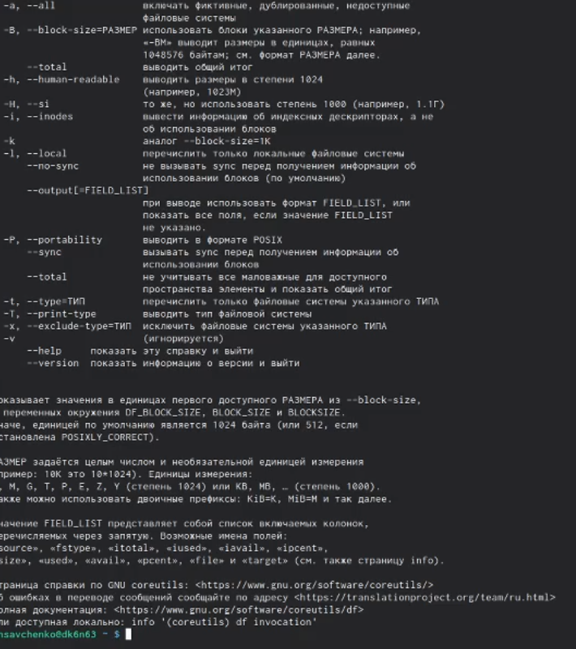{ #fig:001 width=70% }
 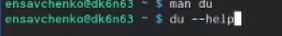{ #fig:001 width=70% }
 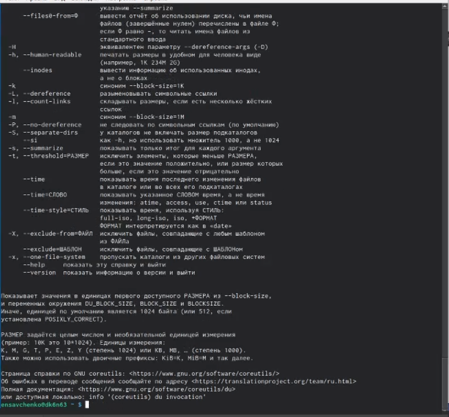{ #fig:001 width=70% }
 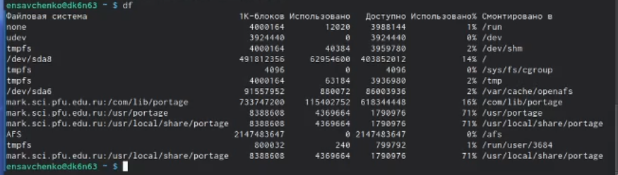{ #fig:001 width=70% }
 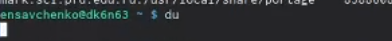{ #fig:001 width=70% }

12. Воспользовавшись справкой команды find, выведите имена всех директорий,имеющихся в вашем домашнем каталоге.

 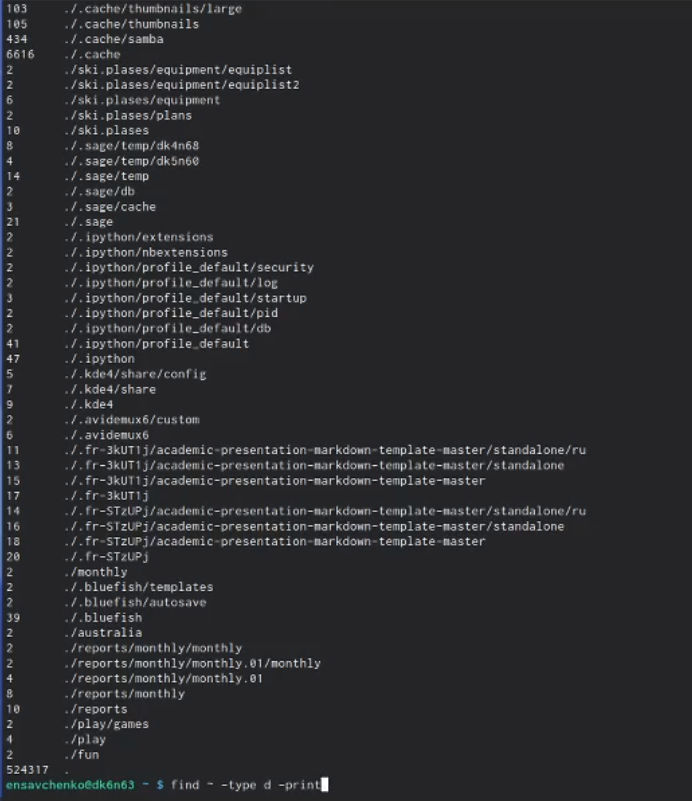{ #fig:001 width=70% }
 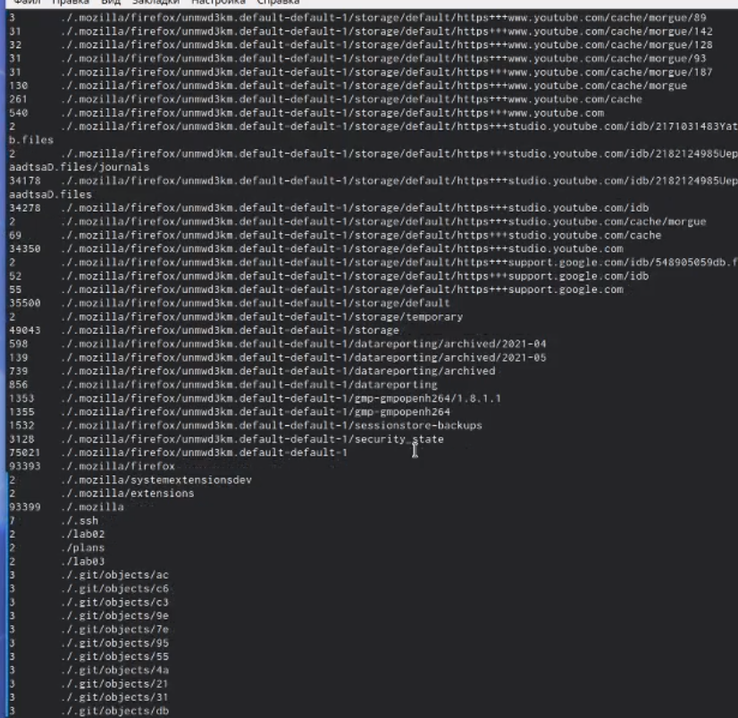{ #fig:001 width=70% }

# Выводы

Я ознакомилась с инструментами поиска файлов и фильтрации текстовых данных. Приобрела практические навыки: по управлению процессами (и заданиями), по проверке использования диска и обслуживанию файловых систем.
