---
## Front matter
lang: ru-RU
title: "Лабораторная работа No 3. Анализ файловой системы Linux.Команды для работы с файлами и каталогами"
author: "Elizaveta Savchenko"
institute: |
	\inst{1}RUDN University, Moscow, Russian Federation
	
date: 13.05.2021

## Formatting
toc: false
slide_level: 2
theme: metropolis
header-includes: 
 - \metroset{progressbar=frametitle,sectionpage=progressbar,numbering=fraction}
 - '\makeatletter'
 - '\beamer@ignorenonframefalse'
 - '\makeatother'
aspectratio: 43
section-titles: true
---

# Цель работы

Освоение основных возможностей командной оболочки Midnight Commander.Приобретение навыков практической работы по просмотру каталогов и файлов; ма-нипуляций с ними.

# Задание

Задание по mc
 1. Изучите информацию о mc, вызвав в командной строкеman mc.
 2. Запустите из командной строки mc, изучите его структуру и меню.
 3. Выполните несколько операций в mc, используя управляющие клавиши(операции с панелями; выделение/отмена выделения файлов, копирова-ние/перемещение файлов, получение информации о размере и правах доступана файлы и/или каталоги и т.п.)

 ## Слайд 1
 4. Выполните основные команды меню левой (или правой) панели. Оцените сте-пень подробности вывода информации о файлах.
 5. Используя возможности подменюФайл, выполните:–просмотр содержимого текстового файла;–редактирование содержимого текстового файла (без сохранения результатовредактирования);–создание каталога;–копирование в файлов в созданный каталог.

 ## Слайд 2
 6. С помощью соответствующих средств подменюКомандаосуществите:–поиск в файловой системе файла с заданными условиями (например, файлас расширением.cили.cpp, содержащего строкуmain);–выбор и повторение одной из предыдущих команд;–переход в домашний каталог;–анализ файла меню и файла расширений.
 7. Вызовите подменюНастройки. Освойте операции, определяющие структуруэкрана mc (Full screen, Double Width, Show Hidden Files и т.д.)
 
## Слайд 3
Задание по встроенному редактору mc
 1. Создайте текстовой файлtext.txt.
 2. Откройте этот файл с помощью встроенного вmcредактора.
 3. Вставьте в открытый файл небольшой фрагмент текста, скопированный из лю-бого другого файла или Интернета.
 4. Проделайте с текстом следующие манипуляции, используя горячие клавиши:4.1.Удалите строку текста.

## Слайд 4
4.2.Выделите фрагмент текста и скопируйте его на новую строку.
4.3.Выделите фрагмент текста и перенесите его на новую строку.
4.4.Сохраните файл.
4.5.Отмените последнее действие.

## Слайд 5
4.6.Перейдите в конец файла (нажав комбинацию клавиш) и напишите некото-рый текст.
4.7.Перейдите в начало файла (нажав комбинацию клавиш) и напишите неко-торый текст.
4.8.Сохраните и закройте файл.

## Слайд 6
 5. Откройте файл с исходным текстом на некотором языке программирования (на-пример C или Java)
 6. Используя меню редактора, включите подсветку синтаксиса, если она не вклю-чена, или выключите, если она включена

# Выполнение лабораторной работы

Задание по mc
 1. Изучите информацию о mc, вызвав в командной строкеman mc.

 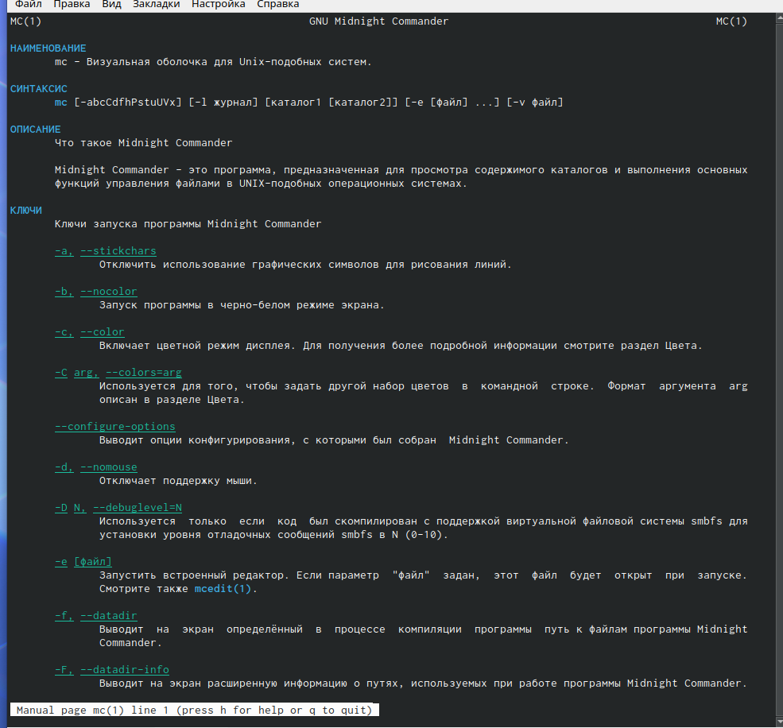{ #fig:001 width=70% }

## Слайд 7

 2. Запустите из командной строки mc, изучите его структуру и меню.

 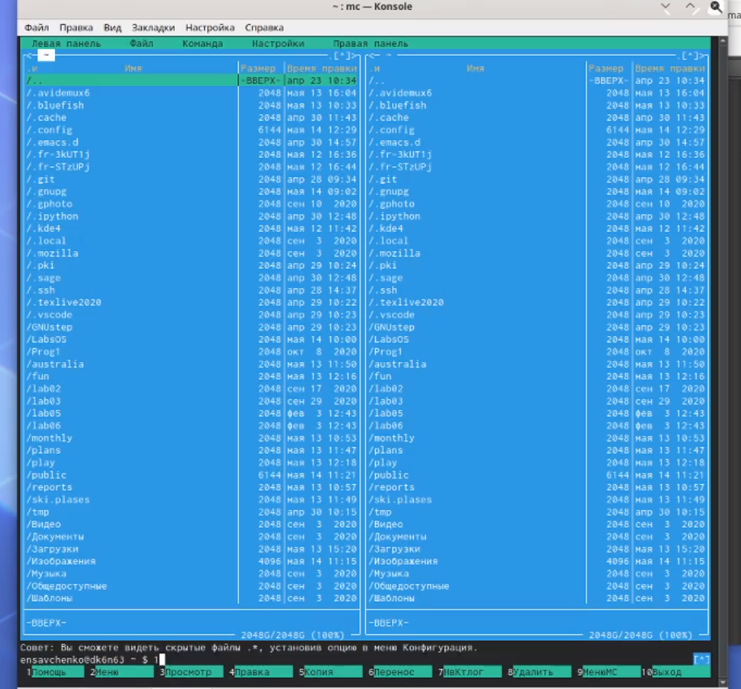{ #fig:001 width=70% }

## Слайд 8

 3. Выполните несколько операций в mc, используя управляющие клавиши(операции с панелями; выделение/отмена выделения файлов, копирова-ние/перемещение файлов, получение информации о размере и правах доступана файлы и/или каталоги и т.п.)
 

## Слайд 9
 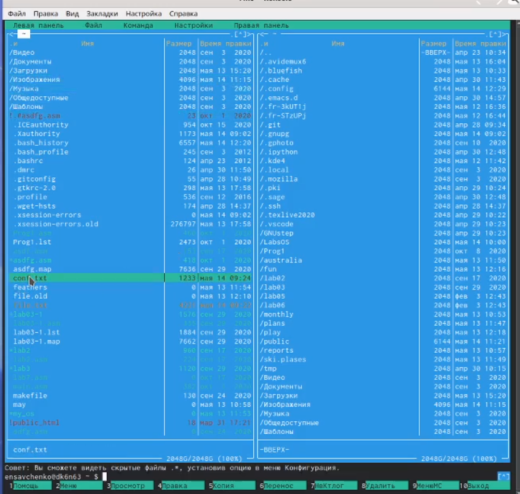{ #fig:001 width=70% }

## Слайд 10
 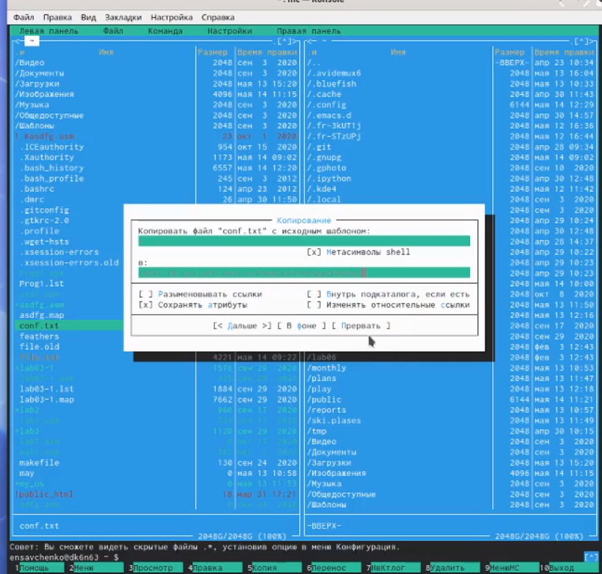{ #fig:001 width=70% }

## Слайд 11
 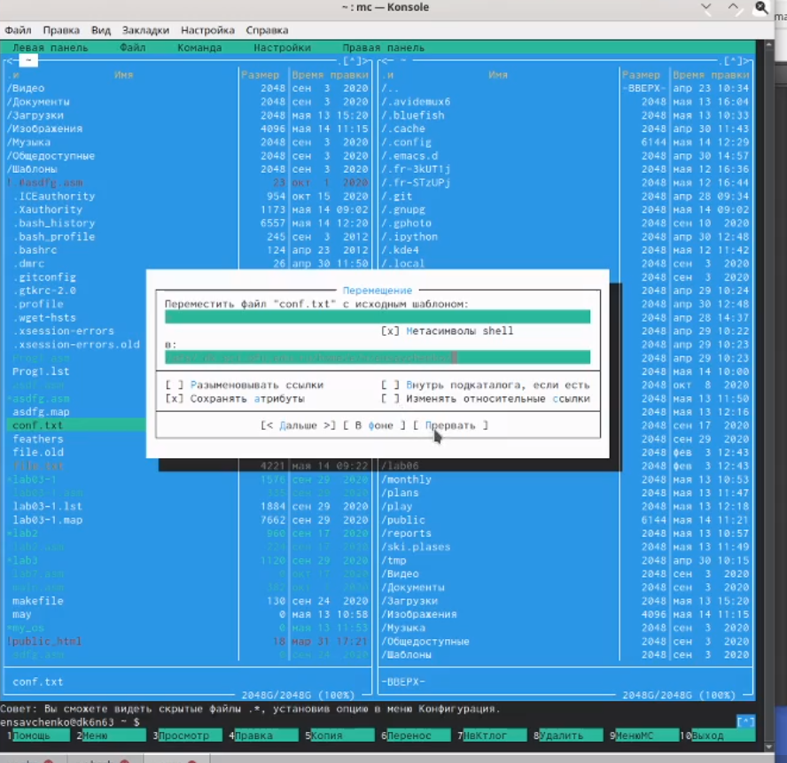{ #fig:001 width=70% }

## Слайд 12
 4. Выполните основные команды меню левой (или правой) панели. Оцените сте-пень подробности вывода информации о файлах.

## Слайд 13
 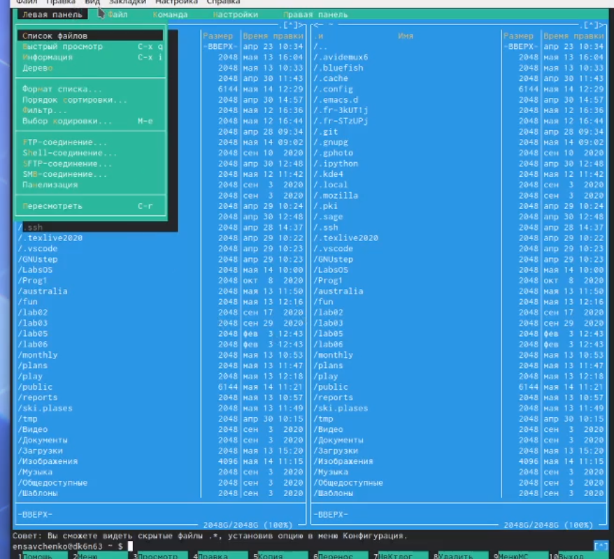{ #fig:001 width=70% }

## Слайд 14
 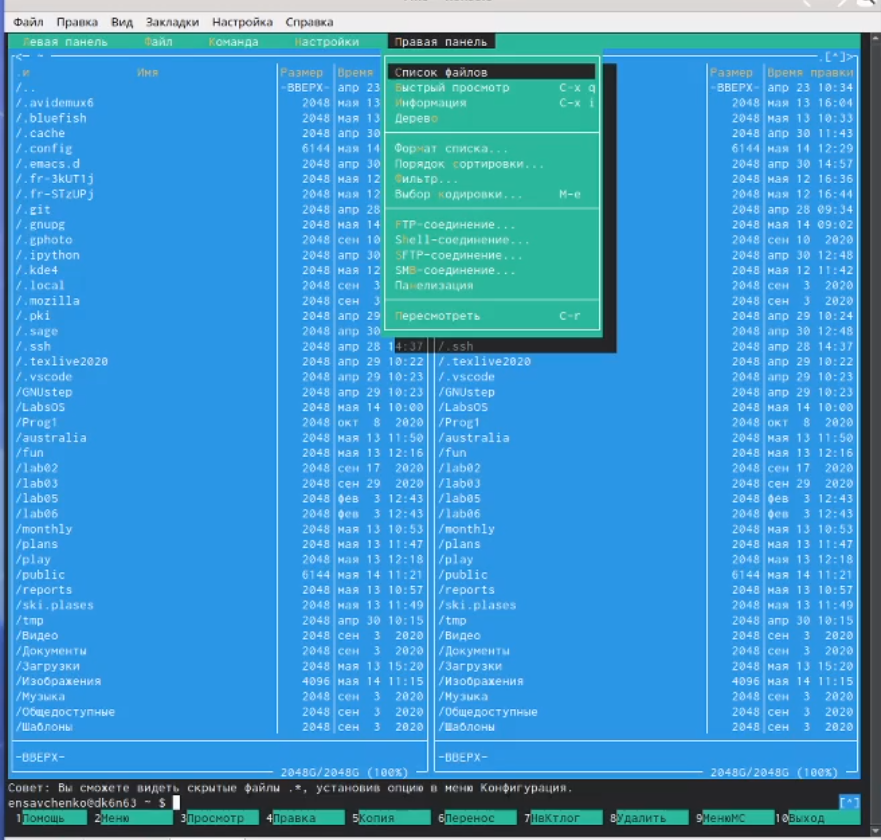{ #fig:001 width=70% }

## Слайд 15
 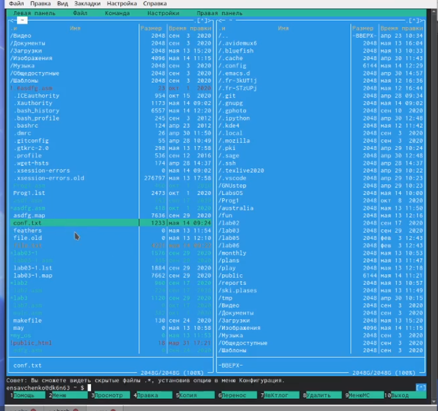{ #fig:001 width=70% }

## Слайд 16
 5. Используя возможности подменюФайл, выполните:–просмотр содержимого текстового файла;–редактирование содержимого текстового файла (без сохранения результатовредактирования);–создание каталога;–копирование в файлов в созданный каталог.

## Слайд 17
 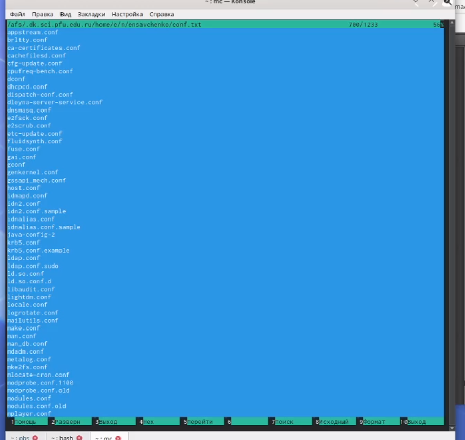{ #fig:001 width=70% }

## Слайд 18
 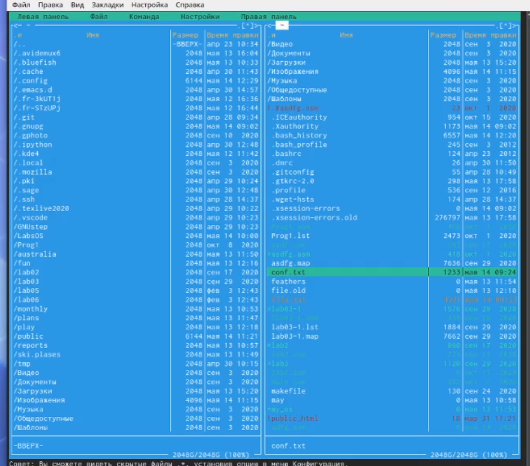{ #fig:001 width=70% }

## Слайд 19
 6. С помощью соответствующих средств подменюКомандаосуществите:–поиск в файловой системе файла с заданными условиями (например, файлас расширением.cили.cpp, содержащего строкуmain);–выбор и повторение одной из предыдущих команд;–переход в домашний каталог;–анализ файла меню и файла расширений.

## Слайд 20

 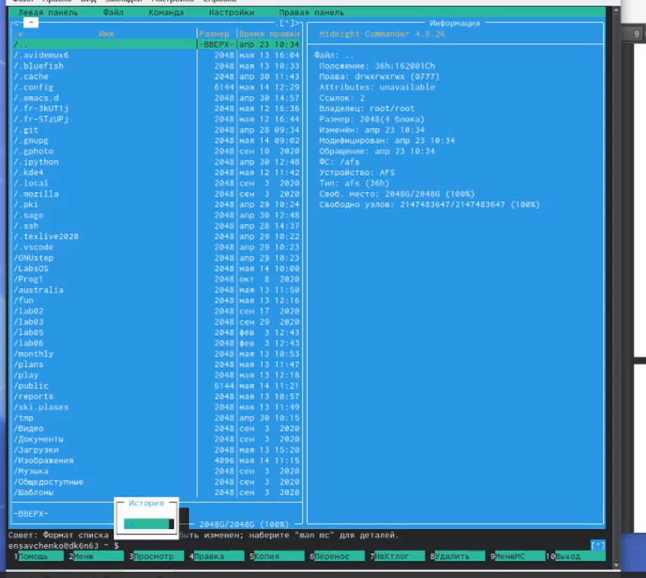{ #fig:001 width=70% }
 
## Слайд 21
 7. Вызовите подменюНастройки. Освойте операции, определяющие структуруэкрана mc (Full screen, Double Width, Show Hidden Files и т.д.)
 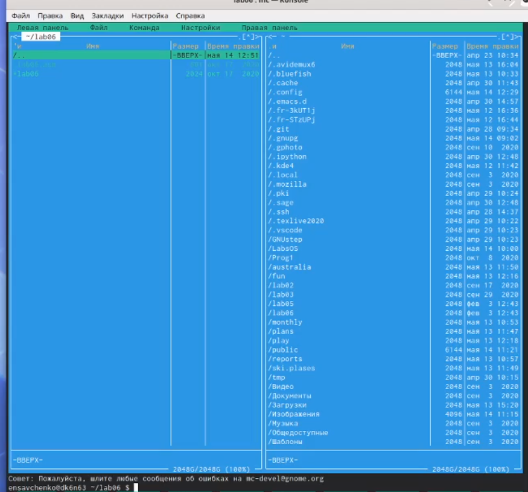{ #fig:001 width=70% }

## Слайд 22
Задание по встроенному редактору mc
 1. Создайте текстовой файлtext.txt.

 { #fig:001 width=70% }

## Слайд 23
 2. Откройте этот файл с помощью встроенного вmcредактора.

 { #fig:001 width=70% }

## Слайд 24
 3. Вставьте в открытый файл небольшой фрагмент текста, скопированный из лю-бого другого файла или Интернета.

## Слайд 25
 { #fig:001 width=70% }

## Слайд 26
 4. Проделайте с текстом следующие манипуляции, используя горячие клавиши:4.1.Удалите строку текста.
4.2.Выделите фрагмент текста и скопируйте его на новую строку.
4.3.Выделите фрагмент текста и перенесите его на новую строку.
4.4.Сохраните файл.
4.5.Отмените последнее действие.

## Слайд 27
4.6.Перейдите в конец файла (нажав комбинацию клавиш) и напишите некото-рый текст.
4.7.Перейдите в начало файла (нажав комбинацию клавиш) и напишите неко-торый текст.
4.8.Сохраните и закройте файл.

## Слайд 28
{ #fig:001 width=70% }

## Слайд 29
 5. Откройте файл с исходным текстом на некотором языке программирования (на-пример C или Java)
 6. Используя меню редактора, включите подсветку синтаксиса, если она не вклю-чена, или выключите, если она включена

## Слайд 30
 { #fig:001 width=70% }

# Выводы

Я освоила основные возможности командной оболочки Midnight Commander.Приобретение навыков практической работы по просмотру каталогов и файлов; ма-нипуляций с ними.
