---
# Front matter
lang: ru-RU
title: "Шаблон отчёта по лабораторной работе"
subtitle: "Простейший вариант"
author: "Дмитрий Сергеевич Кулябов"

# Formatting
toc-title: "Содержание"
toc: true # Table of contents
toc_depth: 2
lof: true # List of figures
lot: true # List of tables
fontsize: 12pt
linestretch: 1.5
papersize: a4paper
documentclass: scrreprt
polyglossia-lang: russian
polyglossia-otherlangs: english
mainfont: PT Serif
romanfont: PT Serif
sansfont: PT Sans
monofont: PT Mono
mainfontoptions: Ligatures=TeX
romanfontoptions: Ligatures=TeX
sansfontoptions: Ligatures=TeX,Scale=MatchLowercase
monofontoptions: Scale=MatchLowercase
indent: true
pdf-engine: lualatex
header-includes:
  - \linepenalty=10 # the penalty added to the badness of each line within a paragraph (no associated penalty node) Increasing the value makes tex try to have fewer lines in the paragraph.
  - \interlinepenalty=0 # value of the penalty (node) added after each line of a paragraph.
  - \hyphenpenalty=50 # the penalty for line breaking at an automatically inserted hyphen
  - \exhyphenpenalty=50 # the penalty for line breaking at an explicit hyphen
  - \binoppenalty=700 # the penalty for breaking a line at a binary operator
  - \relpenalty=500 # the penalty for breaking a line at a relation
  - \clubpenalty=150 # extra penalty for breaking after first line of a paragraph
  - \widowpenalty=150 # extra penalty for breaking before last line of a paragraph
  - \displaywidowpenalty=50 # extra penalty for breaking before last line before a display math
  - \brokenpenalty=100 # extra penalty for page breaking after a hyphenated line
  - \predisplaypenalty=10000 # penalty for breaking before a display
  - \postdisplaypenalty=0 # penalty for breaking after a display
  - \floatingpenalty = 20000 # penalty for splitting an insertion (can only be split footnote in standard LaTeX)
  - \raggedbottom # or \flushbottom
  - \usepackage{float} # keep figures where there are in the text
  - \floatplacement{figure}{H} # keep figures where there are in the text
---

# Цель работы

Освоение основных возможностей командной оболочки Midnight Commander.Приобретение навыков практической работы по просмотру каталогов и файлов; ма-нипуляций с ними.

# Задание

Задание по mc
 1. Изучите информацию о mc, вызвав в командной строкеman mc.
 2. Запустите из командной строки mc, изучите его структуру и меню.
 3. Выполните несколько операций в mc, используя управляющие клавиши(операции с панелями; выделение/отмена выделения файлов, копирова-ние/перемещение файлов, получение информации о размере и правах доступана файлы и/или каталоги и т.п.)4. Выполните основные команды меню левой (или правой) панели. Оцените сте-пень подробности вывода информации о файлах.
 5. Используя возможности подменюФайл, выполните:–просмотр содержимого текстового файла;–редактирование содержимого текстового файла (без сохранения результатовредактирования);–создание каталога;–копирование в файлов в созданный каталог.
 6. С помощью соответствующих средств подменюКомандаосуществите:–поиск в файловой системе файла с заданными условиями (например, файлас расширением.cили.cpp, содержащего строкуmain);–выбор и повторение одной из предыдущих команд;–переход в домашний каталог;–анализ файла меню и файла расширений.
 7. Вызовите подменюНастройки. Освойте операции, определяющие структуруэкрана mc (Full screen, Double Width, Show Hidden Files и т.д.)
 
Задание по встроенному редактору mc
 1. Создайте текстовой файлtext.txt.
 2. Откройте этот файл с помощью встроенного вmcредактора.
 3. Вставьте в открытый файл небольшой фрагмент текста, скопированный из лю-бого другого файла или Интернета.
 4. Проделайте с текстом следующие манипуляции, используя горячие клавиши:4.1.Удалите строку текста.
4.2.Выделите фрагмент текста и скопируйте его на новую строку.
4.3.Выделите фрагмент текста и перенесите его на новую строку.
4.4.Сохраните файл.
4.5.Отмените последнее действие.
4.6.Перейдите в конец файла (нажав комбинацию клавиш) и напишите некото-рый текст.
4.7.Перейдите в начало файла (нажав комбинацию клавиш) и напишите неко-торый текст.
4.8.Сохраните и закройте файл.
 5. Откройте файл с исходным текстом на некотором языке программирования (на-пример C или Java)
 6. Используя меню редактора, включите подсветку синтаксиса, если она не вклю-чена, или выключите, если она включена

# Выполнение лабораторной работы

Задание по mc
 1. Изучите информацию о mc, вызвав в командной строкеman mc.

 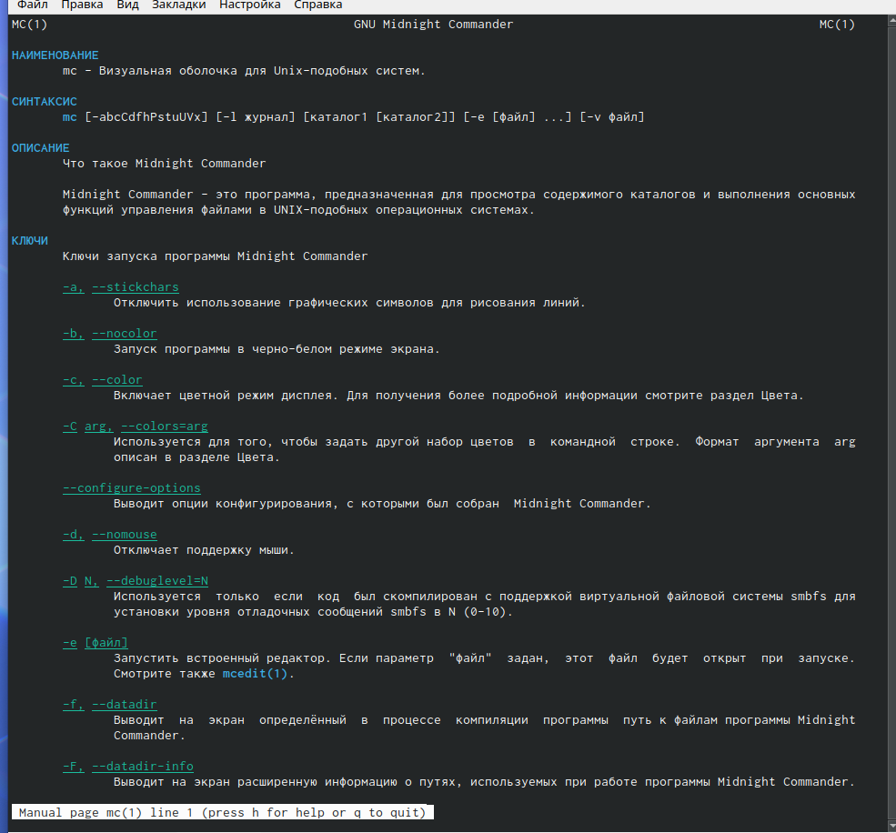{ #fig:001 width=70% }

 2. Запустите из командной строки mc, изучите его структуру и меню.

 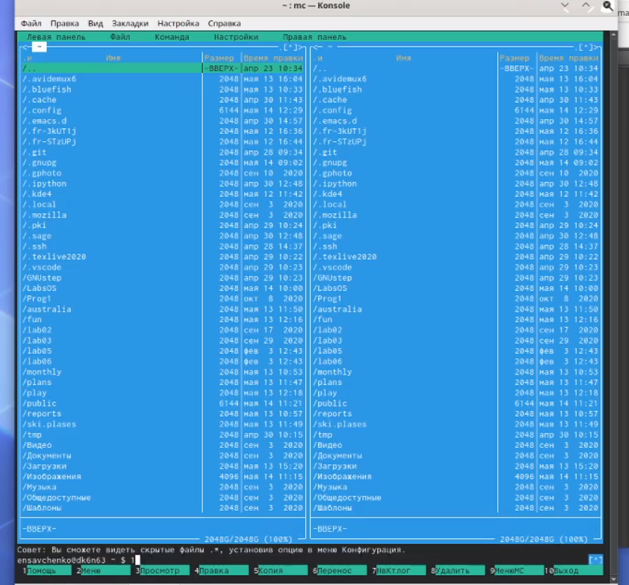{ #fig:001 width=70% }

 3. Выполните несколько операций в mc, используя управляющие клавиши(операции с панелями; выделение/отмена выделения файлов, копирова-ние/перемещение файлов, получение информации о размере и правах доступана файлы и/или каталоги и т.п.)
 
 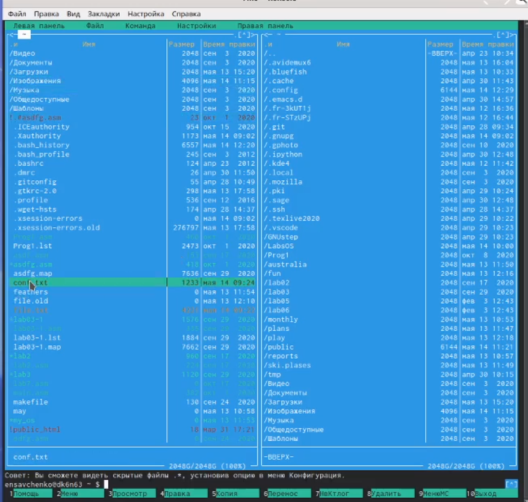{ #fig:001 width=70% }
 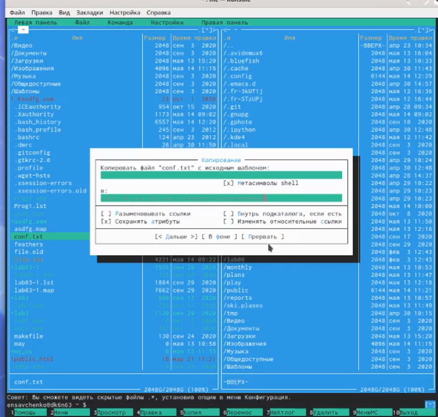{ #fig:001 width=70% }
 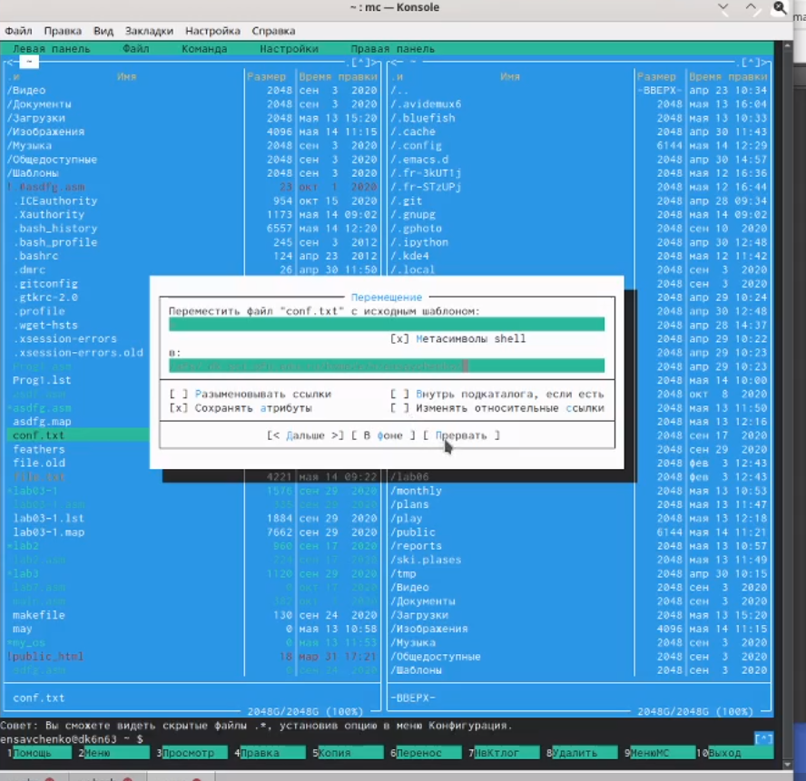{ #fig:001 width=70% }
 4. Выполните основные команды меню левой (или правой) панели. Оцените сте-пень подробности вывода информации о файлах.

 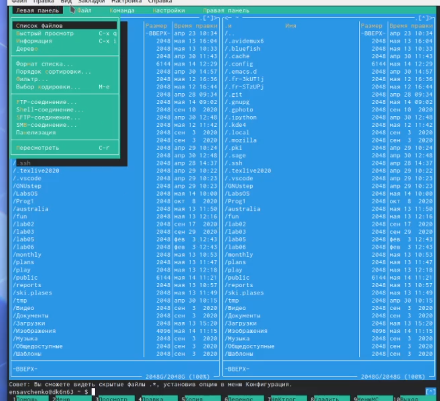{ #fig:001 width=70% }
 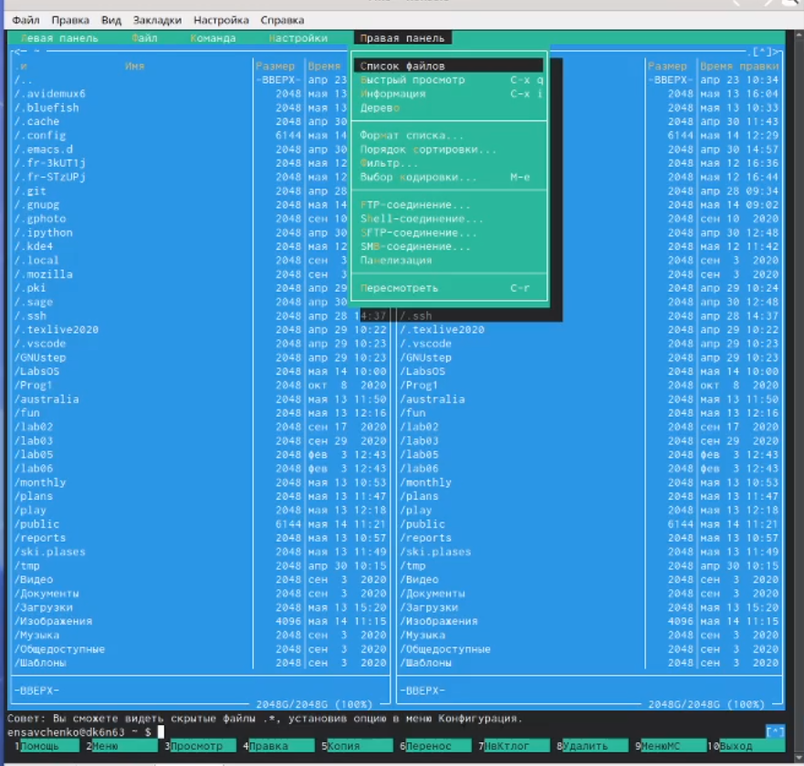{ #fig:001 width=70% }
 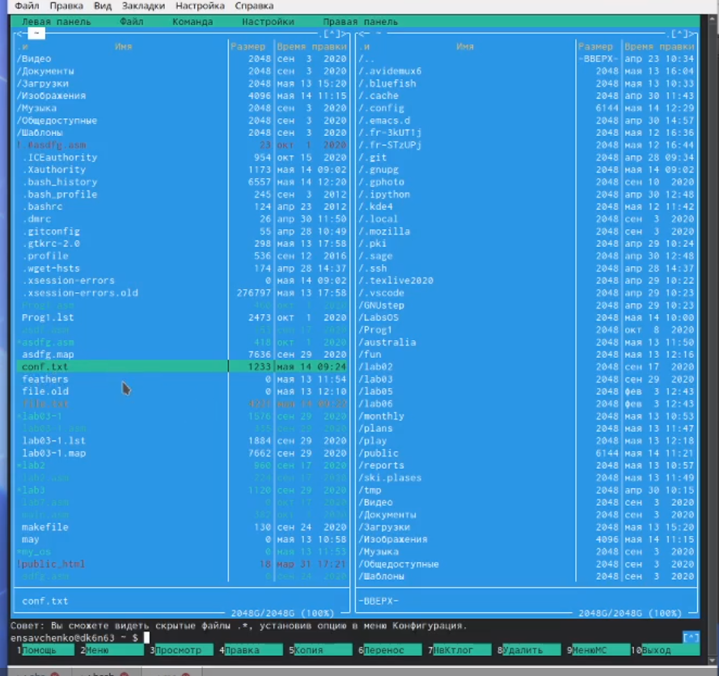{ #fig:001 width=70% }

 5. Используя возможности подменюФайл, выполните:–просмотр содержимого текстового файла;–редактирование содержимого текстового файла (без сохранения результатовредактирования);–создание каталога;–копирование в файлов в созданный каталог.

 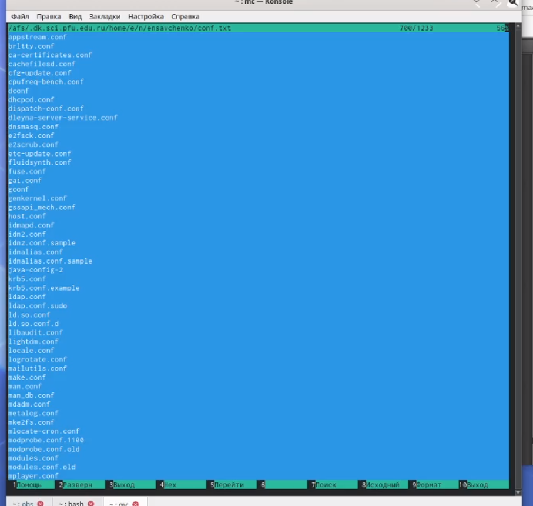{ #fig:001 width=70% }
 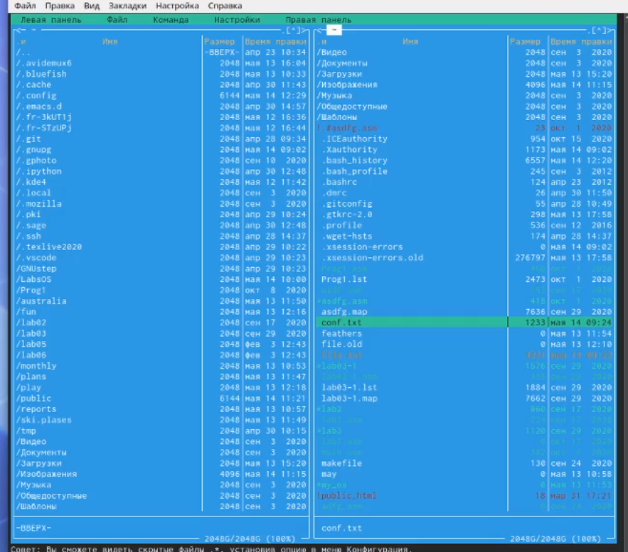{ #fig:001 width=70% }
 6. С помощью соответствующих средств подменюКомандаосуществите:–поиск в файловой системе файла с заданными условиями (например, файлас расширением.cили.cpp, содержащего строкуmain);–выбор и повторение одной из предыдущих команд;–переход в домашний каталог;–анализ файла меню и файла расширений.

 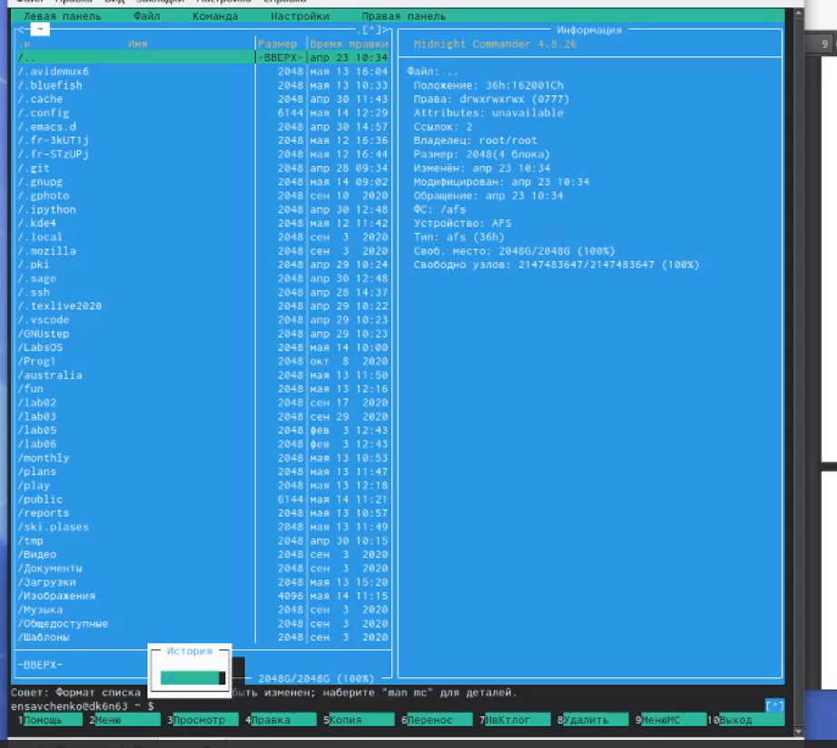{ #fig:001 width=70% }
 

 7. Вызовите подменюНастройки. Освойте операции, определяющие структуруэкрана mc (Full screen, Double Width, Show Hidden Files и т.д.)
 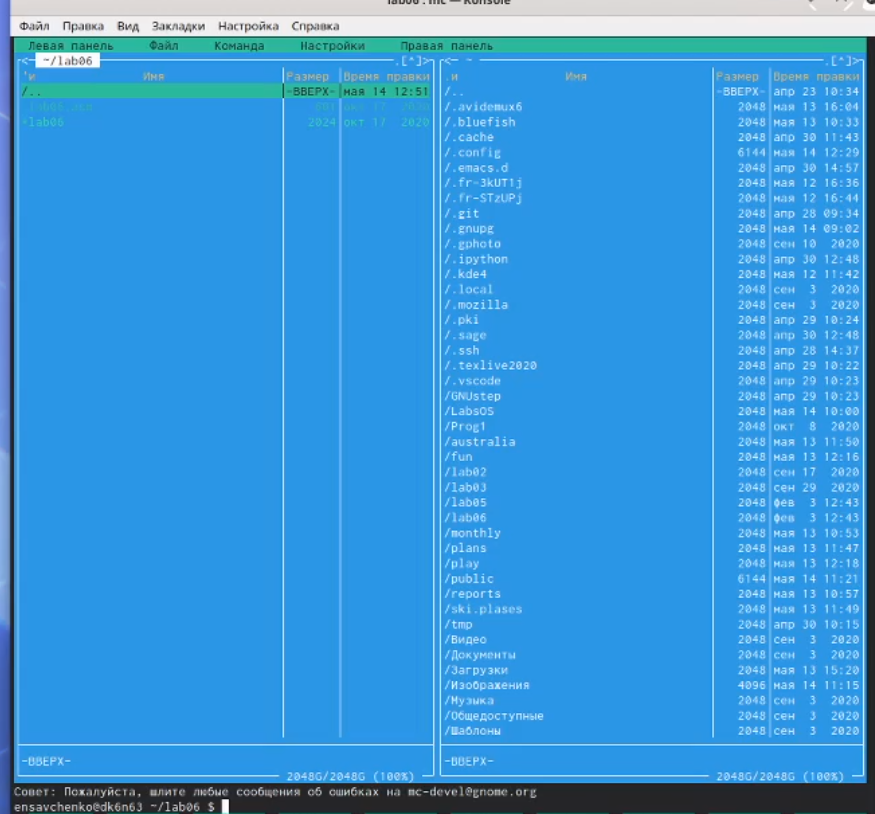{ #fig:001 width=70% }

Задание по встроенному редактору mc
 1. Создайте текстовой файлtext.txt.

 { #fig:001 width=70% }

 2. Откройте этот файл с помощью встроенного вmcредактора.

 { #fig:001 width=70% }

 3. Вставьте в открытый файл небольшой фрагмент текста, скопированный из лю-бого другого файла или Интернета.

 { #fig:001 width=70% }
 
 4. Проделайте с текстом следующие манипуляции, используя горячие клавиши:4.1.Удалите строку текста.
4.2.Выделите фрагмент текста и скопируйте его на новую строку.
4.3.Выделите фрагмент текста и перенесите его на новую строку.
4.4.Сохраните файл.
4.5.Отмените последнее действие.
4.6.Перейдите в конец файла (нажав комбинацию клавиш) и напишите некото-рый текст.
4.7.Перейдите в начало файла (нажав комбинацию клавиш) и напишите неко-торый текст.
4.8.Сохраните и закройте файл.

{ #fig:001 width=70% }

 5. Откройте файл с исходным текстом на некотором языке программирования (на-пример C или Java)
 6. Используя меню редактора, включите подсветку синтаксиса, если она не вклю-чена, или выключите, если она включена

 { #fig:001 width=70% }

# Выводы

Я освоила основные возможности командной оболочки Midnight Commander.Приобретение навыков практической работы по просмотру каталогов и файлов; ма-нипуляций с ними.
