---
# Front matter
lang: ru-RU
title: "Презентация по лабораторной работе"
author: "Elizaveta Savchenko"
institute: \inst{1}RUDN University, Moscow, Russian Federation
	
date: 19.05.2021

## Formatting
toc: false
slide_level: 2
theme: metropolis
header-includes: 
 - \metroset{progressbar=frametitle,sectionpage=progressbar,numbering=fraction}
 - '\makeatletter'
 - '\beamer@ignorenonframefalse'
 - '\makeatother'
aspectratio: 43
section-titles: true
---

# Цель работы

Познакомиться с операционной системой Linux. Получить практические навыки работы с редактором vi, установленным по умолчанию практически во всех дистрибутивах.

# Задание

1.Ознакомиться с теоретическим материалом.
2.Ознакомиться с редактором vi.
3.Выполнить упражнения, используя команды vi.

# Выполнение лабораторной работы

## Задание 1. Создание нового файла с использованием vi

1. Создала каталог с именем~/work/os/lab06.

 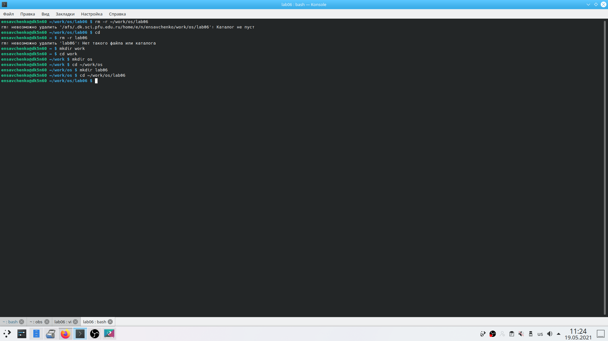{ #fig:001 width=70% }# Выполнение лабораторной работы

## Задание 1. Создание нового файла с использованием vi

1. Создала каталог с именем~/work/os/lab06.

 { #fig:001 width=70% }

2. Перешла во вновь созданный каталог.

## Слайд 8
3. Вызвала vi и создала файлhello.shvi hello.sh4. Нажала клавишу i и ввела следующий текст.#!/bin/bash
HELL=Hello
function hello { 
LOCAL HELLO=World
echo $HELLO
}
echo $HELLO 
hello

## Слайд 9
 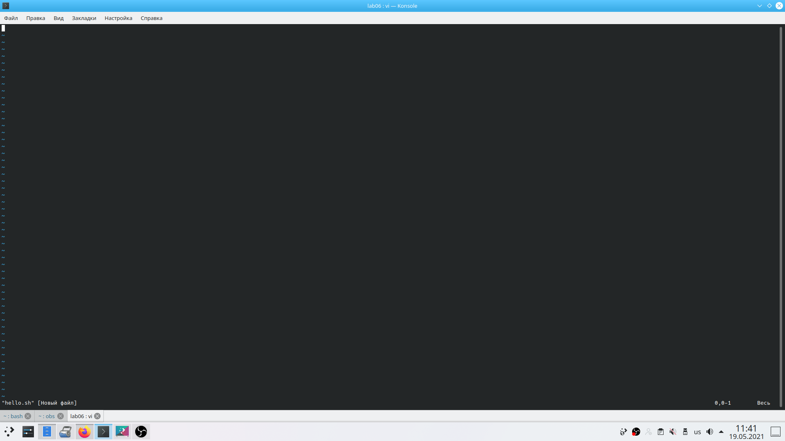{ #fig:001 width=70% }

## Слайд 10
5. Нажала клавишу Esc для перехода в командный режим после завершения ввода текста.
6. Нажала : для перехода в режим последней строки и внизу моего экрана появилось приглашение в виде двоеточия.

## Слайд 11
 { #fig:001 width=70% }

## Слайд 12
7. Нажала w (записала) и q (вышла), а затем нажала клавишу Enter для сохранения своего текста и завершения работы.

 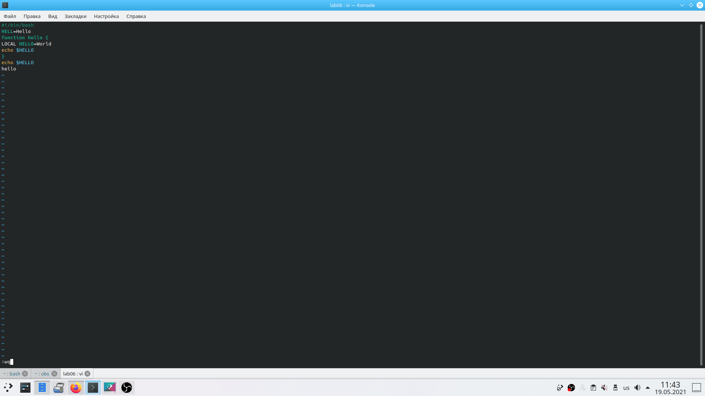{ #fig:001 width=70% }

## Слайд 13
8. Сделала файл исполняемым chmod +x hello.sh

 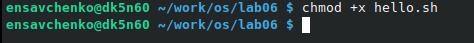{ #fig:001 width=70% }

## Задание 2. Редактирование существующего файла 

1. Вызовала vi на редактирование файла vi ~/work/os/lab06/hello.sh

 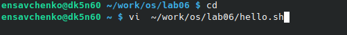{ #fig:001 width=70% }

2. Установила курсор в конец слова HELL второй строки.

 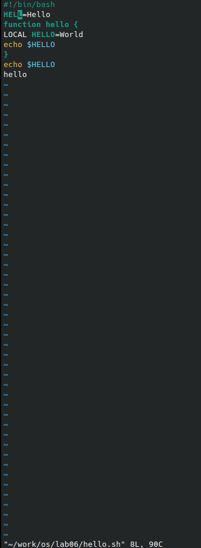{ #fig:001 width=70% }

## Слайд 14
3. Перешла в режим вставки и замените на HELLO. Нажмите Esc для возврата вкомандный режим.

 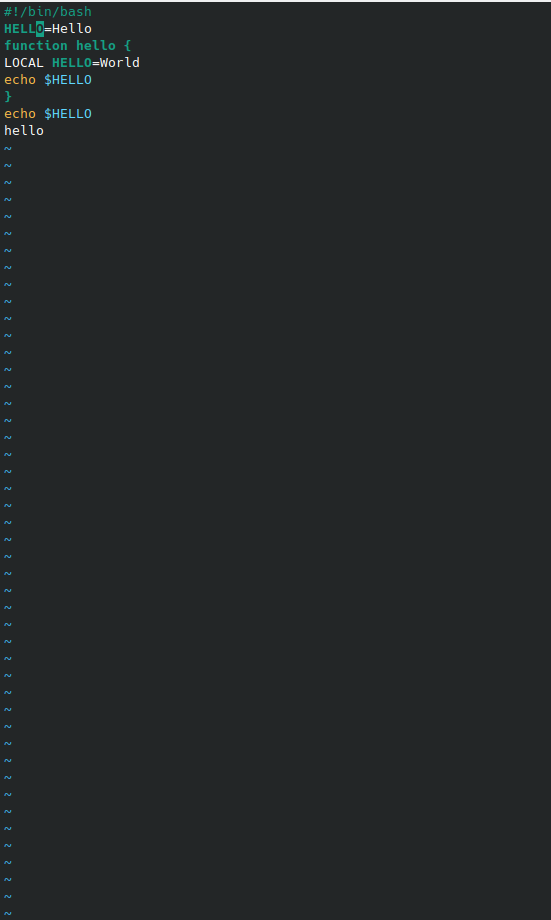{ #fig:001 width=70% }

## Слайд 15
4. Установила курсор на четвертую строку и сотрите слово LOCAL.

 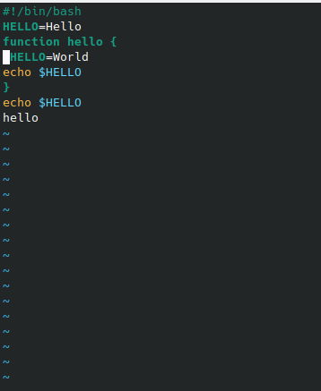{ #fig:001 width=70% }

## Слайд 16
5. Перещла в режим вставки и набрала следующий текст: local, нажала Esc для возврата в командный режим. 

 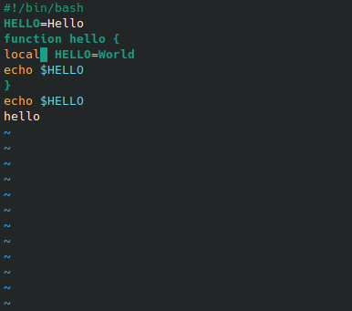{ #fig:001 width=70% }

## Слайд 17
6. Установила курсор на последней строке файла. Вставила после неё строку, содержащую следующий текст: echo $HELLO.

 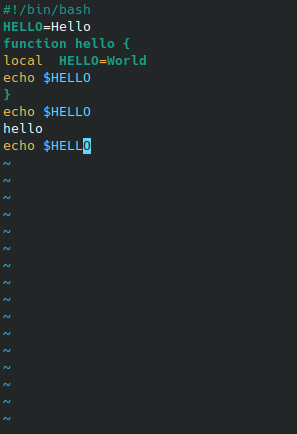{ #fig:001 width=70% }

## Слайд 18
7. Нажала Esc для перехода в командный режим.
8. Удалила последнюю строку.

 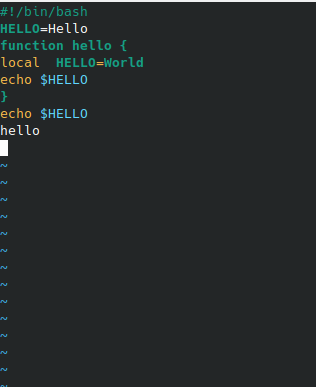{ #fig:001 width=70% }

## Слайд 19
9. Ввела команду отмены изменений u для отмены последней команды. 

 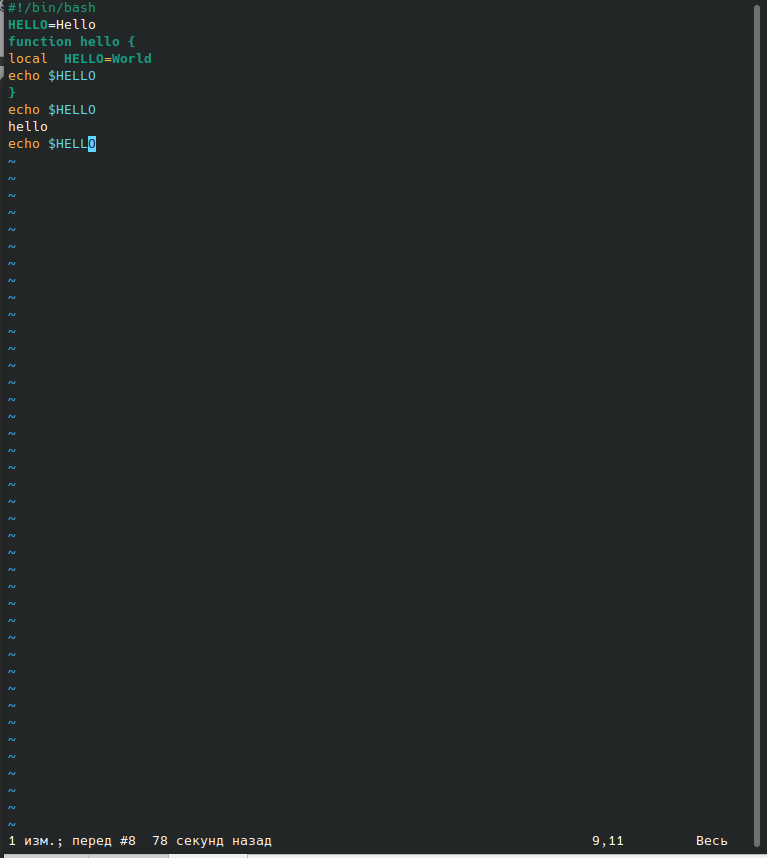{ #fig:001 width=70% }

## Слайд 20
10. Ввела символ: для перехода в режим последней строки. Записала произведённые изменения и вышла из vi.

 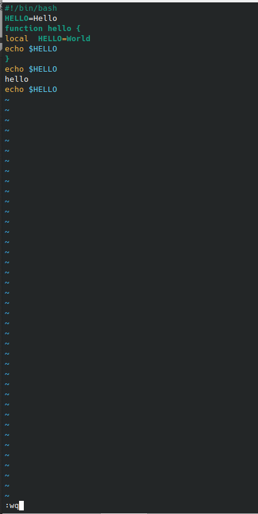{ #fig:001 width=70% }

# Выводы

Я познакомилась с операционной системой Linux и получила практические навыки работы с редактором vi, установленным по умолчанию практически во всех дистрибутивах.

 