---
# Front matter
lang: ru-RU
title: "Отчёт по лабораторной работе"
subtitle: "Лабораторная работа No 6. Текстовой редактор vi"
author: "Savchenko Elizaveta"

# Formatting
toc-title: "Содержание"
toc: true # Table of contents
toc_depth: 2
lof: true # List of figures
lot: true # List of tables
fontsize: 12pt
linestretch: 1.5
papersize: a4paper
documentclass: scrreprt
polyglossia-lang: russian
polyglossia-otherlangs: english
mainfont: PT Serif
romanfont: PT Serif
sansfont: PT Sans
monofont: PT Mono
mainfontoptions: Ligatures=TeX
romanfontoptions: Ligatures=TeX
sansfontoptions: Ligatures=TeX,Scale=MatchLowercase
monofontoptions: Scale=MatchLowercase
indent: true
pdf-engine: lualatex
header-includes:
  - \linepenalty=10 # the penalty added to the badness of each line within a paragraph (no associated penalty node) Increasing the value makes tex try to have fewer lines in the paragraph.
  - \interlinepenalty=0 # value of the penalty (node) added after each line of a paragraph.
  - \hyphenpenalty=50 # the penalty for line breaking at an automatically inserted hyphen
  - \exhyphenpenalty=50 # the penalty for line breaking at an explicit hyphen
  - \binoppenalty=700 # the penalty for breaking a line at a binary operator
  - \relpenalty=500 # the penalty for breaking a line at a relation
  - \clubpenalty=150 # extra penalty for breaking after first line of a paragraph
  - \widowpenalty=150 # extra penalty for breaking before last line of a paragraph
  - \displaywidowpenalty=50 # extra penalty for breaking before last line before a display math
  - \brokenpenalty=100 # extra penalty for page breaking after a hyphenated line
  - \predisplaypenalty=10000 # penalty for breaking before a display
  - \postdisplaypenalty=0 # penalty for breaking after a display
  - \floatingpenalty = 20000 # penalty for splitting an insertion (can only be split footnote in standard LaTeX)
  - \raggedbottom # or \flushbottom
  - \usepackage{float} # keep figures where there are in the text
  - \floatplacement{figure}{H} # keep figures where there are in the text
---

# Цель работы

Познакомиться с операционной системой Linux. Получить практические навыки работы с редактором vi, установленным по умолчанию практически во всех дистрибутивах.

# Задание

1.Ознакомиться с теоретическим материалом.
2.Ознакомиться с редактором vi.
3.Выполнить упражнения, используя команды vi.

# Выполнение лабораторной работы

1. Создала каталог с именем~/work/os/lab06.

 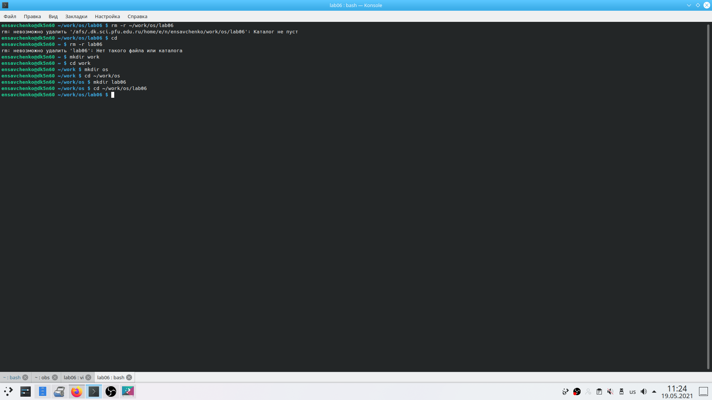{ #fig:001 width=70% }

2. Перешла во вновь созданный каталог.
3. Вызвала vi и создала файл hello.sh vi hello. sh
4. Нажала клавишу i и ввела следующий текст.
#!/bin/bash
HELL=Hello
function hello { 
LOCAL HELLO=World
echo $HELLO
}
echo $HELLO 
hello

 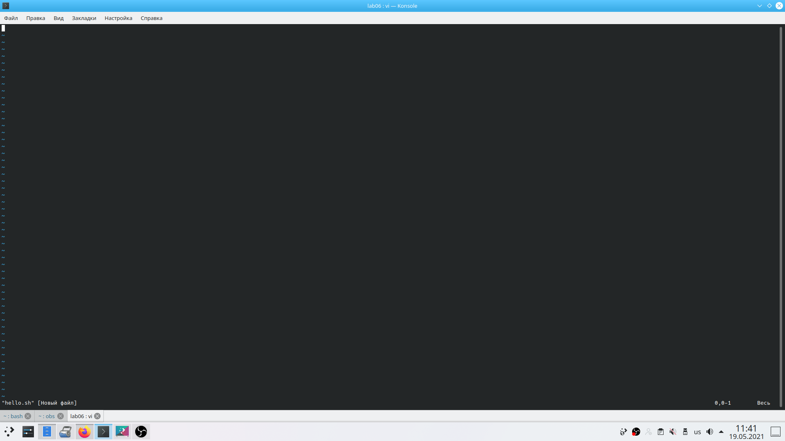{ #fig:001 width=70% }

5. Нажала клавишу Esc для перехода в командный режим после завершения ввода текста.
6. Нажала : для перехода в режим последней строки и внизу моего экрана появилось приглашение в виде двоеточия.

 { #fig:001 width=70% }

7. Нажала w (записала) и q (вышла), а затем нажала клавишу Enter для сохранения вашего текста и завершения работы.

 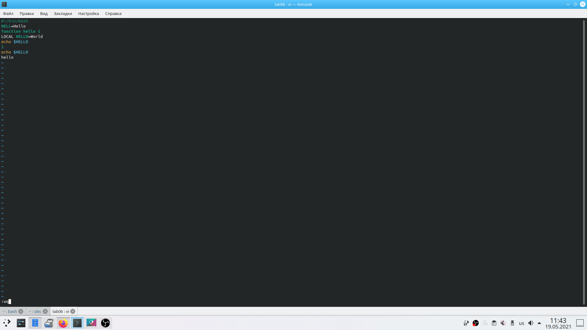{ #fig:001 width=70% }

8. Сделала файл исполняемым chmod +x hello.sh

 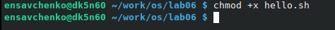{ #fig:001 width=70% }

1. Вызвала vi на редактирование файла vi ~/work/os/lab06/hello.sh

 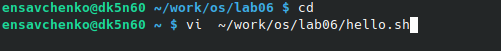{ #fig:001 width=70% }

2. Установила курсор в конец слова HELL второй строки.

 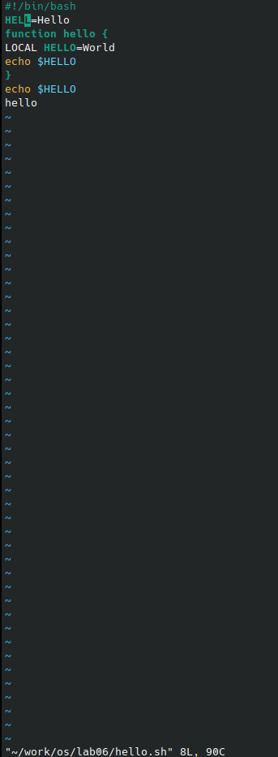{ #fig:001 width=70% }

3. Перешла в режим вставки и заменила на HELLO. Нажала Esc для возврата в командный режим.

 { #fig:001 width=70% }

4. Установила курсор на четвертую строку и стерла слово LOCAL.

 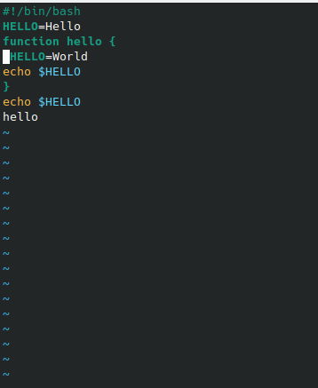{ #fig:001 width=70% }

5. Перешла в режим вставки и набрала следующий текст: local, нажала Esc для возврата в командный режим. 

 { #fig:001 width=70% }

6. Установила курсор на последней строке файла. Вставила после неё строку, содержащую следующий текст:echo $HELLO.

 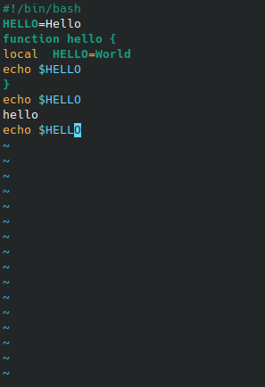{ #fig:001 width=70% }

7. Нажала Esc для перехода в командный режим.
8. Удалила последнюю строку.

 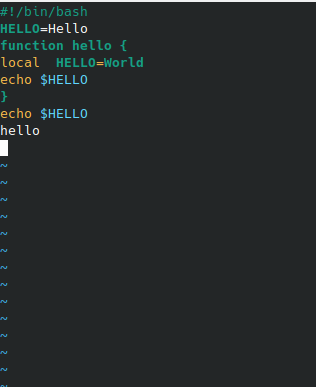{ #fig:001 width=70% }

9. Ввела команду отмены изменений u для отмены последней команды. 

 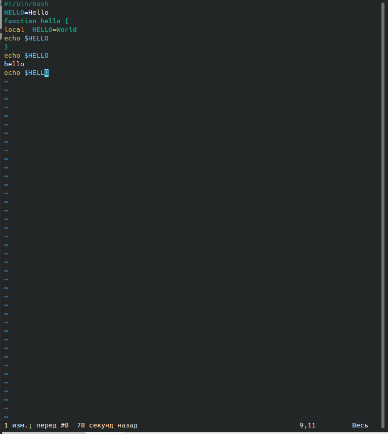{ #fig:001 width=70% }

10. Ввела символ: для перехода в режим последней строки. Записала произведённые изменения и вышла из vi.

 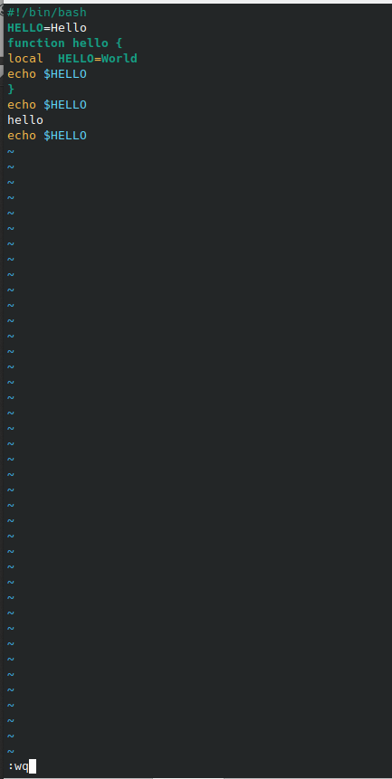{ #fig:001 width=70% }

# Выводы

Я познакомилась с операционной системой Linux и получила практические навыки работы с редактором vi, установленным по умолчанию практически во всех дистрибутивах.