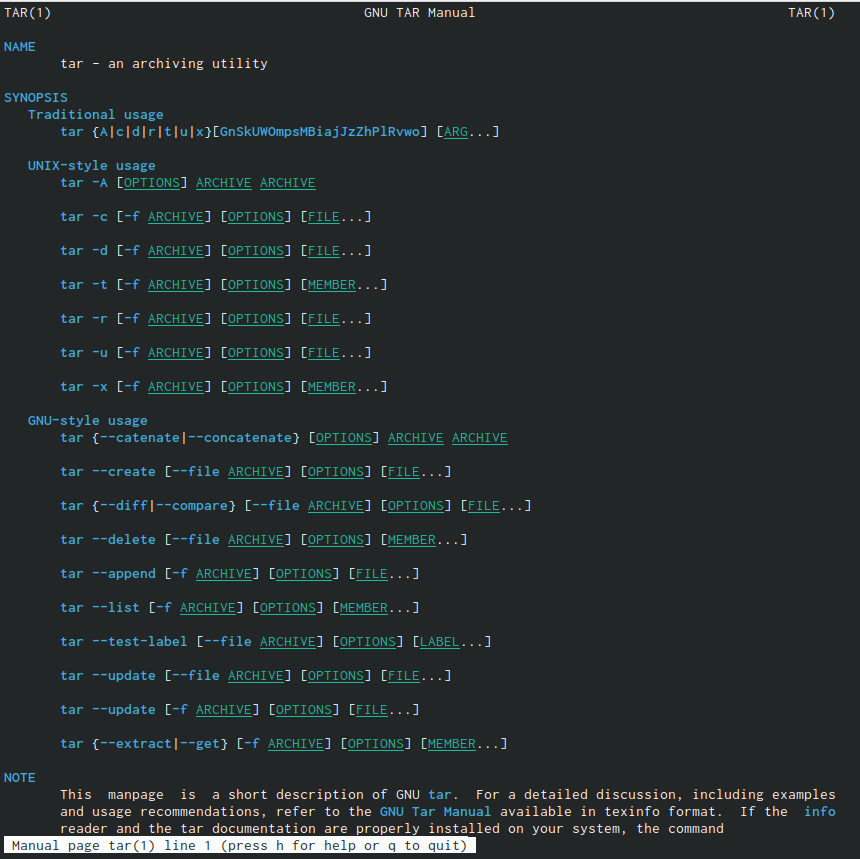
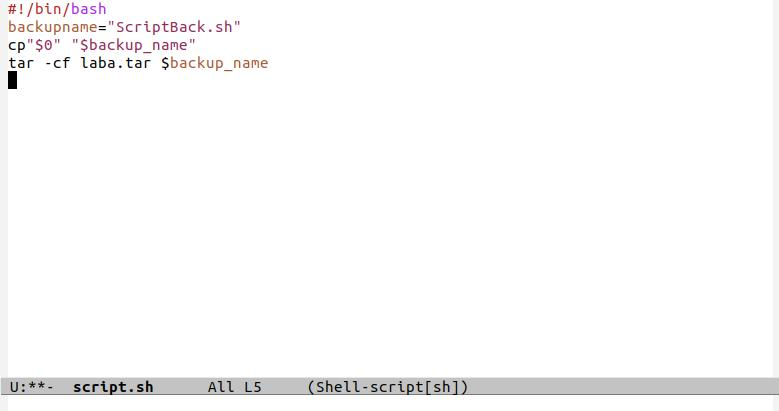
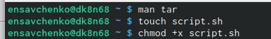
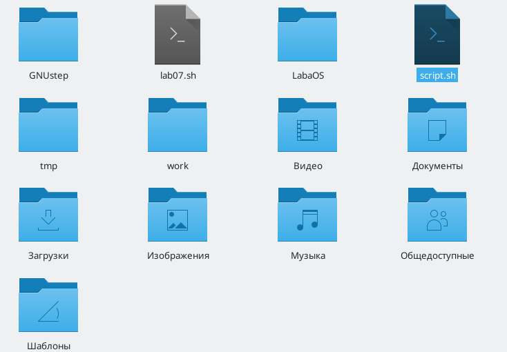
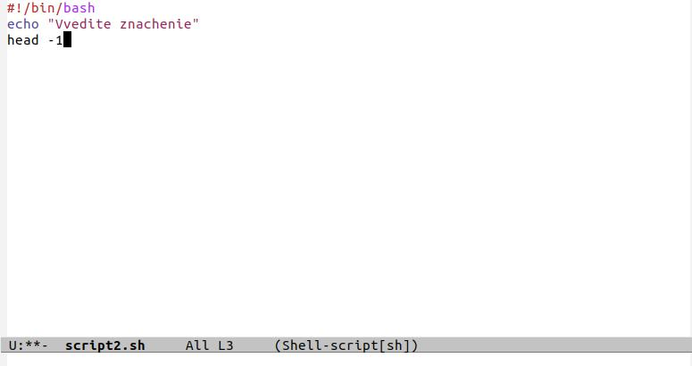
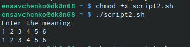
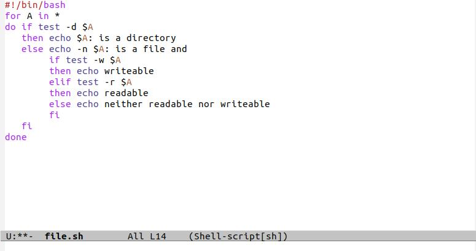
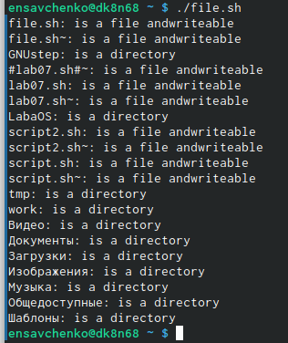
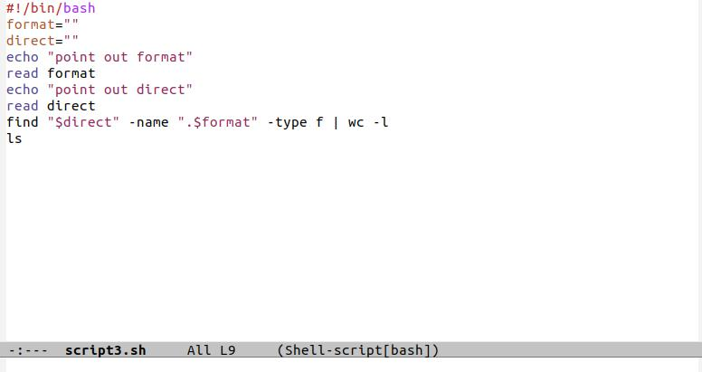
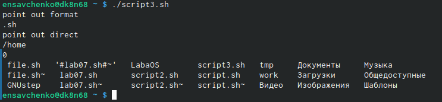

---
# Front matter
lang: ru-RU
title: "Презентация по лабораторной работе"
author: "Elizaveta Savchenko"
institute: \inst{1}RUDN University, Moscow, Russian Federation
	
date: 26.05.2021

## Formatting
toc: false
slide_level: 2
theme: metropolis
header-includes: 
 - \metroset{progressbar=frametitle,sectionpage=progressbar,numbering=fraction}
 - '\makeatletter'
 - '\beamer@ignorenonframefalse'
 - '\makeatother'
aspectratio: 43
section-titles: true
---

# Цель работы

Изучить основы программирования в оболочке ОС UNIX/Linux, научиться писать небольшие командные файлы.

# Выполнение лабораторной работы

1. Написала скрипт, который при запуске будет делать резервную копию самого себя (то есть файла, в котором содержится его исходный код) в другую директорию backup в домашнем каталоге. При этом файл должен архивироваться одним из архиваторов на выбор zip, bzip2 или tar. Способ использования команд архивации узнала, изучив справку.

## Cлайд 1

 

## Слайд 2

 

## Слайд 3

 

## Слайд 4

 

## Слайд 5

2. Написала пример командного файла, обрабатывающего любое произвольное
число аргументов командной строки, в том числе превышающее десять. Например, скрипт может последовательно распечатывать значения всех переданных
аргументов.

## Слайд 6

 
 
## Слайд 7

 

## Слайд 8

3. Написала командный файл — аналог команды ls (без использования самой этой
команды и команды dir). Требуется, чтобы он выдавал информацию о нужном
каталоге и выводил информацию о возможностях доступа к файлам этого каталога.

## Слайд 9

 

## Слайд 10

 

## Слайд 11

4. Написала командный файл, который получает в качестве аргумента командной
строки формат файла (.txt, .doc, .jpg, .pdf и т.д.) и вычисляет количество
таких файлов в указанной директории. Путь к директории также передаётся в
виде аргумента командной строки.

## Слайд 12

 

## Слайд 13

 

# Выводы
 Я изучила основы программирования в оболочке ОС UNIX/Linux, научилась писать небольшие командные файлы.

