---
# Front matter
lang: ru-RU
title: "Презентация по лабораторной работе"
author: "Elizaveta Savchenko"
institute: \inst{1}RUDN University, Moscow, Russian Federation
	
date: 03.06.2021

## Formatting
toc: false
slide_level: 2
theme: metropolis
header-includes: 
 - \metroset{progressbar=frametitle,sectionpage=progressbar,numbering=fraction}
 - '\makeatletter'
 - '\beamer@ignorenonframefalse'
 - '\makeatother'
aspectratio: 43
section-titles: true
---

# Цель работы

 Приобрести простейшие навыки разработки, анализа, тестирования и отладки приложений в ОС типа UNIX/Linux на примере создания на языке программирования C калькулятора с простейшими функциями. 

# Выполнение лабораторной работы

1. В домашнем каталоге создала подкаталог ~/work/os/lab_prog. 

 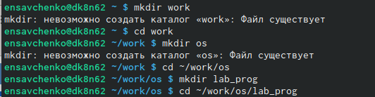
 
## 4
2. Создала в нём файлы: calculate.h, calculate.c, main.c. Это примитивнейший калькулятор, способный складывать, вычитать, умножать, делить, возводить число в степень, вычислять квадратный корень, вычислять sin, cos, tan. При запуске он запрашивает первое число, операцию, второе число. После этого программа выводит результат и останавливается. 

## 5
 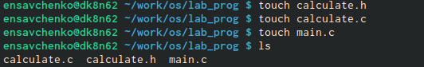

## 6
Реализация функций калькулятора в файле calculate.h: 
 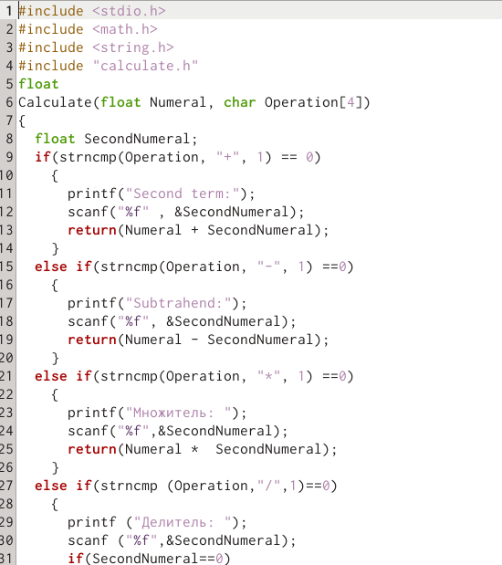

## 7
 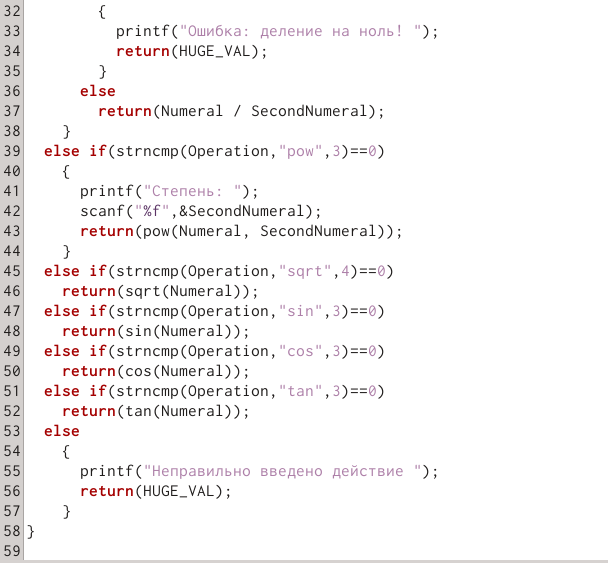

## 8
Интерфейсный файл calculate.h, описывающий формат вызова функции калькулятора: 
 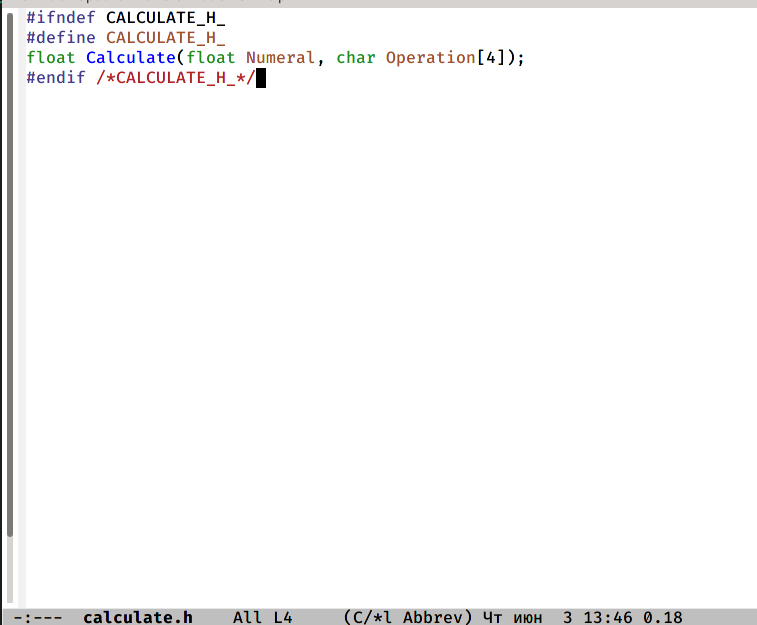

## 9
Oсновной файл main.c, реализующий интерфейс пользователя к калькулятору:
 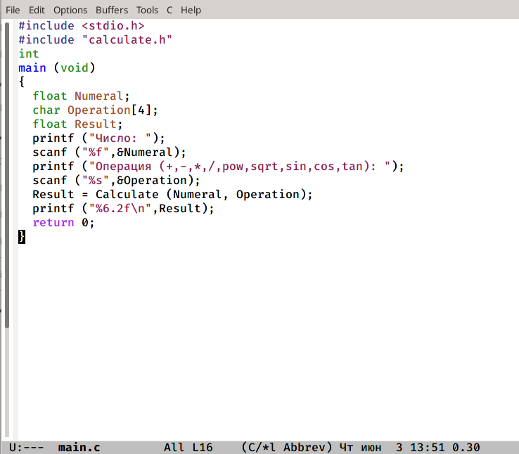

## 10
3. Выполнила компиляцию программы посредством gcc:
 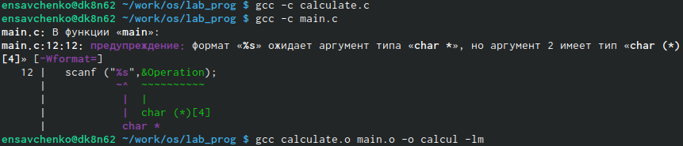

## 11
4. Исправила синтаксические ошибки.
5. Создала Makefile

## 12
 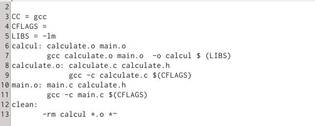

В содержании файла указаны флаги компиляции, тип компилятора и файлы, которые должен собрать сборщик.

## 13
6. С помощью gdb выполнила отладку программы calcul (перед использованием gdb исправила Makefile):
– запустите отладчик GDB, загрузив в него программу для отладки: gdb ./calcul
– для запуска программы внутри отладчика ввела команду run

## 14
 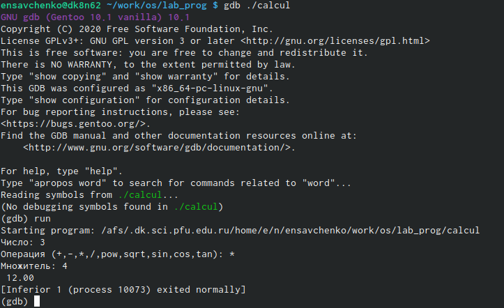

## 15
– для постраничного (по 9 строк) просмотра исходного код использовала команду list
– для просмотра строк с 12 по 15 основного файла использовала list с параметрами:
list 12,15
 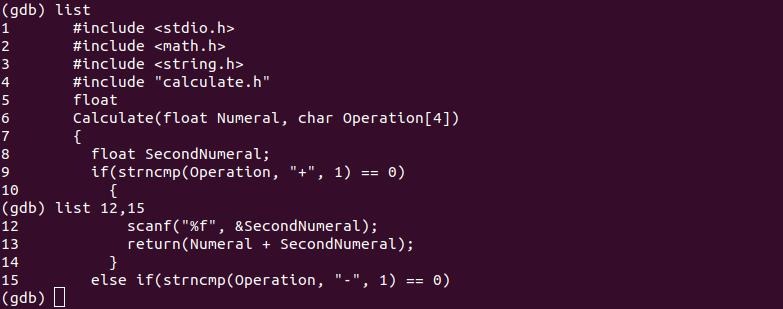

## 16
– для просмотра определённых строк не основного файла использовала list с параметрами: list calculate.c:20,29
– установила точку останова в файле calculate.c на строке номер 21:
list calculate.c:20,27
break 21
– вывела информацию об имеющихся в проекте точка останова: info breakpoints

## 17
  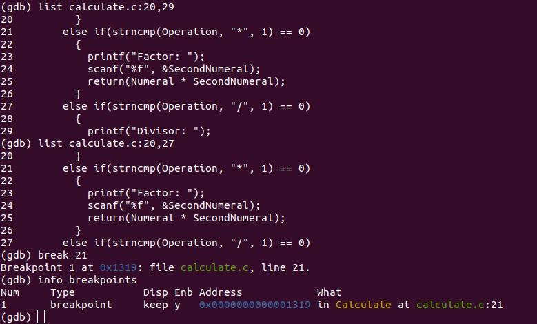

## 18
– запустила программу внутри отладчика и убедилась, что программа остановится в момент прохождения точки останова
– отладчик выдал следующую информацию, а команда backtrace показала весь стек вызываемых функций от начала программы до текущего места:
– посмотрела, чему равно на этом этапе значение переменной Numeral, введя:
print Numeral
display Numeral
– убрала точки останова:
info breakpoints
delete 1 

## 19
 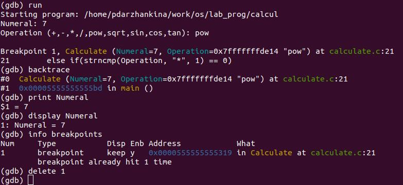

## 20
7. С помощью утилиты splint попробуйте проанализировать коды файлов
calculate.c и main.c. 

 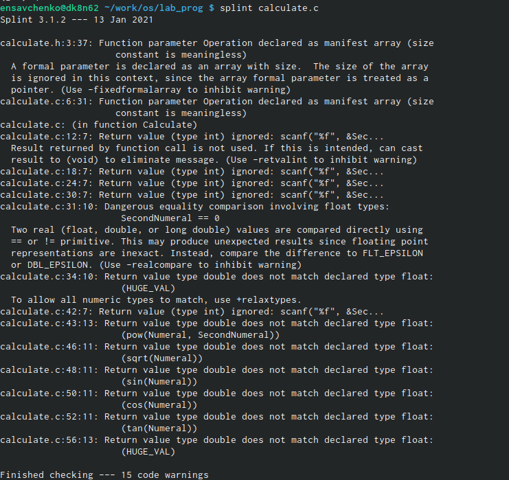

## 21
 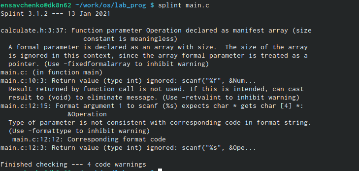

# Выводы

 Я приобрела простейшие навыки разработки, анализа, тестирования и отладки приложений в ОС типа UNIX/Linux на примере создания на языке программирования C калькулятора с простейшими функциями.
 

