---
# Front matter
lang: ru-RU
title: "Отчёт по лабораторной работе"
subtitle: "Лабораторная работа № 14 (11). "
author: "Savchenko Elizaveta"

# Formatting
toc-title: "Содержание"
toc: true # Table of contents
toc_depth: 2
lof: true # List of figures
lot: true # List of tables
fontsize: 12pt
linestretch: 1.5
papersize: a4paper
documentclass: scrreprt
polyglossia-lang: russian
polyglossia-otherlangs: english
mainfont: PT Serif
romanfont: PT Serif
sansfont: PT Sans
monofont: PT Mono
mainfontoptions: Ligatures=TeX
romanfontoptions: Ligatures=TeX
sansfontoptions: Ligatures=TeX,Scale=MatchLowercase
monofontoptions: Scale=MatchLowercase
indent: true
pdf-engine: lualatex
header-includes:
  - \linepenalty=10 # the penalty added to the badness of each line within a paragraph (no associated penalty node) Increasing the value makes tex try to have fewer lines in the paragraph.
  - \interlinepenalty=0 # value of the penalty (node) added after each line of a paragraph.
  - \hyphenpenalty=50 # the penalty for line breaking at an automatically inserted hyphen
  - \exhyphenpenalty=50 # the penalty for line breaking at an explicit hyphen
  - \binoppenalty=700 # the penalty for breaking a line at a binary operator
  - \relpenalty=500 # the penalty for breaking a line at a relation
  - \clubpenalty=150 # extra penalty for breaking after first line of a paragraph
  - \widowpenalty=150 # extra penalty for breaking before last line of a paragraph
  - \displaywidowpenalty=50 # extra penalty for breaking before last line before a display math
  - \brokenpenalty=100 # extra penalty for page breaking after a hyphenated line
  - \predisplaypenalty=10000 # penalty for breaking before a display
  - \postdisplaypenalty=0 # penalty for breaking after a display
  - \floatingpenalty = 20000 # penalty for splitting an insertion (can only be split footnote in standard LaTeX)
  - \raggedbottom # or \flushbottom
  - \usepackage{float} # keep figures where there are in the text
  - \floatplacement{figure}{H} # keep figures where there are in the text
---

# Цель работы

 Приобрести простейшие навыки разработки, анализа, тестирования и отладки приложений в ОС типа UNIX/Linux на примере создания на языке программирования C калькулятора с простейшими функциями. 

# Выполнение лабораторной работы

1. В домашнем каталоге создала подкаталог ~/work/os/lab_prog. 

 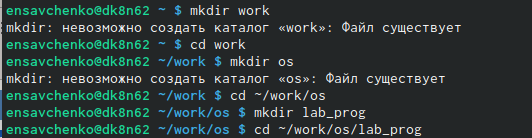
 

2. Создала в нём файлы: calculate.h, calculate.c, main.c. Это примитивнейший калькулятор, способный складывать, вычитать, умножать, делить, возводить число в степень, вычислять квадратный корень, вычислять sin, cos, tan. При запуске он запрашивает первое число, операцию, второе число. После этого программа выводит результат и останавливается. 

 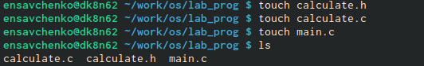

 Реализация функций калькулятора в файле calculate.h: 
 
 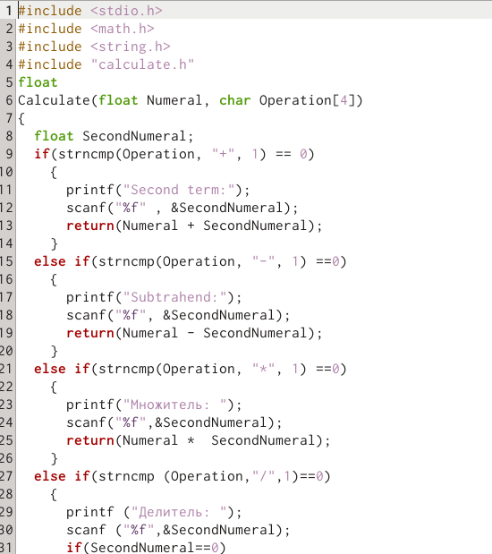
 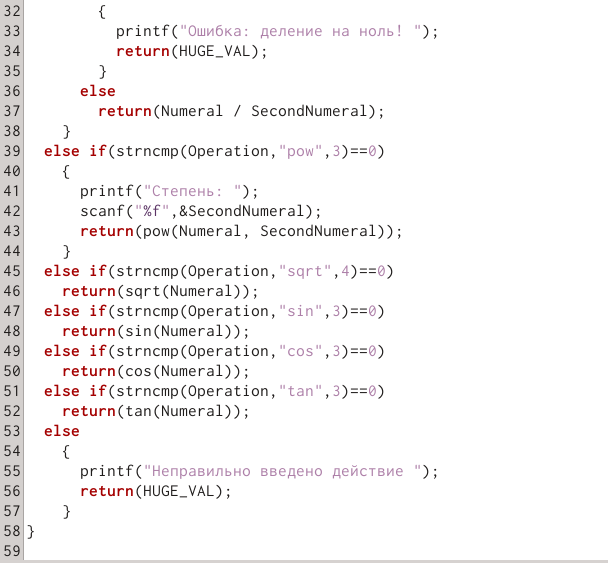

 Интерфейсный файл calculate.h, описывающий формат вызова функции калькулятора: 

 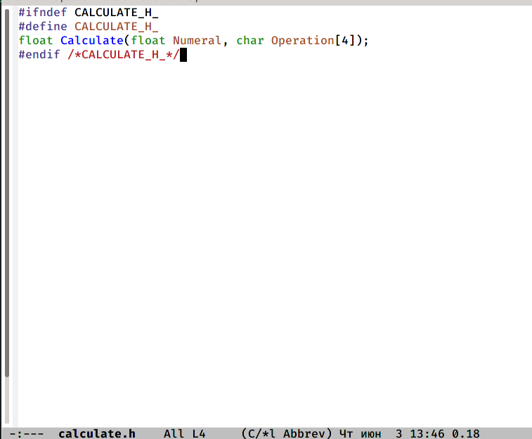

 Основной файл main.c, реализующий интерфейс пользователя к калькулятору:

 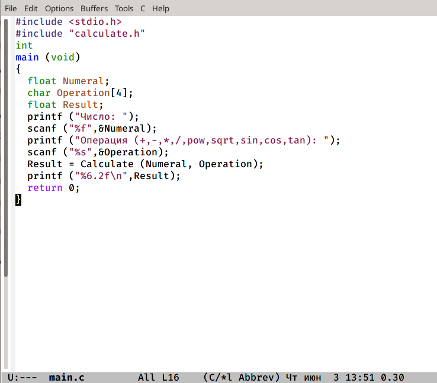
 
3. Выполнила компиляцию программы посредством gcc:
 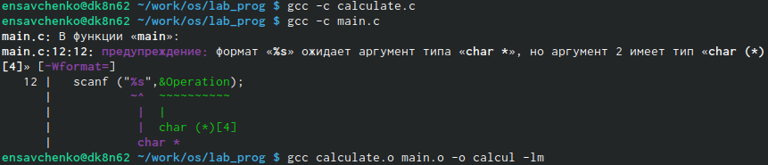
 
4. Исправила синтаксические ошибки.

5. Создала Makefile

 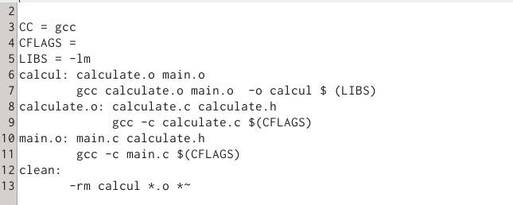

В содержании файла указаны флаги компиляции, тип компилятора и файлы, которые должен собрать сборщик.

6. С помощью gdb выполнила отладку программы calcul (перед использованием gdb исправила Makefile):

– запустите отладчик GDB, загрузив в него программу для отладки: gdb ./calcul
– для запуска программы внутри отладчика ввела команду run

 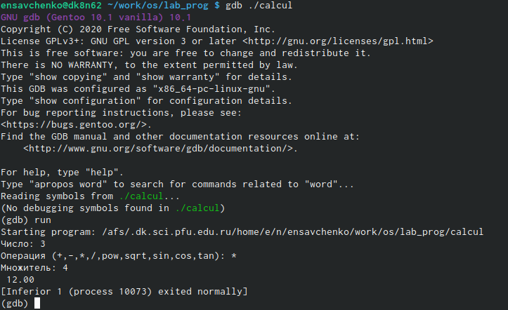

– для постраничного (по 9 строк) просмотра исходного код использовала команду list
– для просмотра строк с 12 по 15 основного файла использовала list с параметрами:
list 12,15

 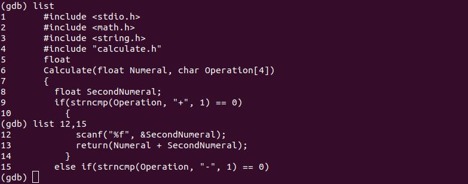

– для просмотра определённых строк не основного файла использовала list с параметрами: list calculate.c:20,29
– установила точку останова в файле calculate.c на строке номер 21:
list calculate.c:20,27
break 21
– вывела информацию об имеющихся в проекте точка останова: info breakpoints

  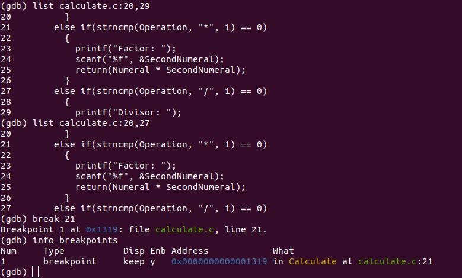

– запустила программу внутри отладчика и убедилась, что программа остановится в момент прохождения точки останова
– отладчик выдал следующую информацию, а команда backtrace показала весь стек вызываемых функций от начала программы до текущего места:
– посмотрела, чему равно на этом этапе значение переменной Numeral, введя:
print Numeral
display Numeral
– убрала точки останова:
info breakpoints
delete 1 

 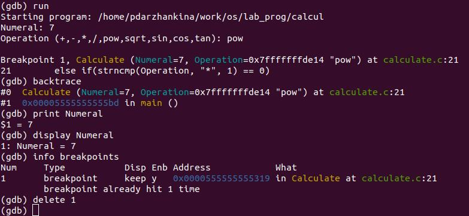

7. С помощью утилиты splint попробуйте проанализировать коды файлов
calculate.c и main.c. 

 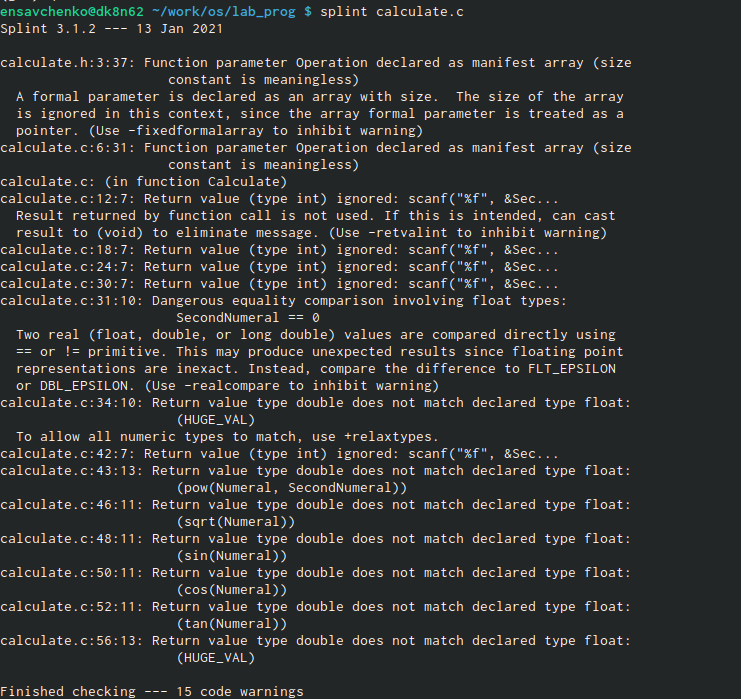
 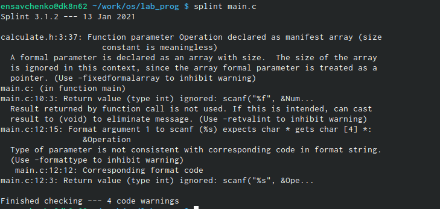

# Выводы

 Я приобрела простейшие навыки разработки, анализа, тестирования и отладки приложений в ОС типа UNIX/Linux на примере создания на языке программирования C калькулятора с простейшими функциями.
