---
# Front matter
lang: ru-RU
title: "Презентация по лабораторной работе"
author: "Elizaveta Savchenko"
institute: \inst{1}RUDN University, Moscow, Russian Federation
	
date: 03.06.2021

## Formatting
toc: false
slide_level: 2
theme: metropolis
header-includes: 
 - \metroset{progressbar=frametitle,sectionpage=progressbar,numbering=fraction}
 - '\makeatletter'
 - '\beamer@ignorenonframefalse'
 - '\makeatother'
aspectratio: 43
section-titles: true
---

# Цель работы

 приобретение практических навыков работы с именованными каналами.

# Выполнение лабораторной работы

1. Изучила приведённые в тексте программы server.c и client.c и взяла данные
примеры за образец.
common.h: 
  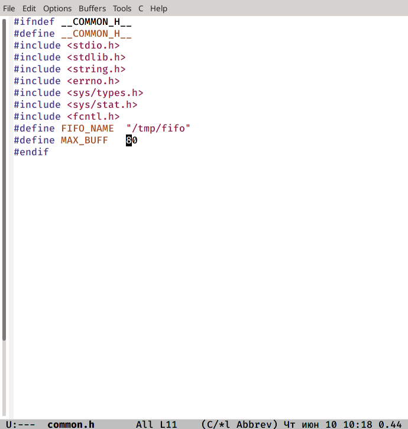

## 4

server.c:
 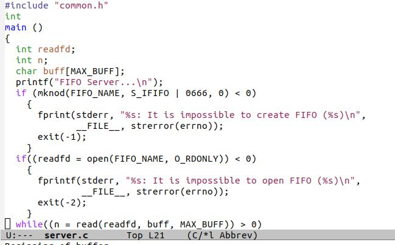

## 5

 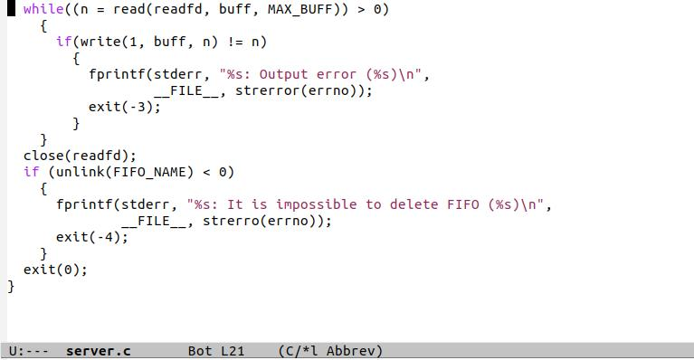

## 6

client.c:
 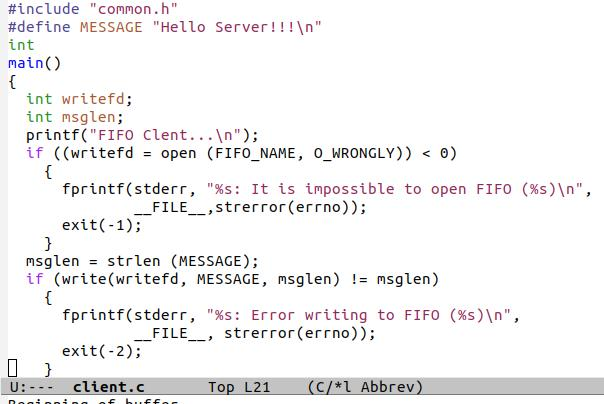

## 7

 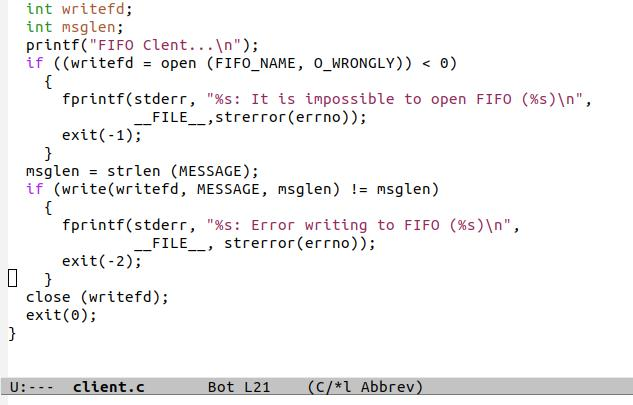

## 8

2. Написала аналогичные программы, внеся следующие изменения:
- работает не 1 клиент, а несколько (например, два).
- клиенты передают текущее время с некоторой периодичностью (например, раз
в пять секунд). Использовала функцию sleep() для приостановки работы клиента.
- сервер работает не бесконечно, а прекращает работу через некоторое время (например, 30 сек). Использовала функцию clock() для определения времени работы
сервера.
common.h:

## 9

 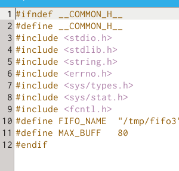
 
## 10

server.c:
 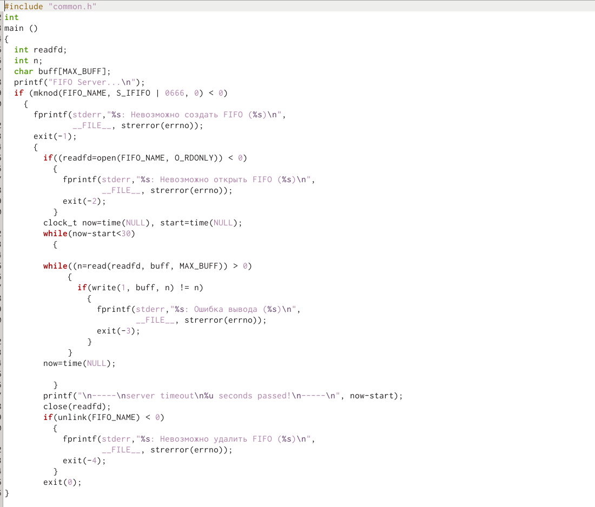

## 11

cluent.c:
 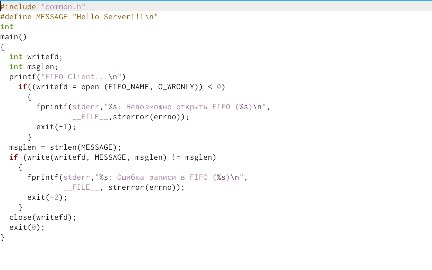

## 12

client2.c:
 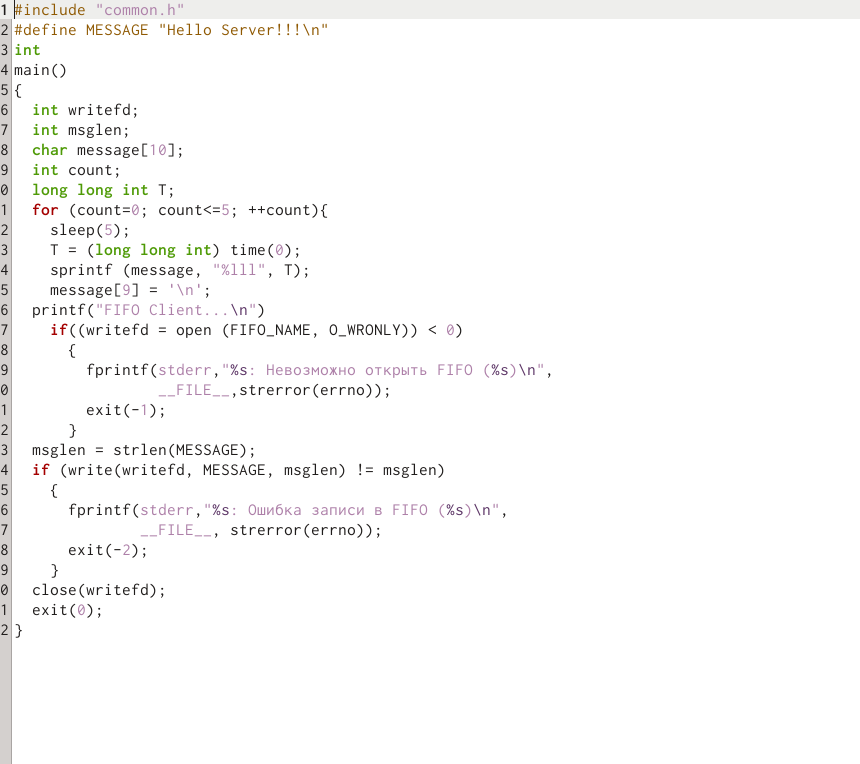

## 13

  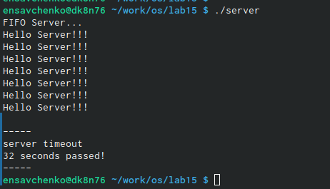

## 14

  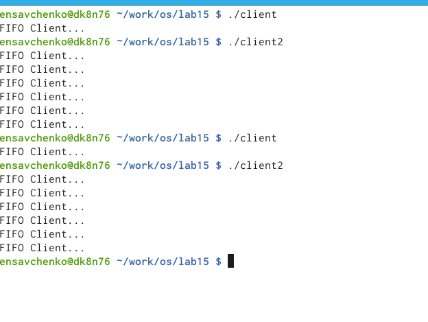

В случае, если сервер завершит работу, не закрыв канал, файл FIFO не удалится, поэтому его в следующий раз создать будет нельзя и вылезет ошибка, следовательно, работать ничего не будет.

# Выводы

 Я приобрела практические навыки работы с именованными каналами.
