---
# Front matter
lang: ru-RU
title: "Отчёт по лабораторной работе"
subtitle: "Лабораторная работа № 15 (13). "
author: "Savchenko Elizaveta"

# Formatting
toc-title: "Содержание"
toc: true # Table of contents
toc_depth: 2
lof: true # List of figures
lot: true # List of tables
fontsize: 12pt
linestretch: 1.5
papersize: a4paper
documentclass: scrreprt
polyglossia-lang: russian
polyglossia-otherlangs: english
mainfont: PT Serif
romanfont: PT Serif
sansfont: PT Sans
monofont: PT Mono
mainfontoptions: Ligatures=TeX
romanfontoptions: Ligatures=TeX
sansfontoptions: Ligatures=TeX,Scale=MatchLowercase
monofontoptions: Scale=MatchLowercase
indent: true
pdf-engine: lualatex
header-includes:
  - \linepenalty=10 # the penalty added to the badness of each line within a paragraph (no associated penalty node) Increasing the value makes tex try to have fewer lines in the paragraph.
  - \interlinepenalty=0 # value of the penalty (node) added after each line of a paragraph.
  - \hyphenpenalty=50 # the penalty for line breaking at an automatically inserted hyphen
  - \exhyphenpenalty=50 # the penalty for line breaking at an explicit hyphen
  - \binoppenalty=700 # the penalty for breaking a line at a binary operator
  - \relpenalty=500 # the penalty for breaking a line at a relation
  - \clubpenalty=150 # extra penalty for breaking after first line of a paragraph
  - \widowpenalty=150 # extra penalty for breaking before last line of a paragraph
  - \displaywidowpenalty=50 # extra penalty for breaking before last line before a display math
  - \brokenpenalty=100 # extra penalty for page breaking after a hyphenated line
  - \predisplaypenalty=10000 # penalty for breaking before a display
  - \postdisplaypenalty=0 # penalty for breaking after a display
  - \floatingpenalty = 20000 # penalty for splitting an insertion (can only be split footnote in standard LaTeX)
  - \raggedbottom # or \flushbottom
  - \usepackage{float} # keep figures where there are in the text
  - \floatplacement{figure}{H} # keep figures where there are in the text
---

# Цель работы

 приобретение практических навыков работы с именованными каналами.

# Выполнение лабораторной работы

1. Изучила приведённые в тексте программы server.c и client.c и взяла данные
примеры за образец.
common.h: 
  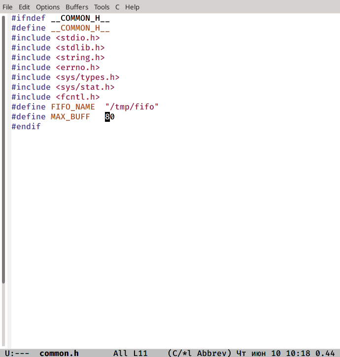

server.c:
 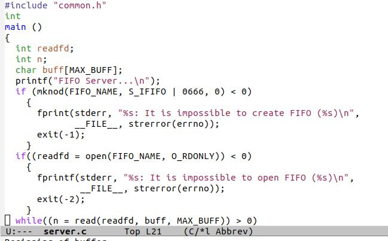
 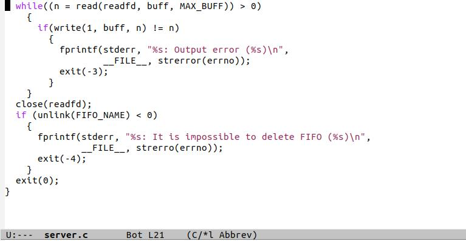

client.c:
 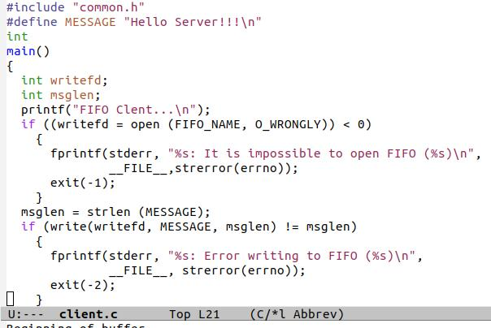
 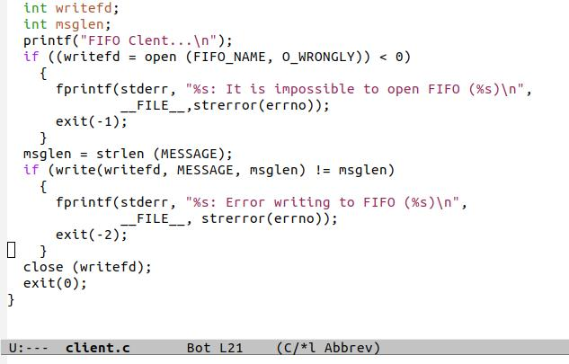

2. Написала аналогичные программы, внеся следующие изменения:
- работает не 1 клиент, а несколько (например, два).
- клиенты передают текущее время с некоторой периодичностью (например, раз
в пять секунд). Использовала функцию sleep() для приостановки работы клиента.
- сервер работает не бесконечно, а прекращает работу через некоторое время (например, 30 сек). Использовала функцию clock() для определения времени работы
сервера.
common.h:
 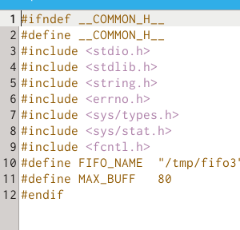
 
server.c:
 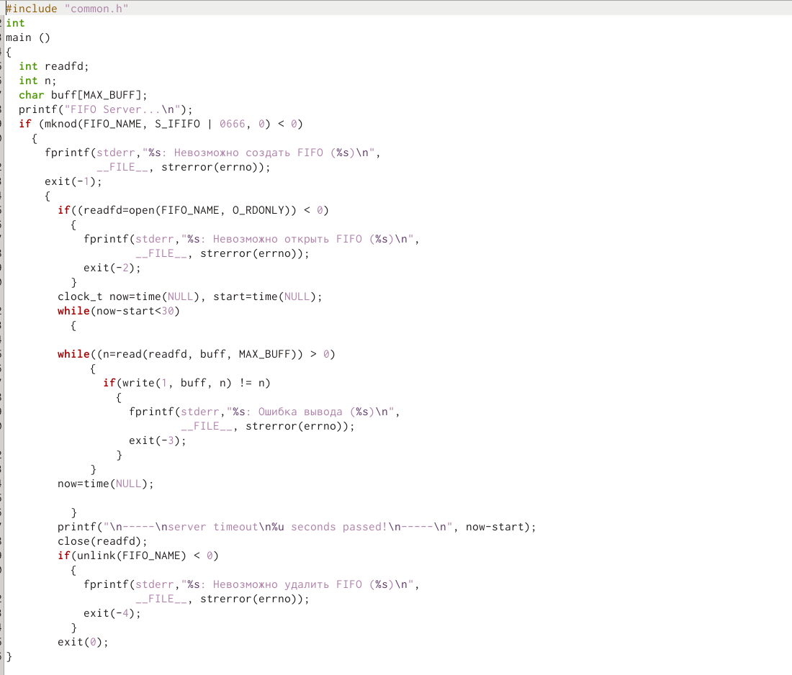

cluent.c:
 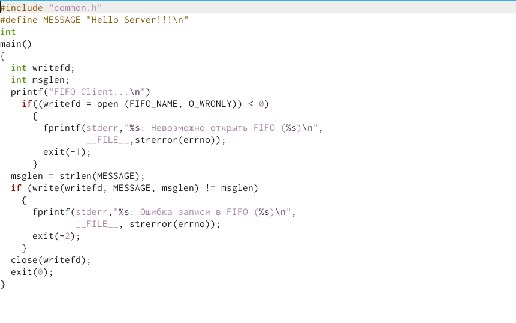

client2.c:
 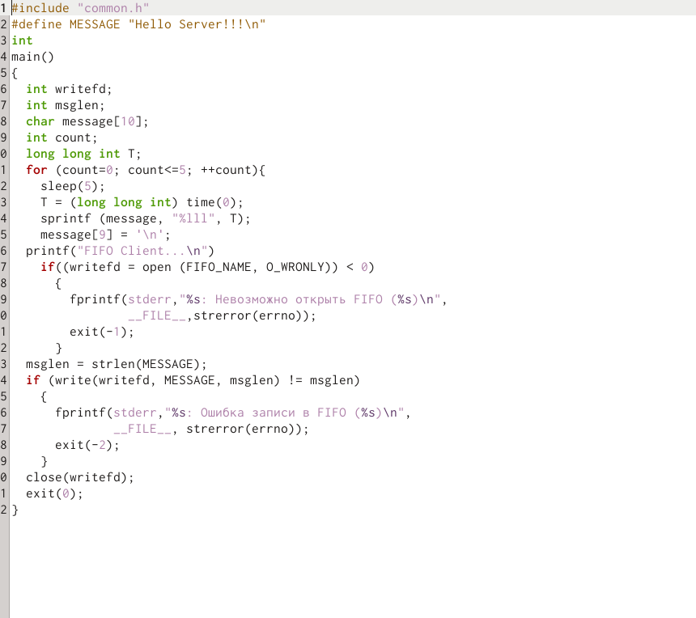

  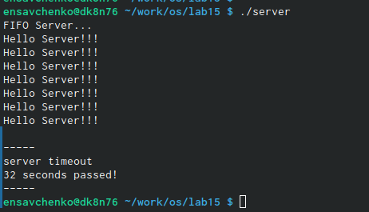
  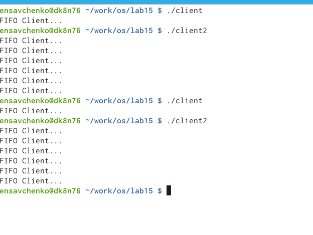

В случае, если сервер завершит работу, не закрыв канал, файл FIFO не удалится, поэтому его в следующий раз создать будет нельзя и вылезет ошибка, следовательно, работать ничего не будет.

# Выводы

 Я приобрела практические навыки работы с именованными каналами.
